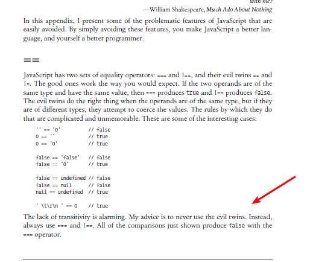

## JavaScript是Web 的编程语言

所有现代的 HTML 页面都使用 JavaScript。

JavaScript 非常容易学。

在了解JavaScript 前我想各位都是对HTML及CSS有过一定了解的;

## JavaScript组成

- ECMAScript（规定了JS的基本语法）
- DOM文档对象模型 （主要提供一些操作HTML的文档的工具）
- BOM浏览器对象模型（主要提供一些操作浏览器的工具

## JavaScript代码的执行

浏览器本身不会瑞执行js代码，js代码是通过js引擎执行代码，js引擎执行代码的时候会逐条解析有计算机进行处理。js语言被称为运行在客户端的弱类型语言。

# JavaScript是脚本语言

特点

- 是一种轻量级的基于对象（object-based）的高级编程语言

- 是可插入的HTML页面的编程代码

- 可有所有的现代浏览器只写

- 容易学习

    

   ## 书写位置

- 行内式

- 内嵌式

   ```js
   <script></script>
   ```

   

- 外联式

   ```js
   <script src=""></script>
   ```

   

# JS变量 !important

本质：变量是程序在内存中申请的一块存放数据的空间；（存放数据的容器，可以通过变量获取数据，也可以修改数据）

## 变量命名规范

1. 由字母（a-zA-Z）、数字（0-9）、下划线（_）、美元符号($)组成
2. 严格区大小写。var app与var App;这是两个变量
3. 不能以为数字开头。18age是错误的
4. 不能是关键词是关键字、保留字。例如：var、for、while

建议

   5.变量名必须有意义

   6.遵守驼峰命名法，首字母小写，后面单词的首字母需要大写，myFirstName这样

# JavaScript 数据类型

## 数据类型的概念

在编程过程中，数据类型是重要的概念。

为了能够操作变量，了解数据类型是很重要的。

如果没有数据类型，计算机就无法安全地解决这道题：

给 "Volvo" 加上 911 有意义吗？这么做会发生错误还是会产生一个结果？

JavaScript 会这样处理上面的例子：

```js
var x = "911" + "Porsche";
```

当数值和字符串相加时，JavaScript 将把数值视作字符串。

JavaScript 变量能够保存多种*数据类型*：数值、字符串值、数组、对象等等：

值类型(基本类型)*

- 字符串（String）
- 数字(Number)
- 布尔(Boolean)
- 对空（Null）
- 未定义（Undefined）
- Symbol

*引用数据类型*  (存放在堆堆内存中)

- 对象(Object)
- 数组(Array)
- 函数(Function)

## JavaScript 拥有动态类型

JavaScript 拥有动态类型。这意味着相同的变量可用作不同的类型，同时声明多个变量也可以只用写一个Var，用英文逗号隔开，变量值将以最后一次赋的值为准：

```js
var x;               // x 为 undefined
var x = 5;           // 现在 x 为数字
var x = "John";      // 现在 x 为字符串
```

## JS的严格模式

```js
//使用严格模式 加了'use strict' 使用ES6YIS以上的js 如果没有ES5
	’use strict'
	username = '张三'
	cosole.log(userame)//报错 username is not defined
	//定义变量时一定记得加Var
```


## JavaScript：直接写入 HTML 输出流

实例

```js
document.write("<h1>这是一个标题</h1>");
document.write("<p>这是一个段落。</p>");
```

```js
您只能在 HTML 输出中使用 document.write。如果您在文档加载后使用该方法，会覆盖整个文档。 
```

------

## JavaScript：验证输入 

JavaScript 常用于验证用户的输入。

```js
if isNaN(x) {alert("不是数字")};
```

```js
定义和用法
isNaN() 函数可确定值是否为非数字（Not-a-Number）。


如果该值等于 NaN，则此函数返回 true。否则返回 false。

此函数不同于 Number 特定的 Number.isNaN() 方法。

全局 isNaN() 函数将测试值转换为数字，然后对其进行测试。

Number.isNaN() 不会将值转换为数字，并且不会为任何非数字类型的值返回 true。
```

```js
isNaN(123) //false
isNaN(-1.23) //false
isNaN(5-2) //false
isNaN(0) //false
isNaN('123') //false
isNaN('Hello') //true
isNaN('2005/12/12') //true
isNaN('') //false
isNaN(true) //false
isNaN(undefined) //true
isNaN('NaN') //true
isNaN(NaN) //true
isNaN(0 / 0) //true
isNaN(null) //false
```

## Undefined

在 JavaScript 中，没有值的变量，其值是 undefined。typeof 也返回 undefined。

```js
var person;                  // 值是 undefined，类型是 undefined
```

任何变量均可通过设置值为 undefined 进行清空。其类型也将是 undefined。

```js
person = undefined;          // 值是 undefined，类型是 undefined
```

## Null

在 JavaScript 中，null 是 "nothing"。它被看做不存在的事物。

不幸的是，在 JavaScript 中，null 的数据类型是对象。

您可以把 null 在 JavaScript 中是对象理解为一个 bug。它本应是 null。

您可以通过设置值为 null 清空对象：

```js
var person = null;           // 值是 null，但是类型仍然是对象
```

您也可以通过设置值为 undefined 清空对象：

```js
var person = undefined;     // 值是 undefined，类型是 undefined
```

## Undefined 与 Null 的区别

Undefined 与 null 的值相等，但类型不相等：

```js
typeof undefined              // undefined
typeof null                   // object
null === undefined            // false
null == undefined             // true
```

**1、定义**

-  （1）undefined：是所有没有赋值变量的默认值，自动赋值。
-  （2）null：主动释放一个变量引用的对象，表示一个变量不再指向任何对象地址。

**2、何时使用null?**

当使用完一个比较大的对象时，需要对其进行释放内存时，设置为 null。

**3、null 与 undefined 的异同点是什么呢？**

**共同点**：都是原始类型，保存在栈中变量本地。

不同点：

（1）undefined——表示变量声明过但并未赋过值。

它是所有未赋值变量默认值，例如：

```j&#39;s
var a;    // a 自动被赋值为 undefined
```

（2）null——表示一个变量将来可能指向一个对象。

一般用于主动释放指向对象的引用，例如：

```js
var emps = ['ss','nn'];
emps = null;     // 释放指向数组的引用
```

  (3)==和!= 会对数据类型进行隐式转换,不建议使用,是js语言糟粕,在蝴蝶书中,作者强烈建议永远不要使用这对邪恶的兄弟使用




4、延伸——垃圾回收站

它是专门释放对象内存的一个程序。

-  （1）在底层，后台伴随当前程序同时运行；引擎会定时自动调用垃圾回收期；
-  （2）总有一个对象不再被任何变量引用时，才释放。

## 原始数据

原始数据值是一种没有额外属性和方法的单一简单数据值。

## typeof 运算符

您可使用 JavaScript 的 typeof 来**确定 JavaScript 变量的数据类型**：

```js
typeof 运算符返回变量或表达式的类型：
- string
- number
- boolean
- undefined
- Null

typeof 运算符可返回以下原始类型之一：
```

```js
typeof "Bill"              // 返回 "string"
typeof 3.14                // 返回 "number"
typeof true                // 返回 "boolean"
typeof false               // 返回 "boolean"
typeof x                   // 返回 "undefined" (假如 x 没有值)
typeof ""                  // 返回 "string"
typeof "Bill"              // 返回 "string"
typeof "Bill Gates"          // 返回 "string"

```

## 复杂数据

typeof 运算符可返回以下两种类型之一：

- function
- object

typeof 运算符把对象、数组或 null 返回 object。

typeof 运算符不会把函数返回 object。

```js
typeof {name:'Bill', age:62} // 返回 "object"
typeof [1,2,3,4]             // 返回 "object" (并非 "array"，参见下面的注释)
typeof null                  // 返回 "object"
typeof function myFunc(){}   // 返回 "function"
```


# JavaScript 输出

JavaScript 没有任何打印或者输出的函数。

## JavaScript 显示数据

JavaScript 可以通过不同的方式来输出数据：

- 使用 **window.alert()** 弹出警告框。

- 使用 **document.write()** 方法将内容写到 HTML 文档中。

- 使用 **innerHTML** 写入到 HTML 元素。

- 使用 **console.log()** 写入到浏览器的控制台。


## 使用window.alert（）

```js
<!DOCTYPE html>
<html>
<body>

<h1>我的第一个页面</h1>
<p>我的第一个段落。</p>

<script>
window.alert(5 + 6);
</script>

</body>
</html>
```

## 操作 HTML 元素

当需从 JavaScript 访问某个 HTML 元素，您可以使用 document.getElementById(*id*) 方法。

请使用 "id" 属性来标识 HTML 元素，并 innerHTML 来获取或插入元素内容：

```js
<!DOCTYPE html>
<html>
<body>

<h1>我的第一个 Web 页面</h1>

<p id="demo">我的第一个段落</p>

<script>
document.getElementById("demo").innerHTML = "段落已修改。";
</script>

</body>
</html>
```

**document.getElementById("demo")** 是使用 id 属性来查找 HTML 元素的 JavaScript 代码 。

**innerHTML = "段落已修改。"** 是用于修改元素的 HTML 内容(innerHTML)的 JavaScript 代码。

## 写到 HTML 文档

出于测试目的，您可以将JavaScript直接写在HTML 文档中：

```js
<!DOCTYPE html>
<html>
<body>

<h1>我的第一个 Web 页面</h1>

<p>我的第一个段落。</p>

<script>
document.write(Date());
</script>

</body>
</html>
```

请使用 document.write() 仅仅向文档输出写内容。

如果在文档已完成加载后执行 document.write，整个 HTML 页面将被覆盖。

```js
<!DOCTYPE html>
<html>
<body>

<h1>我的第一个 Web 页面</h1>

<p>我的第一个段落。</p>

<button onclick="myFunction()">点我</button>

<script>
function myFunction() {
    document.write(Date());
}
</script>

</body>
</html>
```

## 写到控制台

你可以使用 **console.log()** 方法在浏览器中显示 JavaScript 值。

在浏览器中使用 F12 来启用调试模式，调试窗口中点击 "Console" 。

```js
<!DOCTYPE html>
<html>
<body>

<h1>我的第一个 Web 页面</h1>

<script>
a = 5;
b = 6;
c = a + b;
console.log(c);
</script>

</body>
</html>
```


# JavaScript 字符串

JavaScript 字符串用于存储和处理文本。

## 字符串长度

可以使用内置属性 **length** 来计算字符串的长度：

```js
var txt = "ABCDEFGHIJKLMNOPQRSTUVWXYZ";
var sln = txt.length;
```


# 转义字符

| 代码 |    输出     |
| :--: | :---------: |
|  \'  |   单引号    |
|  \"  |   双引号    |
|  \\  |   反斜杠    |
|  \n  |    换行     |
|  \r  |    回车     |
|  \t  | tab(制表符) |
|  \b  |   退格符    |
|  \f  |   换页符    |

## 字符串方法

更多方法实例可以参见：[JavaScript String 对象](https://www.runoob.com/jsref/jsref-obj-string.html)。

|        方法         |                             描述                             |
| :-----------------: | :----------------------------------------------------------: |
|      charAt()       |                    返回指定索引位置的字符                    |
|    charCodeAt()     |              返回指定索引位置字符的 Unicode 值               |
|      concat()       |           连接两个或多个字符串，返回连接后的字符串           |
|   fromCharCode()    |                   将 Unicode 转换为字符串                    |
|      indexOf()      |           返回字符串中检索指定字符第一次出现的位置           |
|    lastIndexOf()    |          返回字符串中检索指定字符最后一次出现的位置          |
|   localeCompare()   |               用本地特定的顺序来比较两个字符串               |
|       match()       |                找到一个或多个正则表达式的匹配                |
|      replace()      |                  替换与正则表达式匹配的子串                  |
|      search()       |                  检索与正则表达式相匹配的值                  |
|       slice()       |      提取字符串的片断，并在新的字符串中返回被提取的部分      |
|       split()       |                  把字符串分割为子字符串数组                  |
|      substr()       |            从起始索引号提取字符串中指定数目的字符            |
|     substring()     |            提取字符串中两个指定的索引号之间的字符            |
| toLocaleLowerCase() | 根据主机的语言环境把字符串转换为小写，只有几种语言（如土耳其语）具有地方特有的大小写映射 |
| toLocaleUpperCase() | 根据主机的语言环境把字符串转换为大写，只有几种语言（如土耳其语）具有地方特有的大小写映射 |
|    toLowerCase()    |                      把字符串转换为小写                      |
|     toString()      |                       返回字符串对象值                       |
|    toUpperCase()    |                      把字符串转换为大写                      |
|       trim()        |                      移除字符串首尾空白                      |
|      valueOf()      |                  返回某个字符串对象的原始值                  |

# 数值交换

```js
<!DOCTYPE html>
<html lang="en">

<head>
    <meta charset="UTF-8">
    <meta http-equiv="X-UA-Compatible" content="IE=edge">
    <meta name="viewport" content="width=device-width, initial-scale=1.0">
    <title>Document</title>
</head>

<body>
    <script>
        var temp
        var apple1= '红苹果'
        var apple2= '青苹果'
        temp = apple1
        apple1 = apple2
        apple2 = temp
        console.log(apple1, '\n', apple2)
    </script>
</body>

</html>
```


# JavaScript 语法

**语法规则定义了语言结构**

```js
isNaN(value)
```

value:必须。要测试的值

## JavaScript 字面量

一般固定值称为字面量，如 3.14。

**数字（Number）字面量** 可以是整数或者是小数，或者是科学计数(e)：   

- 3.14 
- 1001
-  123e5 

**字符串（String）字面量** 可以使用单引号或双引号：

-   "John Doe"
-    'John Doe'

**表达式字面量** 用于计算：

-   5 + 6
-   5 * 10  

**数组（Array）字面量**:

```js
[40, 100, 1, 5, 25, 10]
```

**对象（Object）字面量** 定义一个对象：

```js
{firstName:"John", lastName:"Doe", age:50, eyeColor:"blue"}
```

**函数（Function）字面量** 定义一个函数：

```js
function myFunction(a, b) { return a * b;}
```


Tips:

```js
NaN 的数据类型是 number
数组的数据类型是 object
日期的数据类型是 object
null 的数据类型是 object
未定义变量的数据类型是 undefined
```


# JavaScript 运算符参考手册

## 下表解释了算术运算符：

算术运算符用于在变量和/或值之间执行算术。

|      *加*      | *+*  | *x = y + 2* | *y = 5* |  *x = 7*  |
| :------------: | :--: | :---------: | :-----: | :-------: |
|      *减*      | *-*  | *x = y - 2* | *y = 5* |  *x = 3*  |
|      *乘*      |  *   | *x = y * 2* | *y = 5* | *x = 10*  |
|      *除*      | */*  | *x = y / 2* | *y = 5* | *x = 2.5* |
| *模数（除余）* | *%*  | *x = y % 2* | *y = 5* |  *x = 1*  |
|      累加      | *++* |   x = ++y   |  y = 6  |   x = 6   |
|                |      |   x = y++   |  y = 6  |   x = 5   |
|      递减      |  --  |   x = --y   |  y = 4  |   x = 4   |
|                |      |   x = y--   |  y = 4  |   x = 5   |

## JavaScript 赋值运算符

赋值运算符用于为 JavaScript 变量赋值。

| 运算符 |  例子  |  等同于   | x 中的结果 |
| :----: | :----: | :-------: | :--------: |
|   =    | x = y  |   x = y   |   x = 5    |
|   +=   | x += y | x = x + y |   x = 15   |
|   -=   | x -= y | x = x - y |   x = 5    |
|   *=   | x *= y | x = x * y |   x = 50   |
|   /=   | x /= y | x = x / y |   x = 2    |
|   %=   | x %= y | x = x % y |   x = 0    |

## JavaScript 字符串运算符

赋值运算符用于为 JavaScript 变量赋值。

给定 **x = 10** 且 **y = 5**，下表解释了赋值运算符：

|  +   | text3 = text1 + text2 |    "Good "     | "Morning" | "Good Morning" |
| :--: | :-------------------: | :------------: | :-------: | :------------: |
|  +=  |    text1 += text2     | "Good Morning" | "Morning" |       ""       |

## JavaScript比较运算符

在逻辑语句中使用比较运算符来确定变量或值之间的相等性或差异。

给定 **x = 5**，下表解释了比较运算符：

| 运算符 |      描述      |
| :----: | :------------: |
|   ==   |      等于      |
|  ===   |    等值等型    |
|   !=   |     不相等     |
|  !==   | 不等值或不等型 |
|   >    |      大于      |
|   <    |      小于      |
|   >=   |   大于或等于   |
|   <=   |   小于或等于   |
|   ?    |   三元运算符   |

## JavaScript逻辑运算符

| 运算符 | 描述   |
| ------ | ------ |
| &&     | 逻辑与 |
| \|\|   | 逻辑或 |
| !      | 逻辑非 |

**！ 一元逻辑运算符 取反符 非a即集合补集**

**&& 二元逻辑运算符 符号俩侧一个值为假则假，其余为真**

**||二元逻辑运算符同时为真/假则为假** 


## 逻辑表达式的短路计算

|  e1  |  e2  | e1\|\|e2 | e1&&e2 |
| :--: | :--: | :------: | :----: |
| 非0  | 非0  |    1     |   0    |
| 非0  |  0   |    1     |   0    |
|  0   | 非0  |    1     |   0    |
|  0   |  0   |    0     |   0    |


## JavaScript 类型运算符

|   运算符   |                 描述                  |
| :--------: | :-----------------------------------: |
|   typeof   |           返回变量的类型。            |
| instanceof | 返回 true，如果对象是对象类型的实例。 |

## JavaScript 位运算符

| 运算符 |     描述     |  例子   |    等同于    | 结果 | 十进制 |
| :----: | :----------: | :-----: | :----------: | :--: | :----: |
|   &    |      与      |  5 & 1  | 0101 & 0001  | 0001 |   1    |
|   \|   |      或      | 5 \| 1  | 0101 \| 0001 | 0101 |   5    |
|   ~    |      非      |   ~ 5   |    ~0101     | 1010 |   10   |
|   ^    |     异或     |  5 ^ 1  | 0101 ^ 0001  | 0100 |   4    |
|   <<   | 零填充左位移 | 5 << 1  |  0101 << 1   | 1010 |   10   |
|   >>   | 有符号右位移 | 5 >> 1  |  0101 >> 1   | 0010 |   2    |
|  >>>   | 零填充右位移 | 5 >>> 1 |  0101 >>> 1  | 0010 |   2    |

*上例使用 4 位无符号的例子。但是 JavaScript 使用 32 位有符号数。*

*因此，在 JavaScript 中，~ 5 不会返回 10，而是返回 -6。*

*~00000000000000000000000000000101 将返回 11111111111111111111111111111010。*

# JavaScript 数字

**JavaScript 只有一种数值类型。**

**书写数值时带不带小数点均可。**

## JavaScript 数值始终是 64 位的浮点数

与许多其他编程语言不同，JavaScript 不会定义不同类型的数，比如整数、短的、长的、浮点的等等。

JavaScript 数值始终以双精度浮点数来存储，根据国际 IEEE 754 标准。

此格式用 64 位存储数值，其中 0 到 51 存储数字（片段），52 到 62 存储指数，63 位存储符号：

| 值(aka Fraction/Mantissa) |       指数        |    符号    |
| :-----------------------: | :---------------: | :--------: |
|      52 bits(0 - 51)      | 11 bits (52 - 62) | 1 bit (63) |

## 数字和字符串相加

### 警告！！

JavaScript 的加法和级联（concatenation）都使用 + 运算符。

数字用加法。字符串用级联。

如果您对两个数相加，结果将是一个数：

```js
var x = 10;
var y = 20;
var z = x + y;           // z 将是 30（一个数）
```

## 数字字符串

JavaScript 字符串可以拥有数字内容：

```js
var x = 100;         // x 是数字

var y = "100";       // y 是字符串
```

## NaN - 非数值（Not a Number）

NaN 属于 JavaScript 保留词，**指示某个数不是合法数**。

尝试用一个非数字字符串进行除法会得到 NaN：

```js
var x = 100 / "Apple";  // x 将是 NaN（Not a Number）
```


您可使用全局 JavaScript 函数 isNaN() 来确定某个值是否是数：

```js
var x = 100 / "Apple";
isNaN(x);               // 返回 true，因为 x 不是数
```


要小心 NaN。假如您在数学运算中使用了 NaN，则结果也将是 NaN：

```js
var x = NaN;
var y = 5;
var z = x + y;         // z 将是 NaN
```


结果也许是串连接：

```js
var x = NaN;
var y = "5";
var z = x + y;         // z 将是 NaN5
```


NaN 是数，typeof NaN 返回 number：

```js
typeof NaN;             // 返回 "number"
```

## 十六进制

JavaScript 会把前缀为 0x 的数值常量解释为十六进制。

```js
var x = 0xFF;             // x 将是 255
```

绝不要用前导零写数字（比如 07）。

一些 JavaScript 版本会把带有前导零的数解释为八进制。

默认地，Javascript 把数显示为十进制小数。

但是您能够使用 toString() 方法把数输出为十六进制、八进制或二进制。

```js
var myNumber = 128;
myNumber.toString(16);     // 返回 80
myNumber.toString(8);      // 返回 200
myNumber.toString(2);      // 返回 10000000
```


## 数值可以是对象

通常 JavaScript 数值是通过字面量创建的原始值：var x = 123

但是也可以通过关键词 new 定义为对象：var y = new Number(123)

```js
var x = 123;
var y = new Number(123);

// typeof x 返回 number
// typeof y 返回 object
```

请不要创建数值对象。这样会拖慢执行速度。

new 关键词使代码复杂化，并产生某些无法预料的结果：

当使用 == 相等运算符时，相等的数看上去相等：

```js
var x = 500;             
var y = new Number(500);

// (x == y) 为 true，因为 x 和 y 有相等的值
```


当使用 === 相等运算符后，相等的数变为不相等，因为 === 运算符需要类型和值同时相等。

```js
var x = 500;             
var y = new Number(500);

// (x === y) 为 false，因为 x 和 y 的类型不同
```

甚至更糟。对象无法进行对比：

```js
var x = new Number(500);             
var y = new Number(500);

// (x == y) 为 false，因为对象无法比较
```

# JavaScript 类型转换

- Number(string) 强制将string转换为数字型
- parselnt(string)转为整数数值型
- parseFloat(string)转为浮点数值型
- js隐式转行（- * /）利用算术隐式转行为数值型


 String() 转换为字符串， Boolean() 转换为布尔值。


------

## JavaScript 数据类型

在 JavaScript 中有 6 种不同的数据类型：

- string
- number
- boolean
- object
- function
- symbol

3 种对象类型：

- Object
- Date
- Array

2 个不包含任何值的数据类型：

- null
- undefined

------

## typeof 操作符

你可以使用 **typeof** 操作符来查看 JavaScript 变量的数据类型。

typeof "John"                 // 返回 string
typeof 3.14                   // 返回 number
typeof NaN                    // 返回 number
typeof false                  // 返回 boolean
typeof [1,2,3,4]              // 返回 object
typeof {name:'John', age:34}  // 返回 object
typeof new Date()             // 返回 object
typeof function () {}         // 返回 function
typeof myCar                  // 返回 undefined (如果 myCar 没有声明)
typeof null                   // 返回 object

尝试一下 »

请注意：

- NaN 的数据类型是 number
- 数组(Array)的数据类型是 object
- 日期(Date)的数据类型为 object
- null 的数据类型是 object
- 未定义变量的数据类型为 undefined

如果对象是 JavaScript Array 或 JavaScript Date ，我们就无法通过 **typeof** 来判断他们的类型，因为都是 返回 object。

------

## constructor 属性

**constructor** 属性返回所有 JavaScript 变量的构造函数。

## 

"John".constructor                 // 返回函数 String()  { [native code] }
(3.14).constructor                 // 返回函数 Number()  { [native code] }
false.constructor                  // 返回函数 Boolean() { [native code] }
[1,2,3,4].constructor              // 返回函数 Array()   { [native code] }
{name:'John', age:34}.constructor  // 返回函数 Object()  { [native code] }
new Date().constructor             // 返回函数 Date()    { [native code] }
function () {}.constructor         // 返回函数 Function(){ [native code] }

你可以使用 constructor 属性来查看对象是否为数组 (包含字符串 "Array"):


function isArray(myArray) {
    return myArray.constructor.toString().indexOf("Array") > -1;
}

你可以使用 constructor 属性来查看对象是否为日期 (包含字符串 "Date"):


function isDate(myDate) {
    return myDate.constructor.toString().indexOf("Date") > -1;
}

------

## JavaScript 类型转换

JavaScript 变量可以转换为新变量或其他数据类型：

- 通过使用 JavaScript 函数
- 通过 JavaScript 自身自动转换

------

# 定义字符串

通过 单引号、双引号、反引号

## 转换数据

### 转换为字符串类型

1. 其他数据类型如何转换为字符串类型？
   - 变量.toString()
   - String()强制转换
   - 加号拼接字符串

补充：
隐式转换：悄咪咪的转换数据，是js解释器悄咪咪的帮我们去完成数据转换的操作，程序员不需要操心
显式转换：需要程序员编写代码完成转换

推荐使用隐式转换来转换数据

### 转换为数字类型的parseInt和parseFloat

1. parseInt和parseFloat有什么区别？
   - 一个是将数据转换为整数
   - 一个是将数据转换为小数

### 转换为数字类型的其他方法

1. 还有其他将数据转换为数字的方法，但是大家觉得哪一种比较适合你？
   - 用隐式转换最方便，如：var a = '1.23';  var b = a - 0; var c = +a;

### 计算年龄案例

1. 如何使用反引号字符串的形式替代字符串++的写法？
   - alert(`您今年已经${age}岁了`)

练习3分钟，完成计算年龄案例

### 简单加法器案例

1. 加法器能做出来，如果这个时候，要你把加减乘除的结果都算出来，怎么办？

   ```js
      var num1 = +prompt('请输入第一个数');
      var num2 = +prompt('请输入第二个数');
   
      var jia = num1 + num2;
      var jian = num1 - num2;
      var chen = num1 * num2;
      var chu = num1 / num2;
   
      alert(`加的结果是${jia},减的结果是${jian},乘的结果是${chen},除的结果是${chu}`);
   ```

### 转换为布尔型

1. 如何将一个数据转换为布尔型呢？

   ```js
   bloolean() //true or false
   ```

   - 最简单的做法  !!数据  就可以了

补充：
(代表空、否定的值)会被转换为false：0,'',NaN,undefined,null

## 将数字转换为字符串

全局方法 **String()** 可以将数字转换为字符串。

该方法可用于任何类型的数字，字母，变量，表达式：


```js
String(x)         // 将变量 x 转换为字符串并返回
String(123)       // 将数字 123 转换为字符串并返回
String(100 + 23)  // 将数字表达式转换为字符串并返回
```

尝试一下 »

Number 方法 **toString()** 也是有同样的效果。

```js
x.toString()
(123).toString()
(100 + 23).toString()
```

尝试一下 »

在 [Number 方法](https://www.runoob.com/jsref/jsref-obj-number.html) 章节中，你可以找到更多数字转换为字符串的方法：

| 方法            | 描述                                                 |
| --------------- | ---------------------------------------------------- |
| toExponential() | 把对象的值转换为指数计数法。                         |
| toFixed()       | 把数字转换为字符串，结果的小数点后有指定位数的数字。 |
| toPrecision()   | 把数字格式化为指定的长度。                           |

------

## 将布尔值转换为字符串

全局方法 **String()** 可以将布尔值转换为字符串。

```js
String(false)        // 返回 "false"
String(true)         // 返回 "true"

Boolean 方法 **toString()** 也有相同的效果。

false.toString()     // 返回 "false"
true.toString()      // 返回 "true"
```


------

## 将日期转换为字符串

```js
Date() 返回字符串。

Date()      // 返回 Thu Jul 17 2014 15:38:19 GMT+0200 (W. Europe Daylight Time)

全局方法 String() 可以将日期对象转换为字符串。

String(new Date())      // 返回 Thu Jul 17 2014 15:38:19 GMT+0200 (W. Europe Daylight Time)

Date 方法 **toString()** 也有相同的效果。

## 

obj = new Date()
obj.toString()   // 返回 Thu Jul 17 2014 15:38:19 GMT+0200 (W. Europe Daylight Time)
```

在 [Date 方法](https://www.runoob.com/jsref/jsref-obj-date.html) 章节中，你可以查看更多关于日期转换为字符串的函数：

| 方法              | 描述                                        |
| ----------------- | ------------------------------------------- |
| getDate()         | 从 Date 对象返回一个月中的某一天 (1 ~ 31)。 |
| getDay()          | 从 Date 对象返回一周中的某一天 (0 ~ 6)。    |
| getFullYear()     | 从 Date 对象以四位数字返回年份。            |
| getHours()        | 返回 Date 对象的小时 (0 ~ 23)。             |
| getMilliseconds() | 返回 Date 对象的毫秒(0 ~ 999)。             |
| getMinutes()      | 返回 Date 对象的分钟 (0 ~ 59)。             |
| getMonth()        | 从 Date 对象返回月份 (0 ~ 11)。             |
| getSeconds()      | 返回 Date 对象的秒数 (0 ~ 59)。             |
| getTime()         | 返回 1970 年 1 月 1 日至今的毫秒数。        |

------

## 将字符串转换为数字

全局方法 **Number()** 可以将字符串转换为数字。

字符串包含数字(如 "3.14") 转换为数字 (如 3.14).

空字符串转换为 0。

其他的字符串会转换为 NaN (不是个数字)。


在 [Number 方法](https://www.runoob.com/jsref/jsref-obj-number.html) 章节中，你可以查看到更多关于字符串转为数字的方法：

| 方法         | 描述                               |
| ------------ | ---------------------------------- |
| parseFloat() | 解析一个字符串，并返回一个浮点数。 |
| parseInt()   | 解析一个字符串，并返回一个整数。   |

------

## 一元运算符 +

```js
**Operator +** 可用于将变量转换为数字：

## 

var y = "5";      // y 是一个字符串
var x = + y;      // x 是一个数字

尝试一下 »

如果变量不能转换，它仍然会是一个数字，但值为 NaN (不是一个数字):

## 

var y = "John";   // y 是一个字符串
var x = + y;      // x 是一个数字 (NaN)

尝试一下 »
```

### [逗号操作符](https://developer.mozilla.org/zh-CN/docs/Web/JavaScript/Guide/Expressions_and_Operators#comma_operator)

[逗号操作符](https://developer.mozilla.org/zh-CN/docs/Web/JavaScript/Reference/Operators/Comma_Operator)（`,`）对两个操作数进行求值并返回最终操作数的值。它常常用在 `for` 循环中，在每次循环时对多个变量进行更新。

例如，假如 `a` 是一个二维数组，每个维度各有10个元素，以下代码利用逗号操作符来同时改变两个变量的值。这段代码的功能是打印出该二维数组的对角线元素的值：

```js
var x = [0,1,2,3,4,5,6,7,8,9]
var a = [x, x, x, x, x];

for (var i = 0, j = 9; i <= j; i++, j--)
  console.log('a[' + i + '][' + j + ']= ' + a[i][j]);
```

Copy to Clipboard

### [一元操作符](https://developer.mozilla.org/zh-CN/docs/Web/JavaScript/Guide/Expressions_and_Operators#delete)

一元操作符仅对应一个操作数。

#### `delete`

`delete`操作符，删除一个对象的属性或者一个数组中某一个键值。语法如下:

```js
delete objectName.property;
delete objectName[index];
delete property; // legal only within a with statement
```

Copy to Clipboard

`objectName`是一个对象名，`property` 是一个已经存在的属性，`index`是数组中的一个已经存在的键值的索引值。

第三行的形式只在`with`声明的状态下是合法的， 从对象中删除一个属性。

你能使用 `delete` 删除各种各样的隐式声明， 但是被`var`声明的除外。

如果 `delete` 操作成功，属性或者元素会变成 `undefined`。如果 `delete`可行会返回`true`，如果不成功返回`false`。

```js
x = 42;
var y = 43;
myobj = new Number();
myobj.h = 4;    // create property h
delete x;       // returns true (can delete if declared implicitly)
delete y;       // returns false (cannot delete if declared with var)
delete Math.PI; // returns false (cannot delete predefined properties)
delete myobj.h; // returns true (can delete user-defined properties)
delete myobj;   // returns true (can delete if declared implicitly)
```

Copy to Clipboard

##### 删除数组元素

删除数组中的元素时，数组的长度是不变的，例如删除`a[3]`, `a[4]`，`a[4]``和a[3]` 仍然存在变成了`undefined`。

`delete` 删除数组中的一个元素，这个元素就不在数组中了。例如，`trees[3]`被删除，`trees[3]` 仍然可寻址并返回`undefined`。

```js
var trees = new Array("redwood", "bay", "cedar", "oak", "maple");
delete trees[3];
if (3 in trees) {
  // 不会被执行
}
```

Copy to Clipboard

如果想让数组中存在一个元素但是是`undefined`值，使用`undefined`关键字而不是`delete`操作. 如下： `trees[3]分配一个undefined`,但是这个数组元素仍然存在:

```js
var trees = new Array("redwood", "bay", "cedar", "oak", "maple");
trees[3] = undefined;
if (3 in trees) {
  // this gets executed（会被执行）
}
```


------

## 将布尔值转换为数字

全局方法 **Number()** 可将布尔值转换为数字。

```js
Number(false)     // 返回 0
Number(true)      // 返回 1
```

------

## 将日期转换为数字

全局方法 **Number()** 可将日期转换为数字。

```js
d = new Date();
Number(d)          // 返回 1404568027739
```

日期方法 **getTime()** 也有相同的效果。

```js
d = new Date();
d.getTime()        // 返回 1404568027739
```

------

## 自动转换类型

当 JavaScript 尝试操作一个 "错误" 的数据类型时，会自动转换为 "正确" 的数据类型。

以下输出结果不是你所期望的：

```js
5 + null    // 返回 5         null 转换为 0
"5" + null  // 返回"5null"   null 转换为 "null"
"5" + 1     // 返回 "51"      1 转换为 "1" 
"5" - 1     // 返回 4         "5" 转换为 5
```

------

## 自动转换为字符串

当你尝试输出一个对象或一个变量时 JavaScript 会自动调用变量的 toString() 方法：

```js
document.getElementById("demo").innerHTML = myVar;

myVar = {name:"Fjohn"}  // toString 转换为 "[object Object]"
myVar = [1,2,3,4]       // toString 转换为 "1,2,3,4"
myVar = new Date()      // toString 转换为 "Fri Jul 18 2014 09:08:55 GMT+0200"
```

数字和布尔值也经常相互转换：

```js
myVar = 123             // toString 转换为 "123"
myVar = true            // toString 转换为 "true"
myVar = false           // toString 转换为 "false"
```

下表展示了使用不同的数值转换为数字(Number), 字符串(String), 布尔值(Boolean):

|       原始值        | 转换为数字 |   转换为字符串    | 转换为布尔值 |                             实例                             |
| :-----------------: | :--------: | :---------------: | :----------: | :----------------------------------------------------------: |
|        false        |     0      |      "false"      |    false     |                                                              |
|        true         |     1      |      "true"       |     true     | [尝试一下 »](https://www.runoob.com/try/try.php?filename=tryjs_type_convert_true) |
|          0          |     0      |        "0"        |    false     | [尝试一下 »](https://www.runoob.com/try/try.php?filename=tryjs_type_convert_number_0) |
|          1          |     1      |        "1"        |     true     | [尝试一下 »](https://www.runoob.com/try/try.php?filename=tryjs_type_convert_number_1) |
|         "0"         |     0      |        "0"        |     true     | [尝试一下 »](https://www.runoob.com/try/try.php?filename=tryjs_type_convert_string_0) |
|        "000"        |     0      |       "000"       |     true     | [尝试一下 »](https://www.runoob.com/try/try.php?filename=tryjs_type_convert_string_000) |
|         "1"         |     1      |        "1"        |     true     | [尝试一下 »](https://www.runoob.com/try/try.php?filename=tryjs_type_convert_string_1) |
|         NaN         |    NaN     |       "NaN"       |    false     | [尝试一下 »](https://www.runoob.com/try/try.php?filename=tryjs_type_convert_nan) |
|      Infinity       |  Infinity  |    "Infinity"     |     true     | [尝试一下 »](https://www.runoob.com/try/try.php?filename=tryjs_type_convert_infinity) |
|      -Infinity      | -Infinity  |    "-Infinity"    |     true     | [尝试一下 »](https://www.runoob.com/try/try.php?filename=tryjs_type_convert_infinity_minus) |
|         ""          |     0      |        ""         |    false     | [尝试一下 »](https://www.runoob.com/try/try.php?filename=tryjs_type_convert_string_empty) |
|        "20"         |     20     |       "20"        |     true     | [尝试一下 »](https://www.runoob.com/try/try.php?filename=tryjs_type_convert_string_number) |
|      "Runoob"       |    NaN     |     "Runoob"      |     true     | [尝试一下 »](https://www.runoob.com/try/try.php?filename=tryjs_type_convert_string_text) |
|         [ ]         |     0      |        ""         |     true     | [尝试一下 »](https://www.runoob.com/try/try.php?filename=tryjs_type_convert_array_empty) |
|        [20]         |     20     |       "20"        |     true     | [尝试一下 »](https://www.runoob.com/try/try.php?filename=tryjs_type_convert_array_one_number) |
|       [10,20]       |    NaN     |      "10,20"      |     true     | [尝试一下 »](https://www.runoob.com/try/try.php?filename=tryjs_type_convert_array_two_numbers) |
|     ["Runoob"]      |    NaN     |     "Runoob"      |     true     | [尝试一下 »](https://www.runoob.com/try/try.php?filename=tryjs_type_convert_array_one_string) |
| ["Runoob","Google"] |    NaN     |  "Runoob,Google"  |     true     | [尝试一下 »](https://www.runoob.com/try/try.php?filename=tryjs_type_convert_array_two_strings) |
|    function(){}     |    NaN     |  "function(){}"   |     true     | [尝试一下 »](https://www.runoob.com/try/try.php?filename=tryjs_type_convert_function) |
|         { }         |    NaN     | "[object Object]" |     true     | [尝试一下 »](https://www.runoob.com/try/try.php?filename=tryjs_type_convert_object) |
|        null         |     0      |      "null"       |    false     | [尝试一下 »](https://www.runoob.com/try/try.php?filename=tryjs_type_convert_null) |
|      undefined      |    NaN     |    "undefined"    |    false     | [尝试一下 »](https://www.runoob.com/try/try.php?filename=tryjs_type_convert_undefined) |