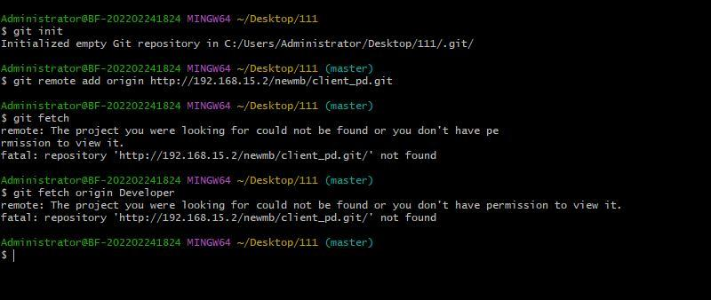
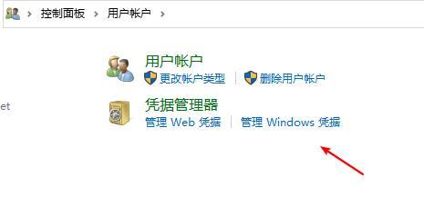

在提交代码的时候发现一直没有权限（windows）

```
//无论是
git init 
git remote add origin
git fetch 
```



```
//或者
git clone -b 
//都没有权限
```


```
//检查你用户名
git config user.name
//若没有配置，则配置
git config --global user.name "your name"
```


```
//win+r control 
//查看你的window凭证
```





- 检查是否同一个
- 修改完成后才能有权限取clone view 仓库


```
<link rel="stylesheet"href="https://cdn.jsdelivr.net/npm/aplayer@1.10/dist/APlayer.min.css"> 
<script src="https://cdn.jsdelivr.net/npm/aplayer@1.10/dist/APlayer.min.js"></script> 
<script src="https://cdn.jsdelivr.net/npm/meting@1.2/dist/Meting.min.js"></script> 
```

```

```

