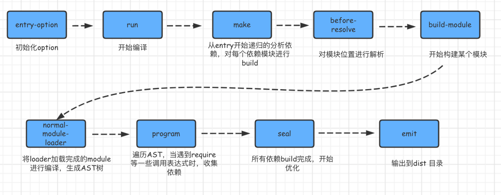

### 什么是webpack

1. webpack是一个javascript的静态模块打包工具
2. webpack里一切文件皆模块，通过loader转换文件，通过plugin注入钩子
3. 最后输出由多个模块组合成的文件，webpack专注构建模块化项目

### webpack的优点是什么？

1. 专注于处理模块化的项目，能做到开箱即用，一步到位
2. 通过plugin扩展，完整好用又不失灵活
3. 通过loaders扩展, 可以让webpack把所有类型的文件都解析打包
4. 社区庞大活跃，经常引入紧跟时代发展的新特性，能为大多数场景找到已有的开源扩展

## webpack-开发服务器-为何学

### 目标

开发时, 快速自动打包查看效果

### 问题

每次修改代码, 重新打包, 才能看到最新的效果

实际工作中, 打包非常费时 (10-30s) 之间, 影响开发效率

### 原因

1. 构建入口和所有模块依赖关系图
2. 磁盘读取对应的文件到内存, 才能加载
3. 用对应的 loader 进行处理和翻译
4. 将处理完的内容, 输出到磁盘指定文件内
5. 以后代码变化, **从1重新开始**

## webpack 构建流程分析



## webpack 构建流程

Webpack 的运行流程是一个串行的过程,从启动到结束会依次执行以下流程 :

1. 初始化参数：从配置文件和 Shell 语句中读取与合并参数,得出最终的参数。
2. 开始编译：用上一步得到的参数初始化 Compiler 对象,加载所有配置的插件,执行对象的 run 方法开始执行编译。
3. 确定入口：根据配置中的 entry 找出所有的入口文件。
4. 编译模块：从入口文件出发,调用所有配置的 Loader 对模块进行翻译,再找出该模块依赖的模块,再递归本步骤直到所有入口依赖的文件都经过了本步骤的处理。
5. 完成模块编译：在经过第 4 步使用 Loader 翻译完所有模块后,得到了每个模块被翻译后的最终内容以及它们之间的依赖关系。
6. 输出资源：根据入口和模块之间的依赖关系,组装成一个个包含多个模块的 Chunk,再把每个 Chunk 转换成一个单独的文件加入到输出列表,这步是可以修改输出内容的最后机会。
7. 输出完成：在确定好输出内容后,根据配置确定输出的路径和文件名,把文件内容写入到文件系统。

在以上过程中,Webpack 会在特定的时间点广播出特定的事件,插件在监听到感兴趣的事件后会执行特定的逻辑,并且插件可以调用 Webpack 提供的 API 改变 Webpack 的运行结果。

看一下我们脚手架的基本配置信息

```javascript
// webpack 是基于 Node 的静态模块打包工具, 所有配置就是向外暴露一个配置对象
// 要遵循 CommonJS 规范
const path = require('path')

// 目标1: 使用插件
// 1.1 引入插件
const HtmlWebpackPlugin = require('html-webpack-plugin')

// 改成 ES6 的模块化导入导出规范
// import path from 'path'

// model module
module.exports = {
  // mode: 指定打包的模式
  // development: 开发模式, webpack 不会压缩混淆代码, 打包速度很快
  // production: 上线模式, 进行压缩混淆代码, 打包速度较慢
  mode: 'production',
  // 配置对象
  // 配置入口, 可以是相对路径
  entry: './src/main.js',
  output: { // 配置出口, 必须是绝对路径
    // __dirname: 表示当前文件所在目录的绝对路径
    path: path.join(__dirname, './dist'), // 路径
    filename: 'bundle.js' // 文件名
  },
  // 1.2 配置插件
  plugins: [
    // 扩展: 将 HTML 自动复制并引入 bundle.js 文件, 同时设置 defer 属性
    // defer 属性: 等页面资源加载完毕后才执行引入的 js 文件
    new HtmlWebpackPlugin({ // 自动从指定的位置复制 HTML 到 dist 目录
      template: './public/index.html' // 指定 HTML 路径,
    })
  ],
  // 目标2: 使用 loader 来处理 css 文件
  module: { // 配置 loader 的属性
    rules: [ // 配置 loader 的规则
      // 一个对象表示一条规则
      {
        test: /\.css$/i,
        use: ['style-loader', 'css-loader']
      },
      // 目标3: 使用 loader 来处理 less 文件
      {
        test: /\.less$/i,
        use: ['style-loader', 'css-loader', 'less-loader']
      },
      // 目标4: 使用 loader 来处理图片文件
      {
        test: /\.(png|jpg|gif|jpeg)$/i,
        type: 'asset' // 自动处理图片, 小于 8K 打包成 base64, 否则直接复制图片
      },
      {
        test: /\.(woff|svg|eot|ttf|woff2)$/i,
        type: 'asset/resource', // 永远不会转成 base64 直接复制文件到出口
        generator: { // 生成器
          // [name]: 占位符变量, 最终会被替换成原来的文件名
          // [hash]: 生成 hash 值
          // [ext]: 原先的后缀名
          filename: 'fonts/[name]-[hash:4][ext]'
        }
      },
      {
        test: /\.m?js$/,
        exclude: /(node_modules|bower_components)/,
        use: {
          loader: 'babel-loader',
          options: {
            presets: ['@babel/preset-env']
          }
        }
      }
    ]
  },
  devServer: {
    port: 3000, // 端口号
    open: true // 第一次运行自动打开浏览器
  }
}

// o.output.path
```

babel

------

#### 找出所有依赖模块

Babel 提供了@babel/traverse(遍历)方法维护这 AST 树的整体状态,我们这里使用它来帮我们找出依赖模块。

#### AST 转换为 code

将 AST 语法树转换为浏览器可执行代码,我们这里使用@babel/core 和 @babel/preset-env。

##### 递归解析所有依赖项,生成依赖关系图

### 重写 require 函数,输出 bundle

------

webpack默认入口和出口是什么?

<details style="box-sizing: inherit; display: block; color: rgb(52, 73, 94); font-family: -apple-system, BlinkMacSystemFont, &quot;Segoe UI&quot;, Roboto, Oxygen-Sans, Ubuntu, Cantarell, &quot;Helvetica Neue&quot;, sans-serif; font-size: 15px; font-style: normal; font-variant-ligatures: normal; font-variant-caps: normal; font-weight: 400; letter-spacing: normal; orphans: 2; text-align: start; text-indent: 0px; text-transform: none; white-space: normal; widows: 2; word-spacing: 0px; -webkit-text-stroke-width: 0px; background-color: rgb(255, 255, 255); text-decoration-thickness: initial; text-decoration-style: initial; text-decoration-color: initial;"><summary style="box-sizing: inherit; display: list-item;">答案</summary><ul style="box-sizing: inherit; padding-left: 2em !important; list-style-type: none; display: block; word-spacing: 0.05rem;"><li style="box-sizing: inherit; list-style-type: disc; display: list-item; line-height: 1.8rem; font-size: 1rem;"></li><li style="box-sizing: inherit; list-style-type: disc; display: list-item; line-height: 1.8rem; font-size: 1rem;"></li></ul></details>

------

### 说一下 webpack 的热更新原理

 webpack 的热更新又称热替换（Hot Module Replacement），缩写为 HMR。这个机制可以做到不用刷新浏览器而将新变更的模块替换掉旧的模块。

 HMR的核心就是客户端从服务端拉去更新后的文件，准确的说是 chunk diff (chunk 需要更新的部分)，实际上 WDS(webpack-dev-server) 与浏览器之间维护了一个 Websocket，当本地资源发生变化时，WDS 会向浏览器推送更新，并带上构建时的 hash，让客户端与上一次资源进行对比。客户端对比出差异后会向 WDS 发请求来获取更改内容(文件列表、hash)，这样客户端就可以再借助这些信息继续向 WDS 发起 jsonp 请求获取该chunk的增量更新。

 后续的部分(拿到增量更新之后如何处理？哪些状态该保留？哪些又需要更新？)由 HotModulePlugin 来完成，提供了相关 API 以供开发者针对自身场景进行处理，像react-hot-loader 和 vue-loader 都是借助这些 API 实现 HMR。

------

### 有哪些常见的Loader？他们是解决什么问题的？

1、 file-loader：把文件输出到一个文件夹中，在代码中通过相对 URL 去引用输出的文件

2、 url-loader：和 file-loader 类似，但是能在文件很小的情况下以 base64 的方式把文件内容注入到代码中去

3、 source-map-loader：加载额外的 Source Map 文件，以方便断点调试

4、 image-loader：加载并且压缩图片文件

5、 babel-loader：把 ES6 转换成 ES5

6、 css-loader：加载 CSS，支持模块化、压缩、文件导入等特性

7、 style-loader：把 CSS 代码注入到 JavaScript 中，通过 DOM 操作去加载 CSS。

8、 eslint-loader：通过 ESLint 检查 JavaScript 代码

------

### Loader和Plugin的不同？

**1)** **不同的作用**

 loader直译为”加载器”。webpack将一切文件视为模块，但是webpack原生是只能解析js文件，如果想将其他文件也打包的话，就会用到loader。 所以loader的作用是让webpack拥有了加载和解析非JavaScript文件的能力。

 Plugin直译为”插件”。Plugin可以扩展webpack的功能，让webpack具有更多的灵活性。 在 webpack 运行的生命周期中会广播出许多事件，Plugin 可以监听这些事件，在合适的时机通过 webpack 提供的 API 改变输出结果。

**2)** **不同的用法**

 Loader在module.rules中配置，也就是说他作为模块的解析规则而存在。 类型为数组，每一项都是一个Object，里面描述了对于什么类型的文件（test），使用什么加载(loader)和使用的参数（options）

 Plugin在plugins中单独配置。 类型为数组，每一项是一个plugin的实例，参数都通过构造函数传入。