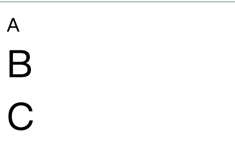

# 前端常见高频面试题

[TOC]


### 1、什么是mvvm  、 mvc 模型？


*MVC*: MVC即model-view-controller（模型-视图-控制器）是项目的一种分层架构思想，它把复杂的业务逻辑，抽离为职能单一的小模块，每个模块看似相互独立，其实又各自有相互依赖关系。它的好处是：保证了模块的智能单一性，方便程序的开发、维护、耦合度低。


mvvm: *MVVM*：MVVM即 *Model-View-ViewModel*，(模型-视图-控制器)它是一种双向数据绑定的模式，用viewModel来建立起model数据层和view视图层的连接，数据改变会影响视图，视图改变会影响数据


### 2、vue双向数据绑定的原理？

　　vue.js 是采用数据劫持结合发布者-订阅者模式的方式，通过Object.defineProperty()来劫持各个属性的setter，getter，在数据变动时发布消息给订阅者，触发相应的监听回调。

　　具体步骤：

　　第一步：需要 observe 的数据对象进行递归遍历，包括子属性对象的属性，都加上 setter 和 getter
这样的话，给这个对象的某个值赋值，就会触发setter，那么就能监听到了数据变化

　　第二步：compile解析模板指令，将模板中的变量替换成数据，然后初始化渲染页面视图，并将每个指令对应的节点绑定更新函数，添加监听数据的订阅者，一旦数据有变动，收到通知，更新视图

　　第三步：Watcher订阅者是Observer和Compile之间通信的桥梁，主要做的事情是:

　　1、在自身实例化时往属性订阅器(dep)里面添加自己

　　2、自身必须有一个update()方法

　　3、待属性变动dep.notice()通知时，能调用自身的 update() 方法，并触发Compile中绑定的回调，则功成身退。

　　第四步：MVVM作为数据绑定的入口，整合Observer、Compile和Watcher三者，通过Observer来监听自己的model数据变化，通过Compile来解析编译模板指令，最终利用Watcher搭起Observer和Compile之间的通信桥梁，达到数据变化 -> 视图更新；视图交互变化(input) -> 数据model变更的双向绑定效果。


### 3、vue的生命周期有哪些？


　vue 实例从创建到销毁的过程就是生命周期。

　　也就是从开始创建、初始化数据、编译模板、挂在 dom -> 渲染、更新 -> 渲染、准备销毁、销毁在等一系列过程

vue的声明周期常见的主要分为4大阶段8大钩子函数

另外三个生命周期函数不常用

keep-alive 主要用于保留组件状态或避免重新渲染。

activated只有在keep-alive 组件激活时调用。

deactivated只有在keep-alive 组件停用时调用。

errorCapured 当捕获一个来自子孙组件的错误时被调用。此钩子会收到三个参数：错误对象、发生错误的组件实例以及一个包含错误来源信息的字符串。此钩子可以返回 `false` 以阻止该错误继续向上传播。

一、创建前 / 后

在beforeCreate生命周期函数执行的时候，data和method 还没有初始化

在created 生命周期函数执行的时候，data和method已经初始化完成

二、渲染前/后

在beforeMount 生命周期函数执行的时候，已经编译好了模版字符串、但还没有真正渲染到页面中去

在mounted 生命周期函数执行的时候，已经渲染完，可以看到页面

三、数据更新前/后

在beforeUpdate生命周期函数执行的时候，已经可以拿到最新的数据，但还没渲染到视图中去。

在updated生命周期函数执行的时候，已经把更新后的数据渲染到视图中去了。

四、销毁前/后

在beforeDestroy 生命周期函数执行的时候，实例进入准备销毁的阶段、此时data 、methods 、指令等还是可用状态

在destroyed生命周期函数执行的时候，实例已经完成销毁、此时data 、methods 、指令等都不可用

### 4、v-if 和v-show有什么区别？

`v-if` 是“真正”的条件渲染，因为它会确保在切换过程中条件块内的事件监听器和子组件适当地被销毁和重建，操作的实际上是dom元素的创建或销毁。

v-show  就简单得多——不管初始条件是什么，元素总是会被渲染，并且只是简单地基于 CSS 进行切换 它操作的是display:none/block属性。

一般来说，`v-if` 有更高的切换开销，而 `v-show` 有更高的初始渲染开销。因此，如果需要非常频繁地切换，则使用 `v-show` 较好；如果在运行时条件很少改变，则使用 `v-if` 较好。

### 5、async    await  是什么？它有哪些作用？

async await 是es7里面的新语法、它的作用就是 async 用于申明一个 function 是异步的，而 await 用于等待一个异步方法执行完成。它可以很好的替代promise 中的then

`async`函数返回一个 Promise 对象，可以使用`then`方法添加回调函数。当函数执行的时候，一旦遇到`await`就会先返回，等到异步操作完成，再接着执行函数体内后面的语句。

### 6、常用的数组方法有哪些？

 concat()  方法用于合并两个或多个数组。此方法不会更改现有数组，而是返回一个新数组。

 `**find()**` 方法返回数组中满足提供的测试函数的第一个元素的值。否则返回 [`undefined`](https://developer.mozilla.org/zh-CN/docs/Web/JavaScript/Reference/Global_Objects/undefined)。

`**findIndex()**`方法返回数组中满足提供的测试函数的第一个元素的**索引**。否则返回-1。

`**includes()**` 方法用来判断一个数组是否包含一个指定的值，根据情况，如果包含则返回 true，否则返回false。

`**indexOf()**`方法返回在数组中可以找到一个给定元素的第一个索引，如果不存在，则返回-1。 （通常用它判断数组中有没有这个元素）

`**join()**` 方法将一个数组（或一个[类数组对象](https://developer.mozilla.org/zh-CN//docs/Web/JavaScript/Guide/Indexed_collections#Working_with_array-like_objects)）的所有元素连接成一个字符串并返回这个字符串。如果数组只有一个项目，那么将返回该项目而不使用分隔符。

`**pop()**`方法从数组中删除最后一个元素，并返回该元素的值。此方法更改数组的长度。

`**push()**` 方法将一个或多个元素添加到数组的末尾，并返回该数组的新长度。

`**shift()**` 方法从数组中删除**第一个**元素，并返回该元素的值。此方法更改数组的长度。

**unshift()** 方法将一个或多个元素添加到数组的**开头**，并返回该数组的**新长度(该**方法修改原有数组**)**。

**splice()** 方法通过删除或替换现有元素或者原地添加新的元素来修改数组,并以数组形式返回被修改的内容。此方法会改变原数组。

由被删除的元素组成的一个数组。如果只删除了一个元素，则返回只包含一个元素的数组。如果没有删除元素，则返回空数组。

`**reverse()**` 方法将数组中元素的位置颠倒，并返回该数组。该方法会改变原数组。

`**sort()**` 方法用[原地算法](https://en.wikipedia.org/wiki/In-place_algorithm)对数组的元素进行排序，并返回数组。默认排序顺序是在将元素转换为字符串，然后比较它们的UTF-16代码单元值序列时构建的

### 7、数组有哪几种循环方式？分别有什么作用？

`**every()**` 方法测试一个数组内的所有元素是否都能通过某个指定函数的测试。它返回一个布尔值。

`**filter()**` 方法创建一个新数组, 其包含通过所提供函数实现的测试的所有元素。

`**forEach()**` 方法对数组的每个元素执行一次提供的函数。

`**some()**` 方法测试是否至少有一个元素可以通过被提供的函数方法。该方法返回一个Boolean类型的值。


### 8、常用的字符串方法有哪些？

**charAt()** 方法从一个字符串中返回指定的字符。

**concat()** 方法将一个或多个字符串与原字符串连接合并，形成一个新的字符串并返回。

**includes()** 方法用于判断一个字符串是否包含在另一个字符串中，根据情况返回 true 或 false。

indexOf() 方法返回调用它的 [`String`](https://developer.mozilla.org/zh-CN/docs/Web/JavaScript/Reference/String) 对象中第一次出现的指定值的索引，从 `fromIndex` 处进行搜索。如果未找到该值，则返回 -1。

**match()** 方法检索返回一个字符串匹配正则表达式的的结果。

**padStart()** 方法用另一个字符串填充当前字符串(重复，如果需要的话)，以便产生的字符串达到给定的长度。填充从当前字符串的开始(左侧)应用的。 (常用于时间补0)

**replace()** 方法返回一个由替换值（`replacement`）替换一些或所有匹配的模式（`pattern`）后的新字符串。模式可以是一个字符串或者一个[正则表达式](https://developer.mozilla.org/zh-CN/docs/Web/JavaScript/Reference/RegExp)，替换值可以是一个字符串或者一个每次匹配都要调用的回调函数。

原字符串不会改变。

**slice()** 方法提取某个字符串的一部分，并返回一个新的字符串，且不会改动原字符串。

`**split()** `方法使用指定的分隔符字符串将一个[`String`](https://developer.mozilla.org/zh-CN/docs/Web/JavaScript/Reference/String)对象分割成字符串数组，以将字符串分隔为子字符串，以确定每个拆分的位置。

`**substr()**` 方法返回一个字符串中从指定位置开始到指定字符数的字符。

**trim()** 方法会从一个字符串的两端删除空白字符。在这个上下文中的空白字符是所有的空白字符 (space, tab, no-break space 等) 以及所有行终止符字符（如 LF，CR）。

### 9、什么是原型链？

每一个实例对象上有一个__proto__属性，指向的构造函数的原型对象，构造函数的原型

对象也是一个对象，也有**proto**属性，这样一层一层往上找的过程就形成了原型链。

### 10、什么是闭包？手写一个闭包函数？ 闭包有哪些优缺点？

闭包（closure）指有权访问另一个函数作用域中变量的函数。简单理解就是 ，一个作用

域可以访问另外一个函数内部的局部变量。

```javascript
function fn() {
    var num = 10;
    function fun() {
        console.log(num);
    }
    return fun;
}
var f = fn();
f();
```

作用：延长变量作用域、在函数的外部可以访问函数内部的局部变量，容易造成内层泄露，因为闭包中的局部变量永远不会被回收

### 11、常见的继承有哪些？

**一、原型链继承**

特点：1、实例可继承的属性有：实例的构造函数的属性，父类构造函数属性，父类原型的属性。（新实例不会继承父类实例的属性！

缺点：1、新实例无法向父类构造函数传参。

　　　2、继承单一。

　　　3、所有新实例都会共享父类实例的属性。（原型上的属性是共享的，一个实例修改了原型属性，另一个实例的原   型属性也会被修改！）

**二、借用构造函数继承**

重点：用.call()和.apply()将父类构造函数引入子类函数（在子类函数中做了父类函数的自执行（复制））

　　　　特点：1、只继承了父类构造函数的属性，没有继承父类原型的属性。

　　　　　　　2、解决了原型链继承缺点1、2、3。

　　　　　　　3、可以继承多个构造函数属性（call多个）。

　　　　　　　4、在子实例中可向父实例传参。

　　　　缺点：1、只能继承父类构造函数的属性。

　　　　　　　2、无法实现构造函数的复用。（每次用每次都要重新调用）

　　　　　　　3、每个新实例都有父类构造函数的副本，臃肿。

**三、组合继承（组合原型链继承和借用构造函数继承）（常用）**

重点：**结合了两种模式的优点，传参和复用**

　　　　特点：1、可以继承父类原型上的属性，可以传参，可复用。

　　　　　　　2、每个新实例引入的构造函数属性是私有的。

　　　　缺点：调用了两次父类构造函数（耗内存），子类的构造函数会代替原型上的那个父类构造函数。

**四、原型式继承**

重点：用一个函数包装一个对象，然后返回这个函数的调用，这个函数就变成了个可以随意增添属性的实例或对象。object.create()就是这个原理。

　　　　特点：类似于复制一个对象，用函数来包装。

　　　　缺点：1、所有实例都会继承原型上的属性。

　　　　　　　2、无法实现复用。（新实例属性都是后面添加的）

**五、class类实现继承**

通过extends 和super 实现继承

**六、寄生式继承**

重点：就是给原型式继承外面套了个壳子。

　　　　优点：没有创建自定义类型，因为只是套了个壳子返回对象（这个），这个函数顺理成章就成了创建的新对象。

　　　　缺点：没用到原型，无法复用。

### 12、后台管理系统中的权限管理是怎么实现的？

登录：当用户填写完账号和密码后向服务端验证是否正确，验证通过之后，服务端会返回一个**token**，拿到token之后（我会将这个token存贮到cookie中，保证刷新页面后能记住用户登录状态），前端会根据token再去拉取一个 **user_info** 的接口来获取用户的详细信息（如用户权限，用户名等等信息）。

权限验证：通过token获取用户对应的 权限，动态根据用户的 权限算出其对应有权限的路由，通过 **router.addRoutes** 动态挂载这些路由。

具体思路：

登录成功后，服务端会返回一个 **token**（该token的是一个能唯一标示用户身份的一个key），之后我们将token存储在本地cookie之中，这样下次打开页面或者刷新页面的时候能记住用户的登录状态，不用再去登录页面重新登录了。

ps:为了保证安全性，我司现在后台所有token有效期(Expires/Max-Age)都是Session，就是当浏览器关闭了就丢失了。重新打开游览器都需要重新登录验证，后端也会在每周固定一个时间点重新刷新token，让后台用户全部重新登录一次，确保后台用户不会因为电脑遗失或者其它原因被人随意使用账号。

用户登录成功之后，我们会在全局钩子`router.beforeEach`中拦截路由，判断是否已获得token，在获得token之后我们就要去获取用户的基本信息了

页面会先从 cookie 中查看是否存有 token，没有，就走一遍上一部分的流程重新登录，如果有token,就会把这个 token 返给后端去拉取user_info，保证用户信息是最新的。 当然如果是做了单点登录得功能的话，用户信息存储在本地也是可以的。当你一台电脑登录时，另一台会被提下线，所以总会重新登录获取最新的内容。

先说一说我权限控制的主体思路，前端会有一份路由表，它表示了每一个路由可访问的权限。当用户登录之后，通过 **token** 获取用户的 **role** ，动态根据用户的 **role** 算出其对应有权限的路由，再通过`router.addRoutes`动态挂载路由。但这些控制都只是页面级的，说白了前端再怎么做权限控制都不是绝对安全的，后端的权限验证是逃不掉的。

我司现在就是前端来控制页面级的权限，不同权限的用户显示不同的侧边栏和限制其所能进入的页面(也做了少许按钮级别的权限控制)，后端则会验证每一个涉及请求的操作，验证其是否有该操作的权限，每一个后台的请求不管是 get 还是 post 都会让前端在请求 `header`里面携带用户的 **token**，后端会根据该 **token** 来验证用户是否有权限执行该操作。若没有权限则抛出一个对应的状态码，前端检测到该状态码，做出相对应的操作。

使用vuex管理路由表，根据vuex中可访问的路由渲染侧边栏组件。

具体实现：

创建vue实例的时候将vue-router挂载，但这个时候vue-router挂载一些登录或者不用权限的公用的页面。

当用户登录后，获取用role，将role和路由表每个页面的需要的权限作比较，生成最终用户可访问的路由表。

调用router.addRoutes(store.getters.addRouters)添加用户可访问的路由。

使用vuex管理路由表，根据vuex中可访问的路由渲染侧边栏组件。


### 14、es6有哪些新特性？

ES6是2015年推出的一个新的版本、这个版本相对于ES5的语法做了很多的优化、例如：新增了let、const

let和const具有块级作用域，不存在变量提升的问题。新增了箭头函数，简化了定义函数的写法，同时可以巧用箭头函数的this、（注意箭头函数本身没有this,它的this取决于外部的环境），新增了promise解决了回调地域的问题，新增了模块化、利用import 、export来实现导入、导出。新增了结构赋值，ES6 允许按照一定模式，从数组和对象中提取值，对变量进行赋值，这被称为解构（Destructuring）。新增了class类的概念，它类似于对象。

### 15、v-for 循环为什么一定要绑定key ?

页面上的标签都对应具体的虚拟dom对象(虚拟dom就是js对象), 循环中 ,如果没有唯一key , 页面上删除一条标签, 由于并不知道删除的是那一条! 所以要把全部虚拟dom重新渲染, 如果知道key为x标签被删除掉, 只需要把渲染的dom为x的标签去掉即可!

### 16、组件中的data为什么要定义成一个函数而不是一个对象？

每个组件都是 Vue 的实例。组件共享 data 属性，当 data 的值是同一个引用类型的值时，改变其中一个会影响其他

### 17、常见的盒子垂直居中的方法有哪些请举例3种？

利用子绝父相定位的方式来实现

```css
#container{
    width:500px;
    height:500px;
    position:relative;
}
#center{
    width:100px;
    hight:100px;
     position: absolute;
     top: 50%;
     left: 50%;
    margin-top:-50px;
    margin-left:-50px;

}
```

利用Css3的transform，可以轻松的在未知元素的高宽的情况下实现元素的垂直居中。

```css
#container{
    position:relative;
}
#center{
    position: absolute;
    top: 50%;
    left: 50%;
    transform: translate(-50%, -50%);
}
```


flex

```css
#container{
    display:flex;
    justify-content:center;
    align-items: center;
}

#center{

}
```

### 18、平时都是用什么实现跨域的？

jsonp: 利用 `<script>` 标签没有跨域限制的漏洞，网页可以得到从其他来源动态产生的 JSON 数据。JSONP请求一定需要对方的服务器做支持才可以。

JSONP优点是简单兼容性好，可用于解决主流浏览器的跨域数据访问的问题。缺点是仅支持get方法具有局限性,不安全可能会遭受XSS攻击。

声明一个回调函数，其函数名(如show)当做参数值，要传递给跨域请求数据的服务器，函数形参为要获取目标数据(服务器返回的data)。

创建一个`<script>`标签，把那个跨域的API数据接口地址，赋值给`<script>`的src,还要在这个地址中向服务器传递该函数名（可以通过问号传参:?callback=show）。

服务器接收到请求后，需要进行特殊的处理：把传递进来的函数名和它需要给你的数据拼接成一个字符串,例如：传递进去的函数名是show，它准备好的数据是`show('我不爱你')`。

最后服务器把准备的数据通过HTTP协议返回给客户端，客户端再调用执行之前声明的回调函数（show），对返回的数据进行操作。

CORS：跨域资源共享（CORS）是一种机制；当一个资源访问到另外一个资源(这个资源放在

不同的域名或者不同的协议或者端口)，资源就会发起一个跨域的HTTP请求需要浏览器和服务器同时支持；

1. 整个CORS通信，都是浏览器自动完成。浏览器发现了AJAX请求跨源，就会自动添加一些附加的头信息，有时还会多出一次附加的请求，但用户不会有感觉；
2. 实现CORS的关键是服务器，只要服务器实现了CORS接口，就可以跨源通信
3. 服务器对于不同的请求，处理方式不一样； 有简单请求和非简单请求

### 19、cookie 、localstorage 、 sessionstrorage 之间有什么区别？

- 与服务器交互：
  - cookie 是网站为了标示用户身份而储存在用户本地终端上的数据（通常经过加密）
  - cookie 始终会在同源 http 请求头中携带（即使不需要），在浏览器和服务器间来回传递
  - sessionStorage 和 localStorage 不会自动把数据发给服务器，仅在本地保存
- 存储大小：
- cookie 数据根据不同浏览器限制，大小一般不能超过 4k
- sessionStorage 和 localStorage 虽然也有存储大小的限制，但比cookie大得多，可以达到5M或更大
- 有期时间：
  - localStorage 存储持久数据，浏览器关闭后数据不丢失除非主动删除数据
  - sessionStorage 数据在当前浏览器窗口关闭后自动删除
  - cookie 设置的cookie过期时间之前一直有效，与浏览器是否关闭无关

### 20、this 的指向有哪些？

1、普通函数中的this指向window

2、定时器中的this指向window

3、箭头函数没有this,它的this指向取决于外部环境、

4、事件中的this指向事件的调用者

5、 构造函数中this和原型对象中的this,都是指向构造函数new 出来实例对象

6、类 class中的this  指向由constructor构造器new出来的实例对象

7、自调用函数中的this  指向window


### 21、什么是递归，递归有哪些优点或缺点？

递归：如果一个函数在内部可以调用其本身，那么这个函数就是递归函数。简单理解:函

数内部自己调用自己, 这个函数就是递归函数

优点：结构清晰、可读性强

缺点：效率低、调用栈可能会溢出，其实每一次函数调用会在内存栈中分配空间，而每个进程的栈的容量是有限的，当调用的层次太多时，就会超出栈的容量，从而导致栈溢出。->性能

### 22、谈谈你平时都用了哪些方法进行性能优化？

减少http请求次数、打包压缩上线代码、使用懒加载、使用雪碧图、动态渲染组件、CDN加载包。

### 23、vue实例是挂载到那个标签上的？

vue实例最后会挂载在body标签里面，所以我们在vue中是获取不了body 标签的，如果要使用body标签的话需要用原生的方式获取

### 24、什么是深拷贝、什么是浅拷贝？

浅拷贝：创建一个新对象，这个对象有着原始对象属性值的一份精确拷贝。如果属性是基本类型，拷贝的就是基本类型的值，如果属性是引用类型，拷贝的就是内存地址 ，所以如果其中一个对象改变了这个地址，就会影响到另一个对象。

深拷贝会拷贝所有的属性，并拷贝属性指向的动态分配的内存。当对象和它所引用的对象一起拷贝时即发生深拷贝。深拷贝相比于浅拷贝速度较慢并且花销较大。拷贝前后两个对象互不影响。

### 25、js的执行机制是怎么样的？

js是一个单线程、异步、非阻塞I/O模型、 event loop事件循环的执行机制

所有任务可以分成两种，一种是同步任务（synchronous），另一种是异步任务（asynchronous）。同步任务指的是，在主线程上排队执行的任务，只有前一个任务执行完毕，才能执行后一个任务。异步任务指的是，不进入主线程、而进入"任务队列"（task queue）的任务，只有"任务队列"通知主线程，某个异步任务可以执行了，该任务才会进入主线程执行。


### 26、请写至少三种数组去重的方法？（原生js）

```javascript
//利用filter
function unique(arr) {
  return arr.filter(function(item, index, arr) {
    //当前元素，在原始数组中的第一个索引==当前索引值，否则返回当前元素
    return arr.indexOf(item, 0) === index;
  });
}
    var arr = [1,1,'true','true',true,true,15,15,false,false, undefined,undefined, null,null, NaN, NaN,'NaN', 0, 0, 'a', 'a',{},{}];
        console.log(unique(arr))
```

```javascript
//利用ES6 Set去重（ES6中最常用）
function unique (arr) {
  return Array.from(new Set(arr))
}
var arr = [1,1,'true','true',true,true,15,15,false,false, undefined,undefined, null,null, NaN, NaN,'NaN', 0, 0, 'a', 'a',{},{}];
console.log(unique(arr))
 //[1, "true", true, 15, false, undefined, null, NaN, "NaN", 0, "a", {}, {}]
```

```javascript
//利用for嵌套for，然后splice去重（ES5中最常用）
function unique(arr){
        for(var i=0; i<arr.length; i++){
            for(var j=i+1; j<arr.length; j++){
                if(arr[i]==arr[j]){         //第一个等同于第二个，splice方法删除第二个
                    arr.splice(j,1);
                    j--;
                }
            }
        }
return arr;
}
var arr = [1,1,'true','true',true,true,15,15,false,false, undefined,undefined, null,null, NaN, NaN,'NaN', 0, 0, 'a', 'a',{},{}];
    console.log(unique(arr))
    //[1, "true", 15, false, undefined, NaN, NaN, "NaN", "a", {…}, {…}]     //NaN和{}没有去重，两个null直接消失了
```


### 27、请写出至少两种常见的数组排序的方法（原生js）

```javascript
//快速排序
function quickSort(elements){
    if(elements.length <=1){
      return elements;
    }
  var pivotIndex=Math.floor(elements.length / 2);
  var pivot=elements.splice(pivotIndex,1)[0];
  var left=[];
  var right=[];
  for(var i=0;i<elements.length;i++){
    if(elements[i] < pivot){
        left.push(elements[i]);
    }else{
       right.push(elements[i]);
    }
  }
return  quickSort(left).concat([pivot],quickSort(right));
//concat()方法用于连接两个或者多个数组；该方法不会改变现有的数组，而仅仅会返回被连接数组的一个副本。
};
var elements=[3,5,6,8,2,4,7,9,1,10];
document.write(quickSort(elements));

```

```javascript
//插入排序
function sort(elements){
    // 假设第0个元素是一个有序数列，第1个以后的是无序数列，
    // 所以从第1个元素开始将无序数列的元素插入到有序数列中去
    for (var i =1; i<=elements.length; i++) {
        // 升序
        if(elements[i] < elements[i-1]){
            // 取出无序数列中的第i个作为被插入元素
            var guard=elements[i];
            //记住有序数列的最后一个位置，并且将有序数列的位置扩大一个
            var j=i-1;
            elements[i]=elements[j];
            // 比大小;找到被插入元素所在位置
            while (j>=0 && guard <elements[j]) {
                elements[j+1]=elements[j];
                j--;
            }
            elements[j+1]=guard; //插入
        }
    }
}
var elements=[3,5,6,8,2,4,7,9,1,10];
document.write('没调用之前：'+elements);
document.write('<br>');
sort(elements);
document.write('被调用之后：'+elements);
```

```javascript
//冒泡排序
function sort(elements){
    for(var i=0;i<elements.length-1;i++){
       for(var j=0;j<elements.length-1-i;j++){
          if(elements[j] > elements[j+1]){
               var  swap=elements[j];
               elements[j]=elements[j+1];
               elements[j+1]=swap;
          }
       }
    }
}
var elements=[3,5,6,8,2,4,7,9,1,10];
console.log('before'+elements);
sort(elements);
console.log('after'+elements);
```


### 28、知道lodash吗？它有哪些常见的API   ？

Lodash是一个一致性、模块化、高性能的 JavaScript 实用工具库。

​     _.cloneDeep     深度拷贝

_.reject    根据条件去除某个元素。

_.drop(array, [n=1] )   作用：将 `array` 中的前 `n` 个元素去掉，然后返回剩余的部分.

### 29、http的请求方式有哪些？

get、post、put、delete等

### 30、平时都是用那些工具进行打包的？babel是什么？

WebPack 是一个模块打包工具，你可以使用WebPack管理你的模块依赖，并编绎输出模块们所需的静态文件。它能够很好地管理、打包Web开发中所用到的HTML、Javascript、CSS以及各种静态文件（图片、字体等），让开发过程更加高效。对于不同类型的资源，webpack有对应的模块加载器。webpack模块打包器会分析模块间的依赖关系，最后 生成了优化且合并后的静态资源

babel可以帮助我们转换一些当前浏览器不支持的语法，它会把这些语法转换为低版本的语法以便浏览器识别。

### 31、谈谈set 、 map 是什么？

set 是es6 提供的一种新的数据结构，它类似于数组，但是成员的值都是唯一的。

map 是es6 提供的一种新的数据结构,它类似于对象，也是键值对的集合，但是键的范围不仅限于字符串，各种类型的值都可以当做键。也就是说，Object 结构提供了“字符串—值”的对应，Map 结构提供了“值—值”的对应，是一种更完善的 Hash 结构实现。如果你需要“键值对”的数据结构，Map 比 Object 更合适。

### 32、清除浮动的方法有哪些？

为什么要清除浮动，因为浮动的盒子脱离标准流，如果父盒子没有设置高度的话，下面的盒子就会撑上来。

1.额外标签法（在最后一个浮动标签后，新加一个标签，给其设置clear：both；）（不推荐）

2.父级添加overflow属性（父元素添加overflow:hidden）（不推荐）

3.使用after伪元素清除浮动（推荐使用）

```css
    .clearfix:after{/*伪元素是行内元素 正常浏览器清除浮动方法*/
        content: "";
        display: block;
        height: 0;
        clear:both;
        visibility: hidden;
    }
    .clearfix{
        *zoom: 1;/*ie6清除浮动的方式 *号只有IE6-IE7执行，其他浏览器不执行*/
｝
```

4.使用before和after双伪元素清除浮动

```css
 .clearfix:after,.clearfix:before{
        content: "";
        display: table;
    }
    .clearfix:after{
        clear: both;
    }
    .clearfix{
        *zoom: 1;
    }

```


### 33、常见的布局方法有哪些？他们的优缺点是什么？

页面布局常用的方法有浮动、定位、flex、grid网格布局、栅格系统布局

浮动：

- 优点：兼容性好。
- 缺点：浮动会脱离标准文档流，因此要清除浮动。我们解决好这个问题即可。

绝对定位

- 优点：快捷。
- 缺点：导致子元素也脱离了标准文档流，可实用性差。

flex 布局（CSS3中出现的）

- 优点：解决上面两个方法的不足，flex布局比较完美。移动端基本用 flex布局。

网格布局（grid）

- CSS3中引入的布局，很好用。代码量简化了很多。

利用网格布局实现的一个左右300px中间自适应的布局

```html
<!DOCTYPE html>
<html lang="en">
<head>
    <meta charset="UTF-8">
    <title>Document</title>
    <style>
        html * {
            padding: 0;
            margin: 0;
        }
        /* 重要：设置容器为网格布局，宽度为100% */
        .layout.grid .left-center-right {
            display: grid;
            width: 100%;
            grid-template-rows: 100px;
            grid-template-columns: 300px auto 300px;  /* 重要：设置网格为三列，并设置每列的宽度。即可。*/
        }
        .layout.grid .left {
            background: red;
        }
        .layout.grid .center {
            background: green;
        }
        .layout.grid .right {
            background: blue;
        }
    </style>
</head>
<body>
    <section class="layout grid">
        <article class="left-center-right">
            <div class="left">
                我是 left
            </div>
            <div class="center">
                <h1>网格布局解决方案</h1>
                我是 center
            </div>
            <div class="right">
                我是 right
            </div>
        </article>
    </section>
</body>
</html>
```

栅格系统布局

​    优点：可以适用于多端设备

### 34、图片懒加载是怎么实现的？

就是我们先设置图片的data-set属性（当然也可以是其他任意的，只要不会发送http请求就行了，作用就是为了存取值）值为其图片路径，由于不是src，所以不会发送http请求。 然后我们计算出页面scrollTop的高度和浏览器的高度之和， 如果图片距离页面顶端的坐标Y（相对于整个页面，而不是浏览器窗口）小于前两者之和，就说明图片就要显示出来了（合适的时机，当然也可以是其他情况），这时候我们再将 data-set 属性替换为 src 属性即可。

### 35、vue中computed 和watch 的区别是什么？

computed计算属性就是为了简化template里面模版字符串的计算复杂度、防止模版太过冗余。它具有缓存特性

computed用来监控自己定义的变量，该变量不在data里面声明，直接在computed里面定义，然后就可以在页面上进行双向数据绑定展示出结果或者用作其他处理；

​    watch主要用于监控vue实例的变化，它监控的变量当然必须在data里面声明才可以，它可以监控一个变量，也可以是一个对象，一般用于监控路由、input输入框的值特殊处理等等，它比较适合的场景是一个数据影响多个数据，它不具有缓存性

- watch：监测的是属性值， 只要属性值发生变化，其都会触发执行回调函数来执行一系列操作。
- computed：监测的是依赖值，依赖值不变的情况下其会直接读取缓存进行复用，变化的情况下才会重新计算。

除此之外，有点很重要的区别是：**计算属性不能执行异步任务，计算属性必须同步执行**。也就是说计算属性不能向服务器请求或者执行异步任务。如果遇到异步任务，就交给侦听属性。watch也可以检测computed属性。

### 36、vue中是怎么实现父向子、子向父、兄弟之间的传值的？

父向子传值主要通过的是props属性来传值，props只读

```html
<!DOCTYPE html>
<html lang="en">
<head>
    <meta charset="UTF-8">
    <meta name="viewport" content="width=device-width, initial-scale=1.0">
    <meta http-equiv="X-UA-Compatible" content="ie=edge">
    <title>父组件向子组件传值--props</title>
    <script src="./js/vue.min.js"></script>
</head>
<body>
    <div id="app">
        <menu-item title="来自父组件的值"></menu-item>
  <!--   在子组件身上绑定自定义属性来接收父组件data中的数据 -->
        <menu-item :tit="title"></menu-item>
    </div>
    <script>
Vue.component('menu-item',{
    props:['tit'],  //props用来接收父组件传过来的值
    //在props中使用驼峰形式，模版中要改为使用短横线拼接  props里面的值只读，不能修改
    //props是单向数据流
    data(){
        return{
        }
    },
    template:'<div>{{tit}}</div>'
})
        var vm=new Vue({
           el:'#app',
           data:{
              title:'我是父组件中的数据'
           },
           methods:{
           }
        });
    </script>
</body>
</html>
```

子向父传值   $emit

```html
<!DOCTYPE html>
<html lang="en">
<head>
  <meta charset="UTF-8">
  <title>Document</title>
</head>
<body>
  <div id="app">
    <!--   父组件 -->
    <div :style='{fontSize:fontSize+"px"}'>{{pmsg}}</div>
   <!--  子组件 -->
    <menu-item :parr="parr" @aas="blune"></menu-item>
  </div>
  <script type="text/javascript" src="js/vue.js"></script>
  <script type="text/javascript">
    /*
      子组件向父组件传值-基本用法
      props传递数据原则：单向数据流
    */
    Vue.component('menu-item', {
     props:['parr'],
     data(){
           return {
               msg1:'这是子组件传递过来的值'
           }
        },
      template: `
        <div>
          <ul>
            <li v-for="(item,index) in parr" :key="index">{{item}}</li>
          </ul>
          <button @click='dd'>扩大父组件中字体大小</button>
        </div>
      `,
      methods:{
          dd(){
           this.$emit("aas",this.msg1)
          }
      }
    });
 //$emit
    var vm = new Vue({
      el: '#app',
      data: {
        pmsg: '父组件中内容',
        parr: ['apple','orange','banana'],
        fontSize: 10
      },
      methods: {
        blune(message){
            this.fontSize+=5;
            console.log(message);
        }
      }
    });
  </script>
</body>
</html>
```

兄弟组件传值   事件总线

```html
<!DOCTYPE html>
<html lang="en">
<head>
    <meta charset="UTF-8">
    <meta name="viewport" content="width=device-width, initial-scale=1.0">
    <meta http-equiv="X-UA-Compatible" content="ie=edge">
    <title>Document</title>
    <script src="./js/vue.min.js"></script>
</head>
<body>
    <div id="app">
        <brother></brother>
        <sister></sister>
    </div>
    <script>
        var enveBus = new Vue();
        Vue.component('brother', {
            data() {
                return {
                    kk: ''
                }
            },
            methods: {
                dd() {
                    enveBus.$emit("bTs", '这是哥哥给妹妹的爱')
                }
            },
            template: `
        <div>
          <button @click='dd'>这是一个哥哥组件---{{kk}}</button>
        </div>
      `,
            mounted() {
                enveBus.$on('asd', (result) => {
                    this.kk = result;
                })
            }
        });
        Vue.component('sister', {
            data() {
                return {
                    sis: ''
                }
            },
            template: `
   <div>
     <button @click="cc">这是一个妹妹组件---{{sis}}</button>
   </div>
 `,
            mounted() {
                enveBus.$on('bTs', (message) => {
                    this.sis = message
                })
            },
            methods: {
                cc() {
                    enveBus.$emit('asd', '这是妹妹对哥哥的爱');
                }
            }
        });
        var vm = new Vue({
            el: '#app',
            data: {
            },
            methods: {
            }
        });
    </script>
</body>
</html>
```


### 37、什么vuex ,谈谈你对它的理解？

1. 首先vuex的出现是为了解决web组件化开发的过程中，各组件之间传值的复杂和混乱的问题
2. 将我们在多个组件中需要共享的数据放到store中，
3. 要获取或格式化数据需要使用getters，
4. 改变store中的数据，使用mutation，但是只能包含同步的操作，在具体组件里面调用的方式`this.$store.commit('xxxx')`
5. Action也是改变store中的数据，不过是提交的mutation，并且可以包含异步操作，在组件中的调用方式`this.$store.dispatch('xxx')`； 在actions里面使用的commit('调用mutation')

### 38、数据类型的判断有哪些方法？他们的优缺点及区别是什么？

然后判断数据类型的方法一般可以通过：typeof、instanceof、constructor、toString四种常用方法

| 不同类型的优缺点 | typeof                       | instanceof                         | constructor                                 | Object.prototype.toString.call   |
| ---------------- | ---------------------------- | ---------------------------------- | ------------------------------------------- | -------------------------------- |
| 优点             | 使用简单                     | 能检测出引用类型                   | 基本能检测所有的类型（除了null和undefined） | 检测出所有的类型                 |
| 缺点             | 只能检测出基本类型（出null） | 不能检测出基本类型，且不能跨iframe | constructor易被修改，也不能跨iframe         | IE6下，undefined和null均为Object |

### 39、知道symbol 吗？

ES6 引入新的原始数据类型Symbol，表示独一无二的值

### 40、请描述一下ES6中的class类?

es6中的class可以把它看成是es5中构造函数的语法糖，它简化了构造函数的写法， 类的共有属性放到 constructor 里面

1. 通过class 关键字创建类, 类名我们还是习惯性定义首字母大写
2. 类里面有个constructor 函数,可以接受传递过来的参数,同时返回实例对象
3. constructor 函数 只要 new 生成实例时,就会自动调用这个函数, 如果我们不写这个函数,类也会自动生成这个函数
4. 多个函数方法之间不需要添加逗号分隔
5. 生成实例 new 不能省略
6. 语法规范, 创建类 类名后面不要加小括号,生成实例 类名后面加小括号, 构造函数不需要加function
   1. 继承中,如果实例化子类输出一个方法,先看子类有没有这个方法,如果有就先执行子类的
   2. 继承中,如果子类里面没有,就去查找父类有没有这个方法,如果有,就执行父类的这个方法(就近原则)
   3. 如果子类想要继承父类的方法,同时在自己内部扩展自己的方法,利用super 调用 父类的构造函数,super 必须在子类this之前调用
7. 时刻注意this的指向问题,类里面的共有的属性和方法一定要加this使用.
   1. constructor中的this指向的是new出来的实例对象
   2. 自定义的方法,一般也指向的new出来的实例对象
   3. 绑定事件之后this指向的就是触发事件的事件源
   4. 在 ES6 中类没有变量提升，所以必须先定义类，才能通过类实例化对象

### 41、谈谈盒子模型？

在**标准盒子模型**中，**width 和 height 指的是内容区域**的宽度和高度。增加内边距、边框和外边距不会影响内容区域的尺寸，但是会增加元素框的总尺寸。

**IE盒子模型**中，**width 和 height 指的是内容区域+border+padding**的宽度和高度。

### 42、promise是什么？它有哪些作用？

> Promise 是异步编程的一种解决方案.简单说就是一个容器，里面保存着某个未来才会结束的事件（通常是一个异步操作）的结果。从语法上说，Promise 是一个对象，可以从改对象获取异步操作的消息。
>
> 它可以解决回调地狱的问题，也就是异步深层嵌套问题
>
> ##### .catch()
>
> - 获取异常信息
>
> ##### .finally()
>
> - 成功与否都会执行（不是正式标准）
>
> ```javascript
> /*
>      1. Promise基本使用
>      我们使用new来构建一个Promise  Promise的构造函数接收一个参数，是函数，并且传入两个参数：		   resolve，reject， 分别表示异步操作执行成功后的回调函数和异步操作执行失败后的回调函数
> */
>
>
> var p = new Promise(function(resolve, reject){
> //2. 这里用于实现异步任务  setTimeout
> setTimeout(function(){
>   var flag = false;
>   if(flag) {
>     //3. 正常情况
>     resolve('hello');
>   }else{
>     //4. 异常情况
>     reject('出错了');
>   }
> }, 100);
> });
> //  5 Promise实例生成以后，可以用then方法指定resolved状态和reject状态的回调函数
> //  在then方法中，你也可以直接return数据而不是Promise对象，在后面的then中就可以接收到数据了
> p.then(function(data){
> console.log(data)
> },function(info){
> console.log(info)
> });
> ```
>
>

###43、vue-cli  2.0和3.0 有什么区别？

3.0 把配置webpack的文件隐藏了，如果需要配置它需要创建一个vue.config.js文件，3.0 是2018.10月出来的

### 44、箭头函数有哪些特征，请简单描述一下它？

箭头函数没有自己的this，this指向**定义**箭头函数时所处的**外部执行环境**的this

即时调用call/apply/bind也无法改变箭头函数的this

箭头函数本身没有名字

箭头函数不能new，**会报错**

箭头函数没有arguments，在箭头函数内访问这个变量访问的是**外部执行环境**的arguments

箭头函数没有prototype

### 45、移动端有哪些常见的问题，都是怎么解决的？

点击事件300MS延迟问题  解决方案：下载fastclick的包

 **H5页面窗口自动调整到设备宽度，并禁止用户缩放页面**

```html
<meta name="viewport" content="width=device-width,initial-scale=1.0,minimum-scale=1.0,maximum-scale=1.0,user-scalable=no"> 
```

**忽略Android平台中对邮箱地址的识别**

```html
<meta name="format-detection" content="email=no">
```

**当网站添加到主屏幕快速启动方式，可隐藏地址栏，仅针对ios的safari**

```html
<!-- ios7.0版本以后，safari上已看不到效果 -->

<meta name="apple-mobile-web-app-capable" content="yes">
```

### 46、post和get 请求有哪些区别？

GET：一般用于信息获取，使用URL传递参数，对所发送信息的数量也有限制，一般在2000个字符

POST：一般用于修改服务器上的资源，对所发送的信息没有限制。

GET方式需要使用Request.QueryString来取得变量的值，而POST方式通过Request.Form来获取变量的值，也就是说Get是通过地址栏来传值，而Post是通过提交表单来传值。

然而，在以下情况中，请使用 POST 请求：

无法使用缓存文件（更新服务器上的文件或数据库）

向服务器发送大量数据（POST 没有数据量限制）

发送包含未知字符的用户输入时，POST 比 GET 更稳定也更可靠

### 47、什么是同源策略？

所谓同源策略是浏览器的一种安全机制，来限制不同源的网站不能通信。同源就是域名、协议、端口一致。

### 48、http状态码分别代表什么意思？

1xx	表示HTTP请求已经接受，继续处理请求
2xx	表示HTTP请求已经处理完成(200)
3xx	表示把请求访问的URL重定向到其他目录(304资源没有发生变化，会重定向到本地资源)
4xx	表示客户端出现错误(403禁止访问、404资源不存在)
5xx	表示服务端出现错误

### 49、BFC是什么？

BFC（块级格式化上下文），一个创建了新的BFC的盒子是独立布局的，盒子内元素的布局不会影响盒子外面的元素。在同一个BFC中的两个相邻的盒子在垂直方向发生margin重叠的问题。

BFC是值浏览器中创建了一个独立的渲染区域，该区域内所有元素的布局不会影响到区域外元素的布局，这个渲染区域只对块级元素起作用

### 50、token是什么？（加密）

1. token也可以称做令牌，一般由 `uid+time+sign(签名)+[固定参数]` 组成

   ```
   uid: 用户唯一身份标识
   time: 当前时间的时间戳
   sign: 签名, 使用 hash/encrypt 压缩成定长的十六进制字符串，以防止第三方恶意拼接
   固定参数(可选): 将一些常用的固定参数加入到 token 中是为了避免重复查库
   ```

2. token在客户端一般存放于localStorage，cookie，或sessionStorage中。在服务器一般存于数据库中

3. token 的认证流程

   ```
   用户登录，成功后服务器返回Token给客户端。
   客户端收到数据后保存在客户端
   客户端再次访问服务器，将token放入headers中 或者每次的请求 参数中
   服务器端采用filter过滤器校验。校验成功则返回请求数据，校验失败则返回错误码
   ```

4. token可以抵抗csrf，cookie+session不行

5. session时有状态的，一般存于服务器内存或硬盘中，当服务器采用分布式或集群时，session就会面对负载均衡问题。负载均衡多服务器的情况，不好确认当前用户是否登录，因为多服务器不共享session

6. 客户端登陆传递信息给服务端，服务端收到后把用户信息加密（token）传给客户端，客户端将token存放于localStroage等容器中。客户端每次访问都传递token，服务端解密token，就知道这个用户是谁了。通过cpu加解密，服务端就不需要存储session占用存储空间，就很好的解决负载均衡多服务器的问题了。这个方法叫做JWT(Json Web Token)

### 51、js的数据类型有哪些？

js的数据类型分为基本数据类型（string、number、boolean、null、undefined、symbol）和复杂数据类型

基本数据类型的特点：直接存储在栈中的数据

复杂数据类型的特点：存储的是该对象在栈中引用，真实的数据存放在堆内存里

### 52、**一个页面从输入 URL 到页面加载显示完成，这个过程中都发生了什么？**

01.浏览器查找域名对应的IP地址(DNS 查询：浏览器缓存->系统缓存->路由器缓存->ISP DNS 缓存->根域名服务器)

02.浏览器向 Web 服务器发送一个 HTTP 请求（TCP三次握手）

03.服务器 301 重定向（从 [http://example.com](http://example.com/) 重定向到 [http://www.example.com）](http://www.example.com%29/)

04.浏览器跟踪重定向地址，请求另一个带 www 的网址

05.服务器处理请求（通过路由读取资源）

06.服务器返回一个 HTTP 响应（报头中把 Content-type 设置为 'text/html'）

07.浏览器进 DOM 树构建

08.浏览器发送请求获取嵌在 HTML 中的资源（如图片、音频、视频、CSS、JS等）

09.浏览器显示完成页面

10.浏览器发送异步请求

### 53、安全问题 ：CSRF 和 XSS攻击？

`CSRF`（`Cross-site request forgery`）：**跨站请求伪造**。

**方法一、Token 验证：**（用的最多）

1. 服务器发送给客户端一个`token`；
2. 客户端提交的表单中带着这个`token`。
3. 如果这个 `token` 不合法，那么服务器拒绝这个请求。

**方法二：隐藏令牌：**

把 `token` 隐藏在 `http` 的 `head`头中。

方法二和方法一有点像，本质上没有太大区别，只是使用方式上有区别。

> **方法三、Referer 验证：**

`Referer` 指的是页面请求来源。意思是，**只接受本站的请求，服务器才做响应**；如果不是，就拦截

XSS（Cross Site Scripting）``：**跨域脚本攻击**。

**1. 编码**：

对用户输入的数据进行`HTML Entity`编码。

如上图所示，把字符转换成 转义字符。

Encode`的作用是将`$var`等一些字符进行转化，使得浏览器在最终输出结果上是一样的。

比如说这段代码：

```javascript
<script>alert(1)</script>
```

> 若不进行任何处理，则浏览器会执行alert的js操作，实现XSS注入。进行编码处理之后，L在浏览器中的显示结果就是`<script>alert(1)</script>`，实现了将``$var`作为纯文本进行输出，且不引起J`avaScript`的执行。

**2、过滤：**

- 移除用户输入的和事件相关的属性。如`onerror`可以自动触发攻击，还有`onclick`等。（总而言是，过滤掉一些不安全的内容）
- 移除用户输入的`Style`节点、`Script`节点、`Iframe`节点。（尤其是`Script`节点，它可是支持跨域的呀，一定要移除）。

**3、校正**

- 避免直接对`HTML Entity`进行解码。
- 使用`DOM Parse`转换，校正不配对的`DOM`标签。

备注：我们应该去了解一下`DOM Parse`这个概念，它的作用是把文本解析成`DOM`结构。

比较常用的做法是，通过第一步的编码转成文本，然后第三步转成`DOM`对象，然后经过第二步的过滤。

### 54、CSRF 和 XSS 的区别

**区别一：**

- `CSRF`：需要用户先登录网站`A`，获取 `cookie`
- `XSS`：不需要登录。

**区别二：（原理的区别）**

- `CSRF`：是利用网站`A`本身的漏洞，去请求网站`A`的`api`。
- `XSS`：是向网站 `A` 注入 `JS`代码，然后执行 `JS` 里的代码，篡改网站`A`的内容。

### 55、cookie和session 的区别

- 1、cookie数据存放在客户的浏览器上，session数据放在服务器上。
- 2、cookie不是很安全，别人可以分析存放在本地的COOKIE并进行COOKIE欺骗
  - 考虑到安全应当使用session。
- 3、session会在一定时间内保存在服务器上。当访问增多，会比较占用你服务器的性能
  - 考虑到减轻服务器性能方面，应当使用COOKIE。
- 4、单个cookie保存的数据不能超过4K，很多浏览器都限制一个站点最多保存20个cookie。
- 5、所以个人建议：
  - 将登陆信息等重要信息存放为SESSION
  - 其他信息如果需要保留，可以放在COOKIE中

### 56、call、apply、bind三者的异同

共同点 : 都可以改变this指向;
不同点:
call 和 apply 会调用函数, 并且改变函数内部this指向.
call 和 apply传递的参数不一样,call传递参数使用逗号隔开,apply使用数组传递
bind 不会调用函数, 可以改变函数内部this指向.
应用场景

1. call 经常做继承.
2. apply经常跟数组有关系. 比如借助于数学对象实现数组最大值最小值
3. bind 不调用函数,但是还想改变this指向. 比如改变定时器内部的this指向

### 57、 webpack 中 loader 和 plugin 的区别是什么?

loader，它是一个转换器，将A文件进行编译成B文件，比如：将A.less转换为A.css，单纯的文件转换过程。

plugin是一个扩展器，它丰富了webpack本身，针对是loader结束后，webpack打包的整个过程，它并不直接操作文件，而是基于事件机制工作，会监听webpack打包过程中的某些节点，执行广泛的任务

加载器被用来转换特定类型的模块，而插件可以被用来执行更广泛的任务，比如bundle优化、资产管理和环境变量的注入.

### 58、弹性盒子中 flex: 0 1 auto 表示什么意思

```css
.item {
flex-grow: 0; // 增长比例，子项合计宽度小于容器宽度，需要根据每个子项设置的此属性比例对剩下的长度进行分配
flex-shrink: 1; // 回缩比例，子项合计宽度大于容器宽度，需要根据每个子项设置的此属性比例对多出的长度进行分配
flex-basis: auto; // 设置了宽度跟宽度走，没设置宽度跟内容实际宽度走
}
```

### 59、Vue 中的 computed 和 watch 的区别在哪里

computed：计算属性

计算属性是由data中的已知值，得到的一个新值。
这个新值只会根据已知值的变化而变化，其他不相关的数据的变化不会影响该新值。
计算属性不在data中，计算属性新值的相关已知值在data中。
别人变化影响我自己。
watch：监听数据的变化

监听data中数据的变化
监听的数据就是data中的已知值
我的变化影响别人

1.watch擅长处理的场景：一个数据影响多个数据

2.computed擅长处理的场景：一个数据受多个数据影响

### 60、v-if、v-show、v-html 的原理是什么，它是如何封装的？

v-if：当隐藏结构时该结构会直接从整个dom树中移除；会调用addIfCondition方法，生成vnode的时候会忽略对应节点，render的时候就不会渲染；

v-show会生成vnode，render的时候也会渲染成真实节点，只是在render过程中会在节点的属性中修改show属性值，也就是常说的display；
v-html会先移除节点下的所有节点，调用html方法，通过addProp添加innerHTML属性，归根结底还是设置innerHTML为v-html的值

#### 61、将'10000000000'形式的字符串，以每3位进行分隔展示'10.000.000.000',多种实现方式

```js
var myNum = Number('10000000000'); //字符串转数字后就可以使用toLocaleString()啦~

var num1Str = myNum.toLocaleString(); //"10,000,000,000"

num1Str.replace(/,/g, "."); //"10.000.000.000"
```

<hr>

```js
var myNum = 10000000000..toLocaleString(); //字符串转数字后就可以使用toLocaleString()啦~
console.log(myNum);
var num2Str = '10000000000'.replace(/\B(?=(\d{3})+(?!\d))/g, ',');
console.log(num2Str);
var num3Str = '10000000000'.replace(/(\d)(?=(\d{3})+\b)/g, '$1.')
console.log(num3Str);
```

[Number.prototype.toLocaleString()](https://developer.mozilla.org/zh-CN/docs/Web/JavaScript/Reference/Global_Objects/Number/toLocaleString)

#### 62、手写二进制转 Base64

```javascript
node 端：
toBase64:

Buffer.from('123').toString('base64')
decode:

Buffer.from('MTIz', 'base64').toString()
浏览器端：
toBase64

btoa('123')
decode

atob('MTIz')
```

```javascript
function base64encode(text) {
  let base64Code = "ABCDEFGHIJKLMNOPQRSTUVWXYZabcdefghijklmnopqrstuvwxyz0123456789+/=";
  let res = '';
  let i = 0;
  while (i < text.length) {
    let char1, char2, char3, enc1, enc2, enc3, enc4;
    
    // 三个字符一组，转二进制
    char1 = text.charCodeAt(i++); 
    char2 = text.charCodeAt(i++);
    char3 = text.charCodeAt(i++);

    enc1 = char1 >> 2; // 取第 1 字节的前 6 位
    
    // 三个一组处理
    if (isNaN(char2)) {
      // 只有 1 字节的时候
      enc2 = ((char1 & 3) << 4) | (0 >> 4);
      // 第65个字符用来代替补位的 = 号
      enc3 = enc4 = 64;
    } else if (isNaN(char3)) {
      // 只有 2 字节的时候
      enc2 = ((char1 & 3) << 4) | (char2 >> 4);
      enc3 = ((char2 & 15) << 2) | (0 >> 6);
      enc4 = 64;
    } else {
      enc2 = ((char1 & 3) << 4) | (char2 >> 4); // 取第 1 个字节的后 2 位(3 = 11 << 4 = 110000) + 第 2 个字节的前 4 位
      enc3 = ((char2 & 15) << 2) | (char3 >> 6); // 取第 2 个字节的后 4 位 (15 = 1111 << 2 = 111100) + 第 3 个字节的前 2 位
      enc4 = char3 & 63; // 取最后一个字节的最后 6 位 (63 = 111111)
    }
    
    // 转base64
    res += base64Code.charAt(enc1) + base64Code.charAt(enc2) + base64Code.charAt(enc3) + base64Code.charAt(enc4)
  }

  return res;
}
```

```javascript
字符转Base64-最优解（window.btoa，window.atob）✅✅✅
let encodedData = window.btoa("this is a example");
console.log(encodedData); // dGhpcyBpcyBhIGV4YW1wbGU=

let decodeData = window.atob(encodedData);
console.log(decodeData); // this is a example
```

### 63、用最精炼的代码实现数组非零非负最小值 index

```javascript
const arr = [10, 21, 0, -7, 35, 7, 9, 23, 18];

function findMinimumIndex(arr) {
  return arr.findIndex(item => item === arr.filter(item => item > 0).sort((a, b) => a - b)[0])
}
console.log(findMinimumIndex(arr))
```

```javascript
const arr = [-10, 0, 10, 21, 0, -7, 35, 7, 9, 23, 18]
let minNum
let minIndex = -1
for (let i = 0, len = arr.length; i < len; i++) {
	if (minNum) {
		if (arr[i] < minNum && arr[i] > 0) {
			minNum = arr[i]
			minIndex = i
		}
	} else {
		if (arr[i] > 0) {
			minNum = arr[i]
			minIndex = i
		}
	}
}

console.log(minIndex, minNum)
```

```javascript
const minIndex = (arr) => arr.reduce((num, v, i) => v > 0 && v < arr[num] ? i : num, -1)

初始值为-1的话是没法找到最小值的，经测试这条式子有点问题，做了一点调整，代码如下

// 先找到第一个非负非零的值的下标
function findInitialValue(arr) {
  for (let i = 0; i < arr.length; i++) {
    if (arr[i] > 0) return i;
  }
  return -1;
}
const arr = [10, 21, 0, -7, 35, 7, 9, 23, 18];
function minIndex(arr) {
  let first = findInitialValue(arr);
  // 无非负非零的数，直接返回-1
  if (first === -1) return -1;
  return arr.reduce(
    (num, cur, curIndex) => (cur > 0 && cur < arr[num] ? curIndex : num),
    // 关键是reduce的初始值
    first
  );
}
console.log(minIndex(arr)); // 5
reduce用法相关参考链接：
https://aotu.io/notes/2016/04/14/js-reduce/index.html
```

### 第 64 题：二分查找如何定位左边界和右边界

```javascript
//递归查找
function erfen_digui(arr, val, left = 0, right = arr.length - 1) {
        if (left > right) {
          return -1;
        }
        let cent = Math.floor((right + left) / 2);
        if (arr[cent] === val) {
          return `最终查找结果下标为${cent}`;
        } else if (arr[cent] > val) {
          right = cent - 1;
        } else {
          left = cent + 1;
        }
        return erfen_digui(arr, val, left, right);
      }
//非递归查找
      function erfen_feidigui(arr, val) {
        let left = 0,
          right = arr.length - 1;
        while (left <= right) {
          let cent = left + Math.floor((right - left) / 2);
          if (arr[cent] === val) {
            return `最终查找结果下标为${cent}`;
          } else if (arr[cent] > val) {
            right = cent - 1;
          } else {
            left = cent + 1;
          }
        }
        return -1;
      }

//左边界查找（查找第一个元素）
function erfen_digui(arr, val, left = 0, right = arr.length - 1) {
        if (left > right) {
          return -1;
        }
        let cent = Math.floor((right + left) / 2);
        if (arr[cent] === val) {
          /****************改动点********************/
          if (arr[cent - 1] === val) {
            right = cent - 1;
          } else {
            return `最终查找结果下标为${cent}`;
          }
          /*****************************************/
        } else if (arr[cent] > val) {
          right = cent - 1;
        } else {
          left = cent + 1;
        }
        return erfen_digui(arr, val, left, right);
      }

// 二分查找右边界（查找最后一个元素）
function erfen_digui(arr, val, left = 0, right = arr.length - 1) {
        if (left > right) {
          return -1;
        }
        let cent = Math.floor((right + left) / 2);
        if (arr[cent] === val) {
          /****************改动点********************/
          if (arr[cent + 1] === val) {
            left = cent + 1;
          } else {
            return `最终查找结果下标为${cent}`;
          }
          /*****************************************/
        } else if (arr[cent] > val) {
          right = cent - 1;
        } else {
          left = cent + 1;
        }
        return erfen_digui(arr, val, left, right);
      }
```

### 第 65 题：Vue 中的 computed 和 watch 的区别在哪里 

```html
computed：计算属性

计算属性是由data中的已知值，得到的一个新值。
这个新值只会根据已知值的变化而变化，其他不相关的数据的变化不会影响该新值。
计算属性不在data中，计算属性新值的相关已知值在data中。
别人变化影响我自己。
watch：监听数据的变化

监听data中数据的变化
监听的数据就是data中的已知值
我的变化影响别人

watch擅长处理的场景：一个数据影响多个数据

computed擅长处理的场景：一个数据受多个数据影响

功能上：computed是计算属性，也就是依赖其它的属性计算所得出最后的值。watch是去监听一个值的变化，然后执行相对应的函数

使用上：computed中的函数必须要用return返回；watch的回调里面会传入监听属性的新旧值，通过这两个值可以做一些特定的操作，不是必须要用return

性能上：computed中的函数所依赖的属性没有发生变化，那么调用当前的函数的时候会从缓存中读取，而watch在每次监听的值发生变化的时候都会执行回调

场景上：computed：当一个属性受多个属性影响的时候，例子：购物车商品结算；watch：当一条数据影响多条数据的时候，例子：搜索框
```

```javascript
vue:2.6.10

<template>
    <div class="container" id="home">
        <p>{{a}}</p>
        <p>{{b}} </p>
        <p>{{d}}</p>
        <button @click="change">改变a</button>
    </div>
</template>
<script>

    export default {
        data() {
            return {
                a: 1,
                b: 2
            }
        },
        methods: {
            change() {
                this.a = 5;
            }
        },
        watch: {
            a() {
                console.log('watch a');
            }
        },
        computed:{
            d() {
                console.log('computed');
                return this.a + this.b;
            }
        }
    }
</script>
watch: a属性变化时打印.
computed: (a|b)属性变化时打印.

这个例子change一直都是5,实际上不会一直执行打印,都有缓存.
```

### 第 66 题：谈一谈 nextTick 的原理

```javascript
<template>
  <div>
    <div>{{number}}</div>
    <div @click="handleClick">click</div>
  </div>
</template>
export default {
    data () {
        return {
            number: 0
        };
    },
    methods: {
        handleClick () {
            for(let i = 0; i < 1000; i++) {
                this.number++;
            }
        }
    }
}
当我们按下 click 按钮的时候，number 会被循环增加1000次。

那么按照之前的理解，每次 number 被 +1 的时候，都会触发 number 的 setter 方法，从而根据上面的流程一直跑下来最后修改真实 DOM。那么在这个过程中，DOM 会被更新 1000 次！那怎么办？

Vue.js中的 nextTick 函数，会传入一个 cb ，这个 cb 会被存储到一个队列中，在下一个 tick 时触发队列中的所有 cb 事件。

Vue.js 肯定不会以如此低效的方法来处理。Vue.js在默认情况下，每次触发某个数据的 setter 方法后，对应的 Watcher 对象其实会被 push 进一个队列 queue 中，在下一个 tick 的时候将这个队列 queue 全部拿出来 run（ Watcher 对象的一个方法，用来触发 patch 操作） 一遍。

因为目前浏览器平台并没有实现 nextTick 方法，所以 Vue.js 源码中分别用 Promise、setTimeout、setImmediate 等方式在 microtask（或是task）中创建一个事件，目的是在当前调用栈执行完毕以后（不一定立即）才会去执行这个事件。

export function nextTick (cb?: Function, ctx?: Object) {
  let _resolve
  callbacks.push(() => {
    if (cb) {
      try {
        cb.call(ctx)
      } catch (e) {
        handleError(e, ctx, 'nextTick')
      }
    } else if (_resolve) {
      _resolve(ctx)
    }
  })
  if (!pending) {
    pending = true
    timerFunc()
  }
  // $flow-disable-line
  if (!cb && typeof Promise !== 'undefined') {
    return new Promise(resolve => {
      _resolve = resolve
    })
  }
}
首先定义一个 callbacks 数组用来存储 nextTick，在下一个 tick 处理这些回调函数之前，所有的 cb 都会被存在这个 callbacks 数组中。pending 是一个标记位，代表一个等待的状态。
这里用setTimeout做描述（真实源码里更复杂）：
setTimeout 会在 task 中创建一个事件 flushCallbacks ，flushCallbacks 则会在执行时将 callbacks 中的所有 cb 依次执行。

watcher
上面例子中，当我们将 number 增加 1000 次时，先将对应的 Watcher 对象给 push 进一个队列 queue 中去，等下一个 tick 的时候再去执行，这样做是对的。但是有没有发现，另一个问题出现了？

因为 number 执行 ++ 操作以后对应的 Watcher 对象都是同一个，我们并不需要在下一个 tick 的时候执行 1000 个同样的 Watcher 对象去修改界面，而是只需要执行一个 Watcher 对象，使其将界面上的 0 变成 1000 即可。

那么，我们就需要执行一个过滤的操作，同一个的 Watcher 在同一个 tick 的时候应该只被执行一次，也就是说队列 queue 中不应该出现重复的 Watcher 对象。

那么我们可以用 id 来标记每一个 Watcher 对象，让他们看起来不太一样。

我们再回过头聊一下第一个例子， number 会被不停地进行 ++ 操作，不断地触发它对应的 Dep 中的 Watcher 对象的 update 方法。然后最终 queue 中因为对相同 id 的 Watcher 对象进行了筛选，从而 queue 中实际上只会存在一个 number 对应的 Watcher 对象。在下一个 tick 的时候（此时 number 已经变成了 1000），触发 Watcher 对象的 run 方法来更新视图，将视图上的 number 从 0 直接变成 1000。
nextTick好处: 碰到太频繁的js操作,只需要显示最后一次的数据的视图,如果每次都实时更新视图,会消耗太多性能.
当数据发生变化的时候,将需要通知更新的watcher收集到一个队列中,然后在nextTick函数里会遍历执行watcher的更新,nextTick相当于创建了一个异步任务(可能是异步微任务也可能是异步宏任务),然后在下一个event loop执行这些异步任务.我的理解,就是讲同步代码里的所有数据更改需要通知更新的操作都收集起来,放到一个异步任务中,统一处理.避免了频繁的更新视图这样耗费性能的操作.
```

实现原理:

```javascript
/* @flow */
/* globals MutationObserver */

import { noop } from 'shared/util'
import { handleError } from './error'
import { isIE, isIOS, isNative } from './env'

export let isUsingMicroTask = false

const callbacks = []
let pending = false

function flushCallbacks () {
  pending = false
  const copies = callbacks.slice(0)
  callbacks.length = 0
  for (let i = 0; i < copies.length; i++) {
    copies[i]()
  }
}

// Here we have async deferring wrappers using microtasks.
// In 2.5 we used (macro) tasks (in combination with microtasks).
// However, it has subtle problems when state is changed right before repaint
// (e.g. #6813, out-in transitions).
// Also, using (macro) tasks in event handler would cause some weird behaviors
// that cannot be circumvented (e.g. #7109, #7153, #7546, #7834, #8109).
// So we now use microtasks everywhere, again.
// A major drawback of this tradeoff is that there are some scenarios
// where microtasks have too high a priority and fire in between supposedly
// sequential events (e.g. #4521, #6690, which have workarounds)
// or even between bubbling of the same event (#6566).
let timerFunc

// The nextTick behavior leverages the microtask queue, which can be accessed
// via either native Promise.then or MutationObserver.
// MutationObserver has wider support, however it is seriously bugged in
// UIWebView in iOS >= 9.3.3 when triggered in touch event handlers. It
// completely stops working after triggering a few times... so, if native
// Promise is available, we will use it:
/* istanbul ignore next, $flow-disable-line */
if (typeof Promise !== 'undefined' && isNative(Promise)) {
  const p = Promise.resolve()
  timerFunc = () => {
    p.then(flushCallbacks)
    // In problematic UIWebViews, Promise.then doesn't completely break, but
    // it can get stuck in a weird state where callbacks are pushed into the
    // microtask queue but the queue isn't being flushed, until the browser
    // needs to do some other work, e.g. handle a timer. Therefore we can
    // "force" the microtask queue to be flushed by adding an empty timer.
    if (isIOS) setTimeout(noop)
  }
  isUsingMicroTask = true
} else if (!isIE && typeof MutationObserver !== 'undefined' && (
  isNative(MutationObserver) ||
  // PhantomJS and iOS 7.x
  MutationObserver.toString() === '[object MutationObserverConstructor]'
)) {
  // Use MutationObserver where native Promise is not available,
  // e.g. PhantomJS, iOS7, Android 4.4
  // (#6466 MutationObserver is unreliable in IE11)
  let counter = 1
  const observer = new MutationObserver(flushCallbacks)
  const textNode = document.createTextNode(String(counter))
  observer.observe(textNode, {
    characterData: true
  })
  timerFunc = () => {
    counter = (counter + 1) % 2
    textNode.data = String(counter)
  }
  isUsingMicroTask = true
} else if (typeof setImmediate !== 'undefined' && isNative(setImmediate)) {
  // Fallback to setImmediate.
  // Technically it leverages the (macro) task queue,
  // but it is still a better choice than setTimeout.
  timerFunc = () => {
    setImmediate(flushCallbacks)
  }
} else {
  // Fallback to setTimeout.
  timerFunc = () => {
    setTimeout(flushCallbacks, 0)
  }
}

export function nextTick (cb?: Function, ctx?: Object) {
  let _resolve
  callbacks.push(() => {
    if (cb) {
      try {
        cb.call(ctx)
      } catch (e) {
        handleError(e, ctx, 'nextTick')
      }
    } else if (_resolve) {
      _resolve(ctx)
    }
  })
  if (!pending) {
    pending = true
    timerFunc()
  }
  // $flow-disable-line
  if (!cb && typeof Promise !== 'undefined') {
    return new Promise(resolve => {
      _resolve = resolve
    })
  }
}
```

### 第67题:写 React / Vue 项目时为什么要在组件中写 key，其作用是什么

```javascript
基于没有key的情况diff速度会更快。确实，没有绑定key的情况下，并且在遍历模板简单的情况下，会导致虚拟新旧节点对比更快，节点也会复用。而这种复用是就地复用，一种鸭子辩型的复用。以下为简单的例子:

<div id="app">
    <div v-for="i in dataList">{{ i }}</div>
</div>
var vm = new Vue({
  el: '#app',
  data: {
    dataList: [1, 2, 3, 4, 5]
  }
})
以上的例子，v-for的内容会生成以下的dom节点数组，我们给每一个节点标记一个身份id：

  [
    '<div>1</div>', // id： A
    '<div>2</div>', // id:  B
    '<div>3</div>', // id:  C
    '<div>4</div>', // id:  D
    '<div>5</div>'  // id:  E
  ]
改变dataList数据，进行数据位置替换，对比改变后的数据
 vm.dataList = [4, 1, 3, 5, 2] // 数据位置替换

 // 没有key的情况， 节点位置不变，但是节点innerText内容更新了
  [
    '<div>4</div>', // id： A
    '<div>1</div>', // id:  B
    '<div>3</div>', // id:  C
    '<div>5</div>', // id:  D
    '<div>2</div>'  // id:  E
  ]

  // 有key的情况，dom节点位置进行了交换，但是内容没有更新
  // <div v-for="i in dataList" :key='i'>{{ i }}</div>
  [
    '<div>4</div>', // id： D
    '<div>1</div>', // id:  A
    '<div>3</div>', // id:  C
    '<div>5</div>', // id:  E
    '<div>2</div>'  // id:  B
  ]
增删dataList列表项

  vm.dataList = [3, 4, 5, 6, 7] // 数据进行增删

  // 1. 没有key的情况， 节点位置不变，内容也更新了
  [
    '<div>3</div>', // id： A
    '<div>4</div>', // id:  B
    '<div>5</div>', // id:  C
    '<div>6</div>', // id:  D
    '<div>7</div>'  // id:  E
  ]

  // 2. 有key的情况， 节点删除了 A, B 节点，新增了 F, G 节点
  // <div v-for="i in dataList" :key='i'>{{ i }}</div>
  [
    '<div>3</div>', // id： C
    '<div>4</div>', // id:  D
    '<div>5</div>', // id:  E
    '<div>6</div>', // id:  F
    '<div>7</div>'  // id:  G
  ]
从以上来看，不带有key，并且使用简单的模板，基于这个前提下，可以更有效的复用节点，diff速度来看也是不带key更加快速的，因为带key在增删节点上有耗时。这就是vue文档所说的默认模式。但是这个并不是key作用，而是没有key的情况下可以对节点就地复用，提高性能。

这种模式会带来一些隐藏的副作用，比如可能不会产生过渡效果，或者在某些节点有绑定数据（表单）状态，会出现状态错位。VUE文档也说明了 这个默认的模式是高效的，但是只适用于不依赖子组件状态或临时 DOM 状态 (例如：表单输入值) 的列表渲染输出

楼下 @yeild 也提到，在不带key的情况下，对于简单列表页渲染来说diff节点更快是没有错误的。但是这并不是key的作用呀。

但是key的作用是什么？
我重新梳理了一下文字，可能这样子会更好理解一些。

key是给每一个vnode的唯一id,可以依靠key,更准确, 更快的拿到oldVnode中对应的vnode节点。

1. 更准确
因为带key就不是就地复用了，在sameNode函数 a.key === b.key对比中可以避免就地复用的情况。所以会更加准确。

2. 更快
利用key的唯一性生成map对象来获取对应节点，比遍历方式更快。(这个观点，就是我最初的那个观点。从这个角度看，map会比遍历更快。)

原答案 -----------------------
vue和react都是采用diff算法来对比新旧虚拟节点，从而更新节点。在vue的diff函数中（建议先了解一下diff算法过程）。
在交叉对比中，当新节点跟旧节点头尾交叉对比没有结果时，会根据新节点的key去对比旧节点数组中的key，从而找到相应旧节点（这里对应的是一个key => index 的map映射）。如果没找到就认为是一个新增节点。而如果没有key，那么就会采用遍历查找的方式去找到对应的旧节点。一种一个map映射，另一种是遍历查找。相比而言。map映射的速度更快。
vue部分源码如下：

// vue项目  src/core/vdom/patch.js  -488行
// 以下是为了阅读性进行格式化后的代码

// oldCh 是一个旧虚拟节点数组
if (isUndef(oldKeyToIdx)) {
  oldKeyToIdx = createKeyToOldIdx(oldCh, oldStartIdx, oldEndIdx)
}
if(isDef(newStartVnode.key)) {
  // map 方式获取
  idxInOld = oldKeyToIdx[newStartVnode.key]
} else {
  // 遍历方式获取
  idxInOld = findIdxInOld(newStartVnode, oldCh, oldStartIdx, oldEndIdx)
}
创建map函数

function createKeyToOldIdx (children, beginIdx, endIdx) {
  let i, key
  const map = {}
  for (i = beginIdx; i <= endIdx; ++i) {
    key = children[i].key
    if (isDef(key)) map[key] = i
  }
  return map
}
遍历寻找

// sameVnode 是对比新旧节点是否相同的函数
 function findIdxInOld (node, oldCh, start, end) {
    for (let i = start; i < end; i++) {
      const c = oldCh[i]
      
      if (isDef(c) && sameVnode(node, c)) return i
    }
  }
```

### 第68题:在 Vue 中，子组件为何不可以修改父组件传递的 Prop，如果修改了，Vue 是如何监控到属性的修改并给出警告的

```javascript
子组件为何不可以修改父组件传递的 Prop
单向数据流，易于监测数据的流动，出现了错误可以更加迅速的定位到错误发生的位置。
如果修改了，Vue 是如何监控到属性的修改并给出警告的。
if (process.env.NODE_ENV !== 'production') {
      var hyphenatedKey = hyphenate(key);
      if (isReservedAttribute(hyphenatedKey) ||
          config.isReservedAttr(hyphenatedKey)) {
        warn(
          ("\"" + hyphenatedKey + "\" is a reserved attribute and cannot be used as component prop."),
          vm
        );
      }
      defineReactive$$1(props, key, value, function () {
        if (!isRoot && !isUpdatingChildComponent) {
          warn(
            "Avoid mutating a prop directly since the value will be " +
            "overwritten whenever the parent component re-renders. " +
            "Instead, use a data or computed property based on the prop's " +
            "value. Prop being mutated: \"" + key + "\"",
            vm
          );
        }
      });
    }
在initProps的时候，在defineReactive时通过判断是否在开发环境，如果是开发环境，会在触发set的时候判断是否此key是否处于updatingChildren中被修改，如果不是，说明此修改来自子组件，触发warning提示。

需要特别注意的是，当你从子组件修改的prop属于基础类型时会触发提示。 这种情况下，你是无法修改父组件的数据源的， 因为基础类型赋值时是值拷贝。你直接将另一个非基础类型（Object, array）赋值到此key时也会触发提示(但实际上不会影响父组件的数据源)， 当你修改object的属性时不会触发提示，并且会修改父组件数据源的数据。
```

### 第69题:TypeScript中的never类型具体有什么用？

```javascript
举个具体点的例子，当你有一个 union type:

interface Foo {
  type: 'foo'
}

interface Bar {
  type: 'bar'
}

type All = Foo | Bar
在 switch 当中判断 type，TS 是可以收窄类型的 (discriminated union)：

function handleValue(val: All) {
  switch (val.type) {
    case 'foo':
      // 这里 val 被收窄为 Foo
      break
    case 'bar':
      // val 在这里是 Bar
      break
    default:
      // val 在这里是 never
      const exhaustiveCheck: never = val
      break
  }
}
注意在 default 里面我们把被收窄为 never 的 val 赋值给一个显式声明为 never 的变量。如果一切逻辑正确，那么这里应该能够编译通过。但是假如后来有一天你的同事改了 All 的类型：type All = Foo | Bar | Baz
然而他忘记了在 handleValue 里面加上针对 Baz 的处理逻辑，这个时候在 default branch 里面 val 会被收窄为 Baz，导致无法赋值给 never，产生一个编译错误。所以通过这个办法，你可以确保 handleValue 总是穷尽 (exhaust) 了所有 All 的可能类型。
```

第70题:用css画一个三角形

实现效果:

</img>


```css
实心三角形
步骤一：正方形
先画个正方形：

<div class="filled-triangle"></div>
<div class="margin-triangle">hi, sister</div>
<div class="rounded-triangle"></div>
<style>
  .filled-triangle {
    width: 100px;
    height: 100px;
    border: 1px solid cyan;
  }
</style>
CSS 如何实现一个加载中动画？

步骤二：加大 border
将 border 的值加大，并设为不同的颜色

<style>
  .filled-triangle {
    width: 100px;
    height: 100px;
    border-bottom: 50px solid cyan;
    border-top: 50px solid blueviolet;
    border-left: 50px solid chartreuse;
    border-right: 50px solid gold;
  }
</style>


步骤三：宽高均设为 0
然后把它的高度和宽度去掉，剩下四个border，就变成了：

<style>
  .filled-triangle {
    width: 0px;
    height: 0px;
    border-bottom: 50px solid cyan;
    border-top: 50px solid blueviolet;
    border-left: 50px solid chartreuse;
    border-right: 50px solid gold;
  }
</style>


可以看到，我们现在已经得到四个三角形了

步骤四：保留唯一颜色（等腰三角形）
想要哪个三角形，就保留哪个三角形的颜色，其他的都设置为透明

<style>
  .filled-triangle {
    width: 0px;
    height: 0px;
    border-bottom: 50px solid cyan;
    border-top: 50px solid transparent;
    border-left: 50px solid transparent;
    border-right: 50px solid transparent;
  }
</style>


这样我们就得到了一个等腰三角形

简化代码

其实，我们不需要把四个 border 都设置一遍，只需设置你想要画的三角形所涉及到的三条边的 border 即可

以上步的画最上面的三角形为例，只需设置下、左、右三条边即可

<style>
  .filled-triangle {
    width: 0px;
    height: 0px;
    border-bottom: 50px solid cyan;
    border-left: 50px solid transparent;
    border-right: 50px solid transparent;
  }
</style>


不等腰三角形
上图为等腰三角形，之所以为等腰，是因为所有的边框宽度是一样的，如果我们将边框宽度设置为不同，那会怎样？

例如：

<style>
  .filled-triangle {
    width: 0px;
    height: 0px;
    border-bottom: 100px solid cyan;
    border-top: 100px solid transparent;
    border-left: 50px solid transparent;
    border-right: 50px solid transparent;
  }
</style>


我们可以不局限于保留一条边框，我们可以保留两条，于是我们可以告别等腰，得到更加锐利的三角：

<style>
  .filled-triangle {
    width: 0px;
    height: 0px;
    border-bottom: 50px solid cyan;
    border-top: 50px solid transparent;
    border-left: 50px solid cyan;
    border-right: 50px solid transparent;
  }
</style>


上面都是底边在水平线上；当底边与水平线不重合时，可以利用宽高比和CSS3中的 transform 属性和 rotate 相结合，来实现我们想要呈现的三角形效果

气泡聊天框（带边缘色的三角形）
步骤一：画圆角矩形
<div class="margin-triangle">hi, sister</div>
<style>
  .margin-triangle {
    position: relative;
    width: 300px; 
    height: 60px; 
    padding: 10px;
    border: 1px solid cyan; 
    border-radius: 8px;
  }
</style>


步骤二：加尖角三角形
1. 画一个深色的三角形
先画一个深色的三角形，然后再画一个同样大小白色的三角形盖在它上面，两个三角形错位 2 个像素，这样深色三角形的边缘就刚好露出一个像素

.margin-triangle::before{
    position: absolute; 
    top: 34px; 
    left: -10px; 
    border-top: 6px solid transparent; 
    border-bottom: 6px solid transparent; 
    border-right: 10px solid cyan;
    content: '';  
  }


2. 画一个白色的三角形盖上去，错位 2 个像素
.margin-triangle::after{
    position: absolute; 
    top: 34px; 
    left: -8px; 
    border-top: 6px solid transparent; 
    border-bottom: 6px solid transparent; 
    border-right: 10px solid #fff;
    content: '';  
  }


圆角三角形
步骤一：画一个正方形
<div class="rounded-triangle"></div>
<style>
  .rounded-triangle {
    width:  50px;
    height: 50px;
    background-color: cyan;
  }
</style>


步骤二：画一个菱形
利用 CSS transform 属性旋转、倾斜、缩放

<style>
  .rounded-triangle {
    width:  50px;
    height: 50px;
    background-color: cyan;
    transform: rotate(-60deg) skewX(-30deg) scale(1, 0.866);
  }
</style>


步骤三：设置一个角为圆角
.rounded-triangle:after {
    border-top-right-radius: 30%;
  }


步骤四：拼接 3 个带圆角的菱形
<div class="rounded-triangle"></div>
<style>
  .rounded-triangle {
    width:  50px;
    height: 50px;
    border-top-right-radius: 30%;
    background-color: cyan;
    transform: rotate(-60deg) skewX(-30deg) scale(1,.866);
  }
  .rounded-triangle:before,
  .rounded-triangle:after {
    content: '';
    position: absolute;
    background-color: inherit;
    width:  50px;
    height: 50px;
    border-top-right-radius: 30%;
  }
  .rounded-triangle:before {
    transform: rotate(-135deg) skewX(-45deg) scale(1.414, .707) translate(0,-50%);
  }
  .rounded-triangle:after {
    transform: rotate(135deg) skewY(-45deg) scale(.707, 1.414) translate(50%);
  }
</style>
```

### 第71题:CSS 如何实现一个加载中动画？


https://codepen.io/jh3y/pen/VwLdVoZ

### 第72题:CSS 会阻塞 DOM 解析吗？

- css加载不会阻塞DOM树的解析
- css加载会阻塞DOM树的渲染
- css加载会阻塞后面js语句的执行

浏览器的渲染流程如下：


WebKit 主流程:


图：Mozilla 的 Gecko 呈现引擎主流程（3.6）

结合上图，一个完整的渲染流程如下：

- 渲染进程解析 HTML 内容转换为能够读懂的 DOM 树结构，解析 CSS 为 CSSDOM
- 把 DOM 和 CSSOM 结合起来生成渲染树(Render Tree)
- 渲染树构建好了之后，将会执行布局过程，它将确定每个节点在屏幕上的确切坐标
- 把渲染树展示到屏幕上。再下一步就是绘制，即遍历渲染树，并使用UI后端层绘制每个节点。

**值得注意的是：**

关键的点在于上述的 4 步并不是以严格顺序执行的。渲染引擎会以最快的速度展示内容，也就是说，浏览器一边解析 HTML，一边构建渲染树，构建一部分，就会把当前已有的元素渲染出来。如果这个时候外部样式并没有加载完成，渲染出来的就是浏览器默认样式了。

其它阶段也是如此。由于浏览器会尝试尽快展示内容，所以内容有时会在样式还没有加载的时候展示出来。这就是经常发生的FOCU(flash of unstyled content)或白屏问题。

**CSS** **加载不会阻塞 DOM 树的解析**

由浏览器的渲染流程图可知，DOM 解析和 CSS 解析是两个并行的进程，所以 CSS 加载不会阻塞 DOM 树的解析

**CSS 加载会阻塞 DOM** **树的渲染**

Render Tree是依赖于 DOM Tree 和 CSSOM Tree 的，所以无论 DOM Tree 是否已经完成，它都必须等待到 CSSOM Tree 构建完成，即 CSS 加载完成（或 CSS 加载失败）后，才能开始渲染。

因此，CSS加载是会阻塞 DOM 树的渲染

```
<head>
    <script>
        document.addEventListener('DOMContentLoaded', () => {
            var p = document.querySelector('p')
            console.log(p)
        })
    </script>
    <link rel="stylesheet" href="./static/style.css?sleep=3000">
</head>

<body>
    <p>hello world</p>
</body>
```


案例来源：[关于 JS 与 CSS 是否阻塞 DOM 的渲染和解析](https://juejin.cn/post/6973949865130885157)

CSS 的加载并没有阻塞 DOM 树的解析，p 标签是正常解析的，但 p 标签加载完后，页面是迟迟没有渲染的，是因为 CSS 还没有请求完成，在 CSS 请求完成后，hello world 才被渲染出来，所以 CSS 会阻塞页面渲染

> DOMContentLoaded：只有当纯 HTML 被完全加载以及解析时，**DOMContentLoaded** 事件会被触发，它不会等待样式表，图片或者子框架完成加载

CSS 加载会阻塞其后的 JS 执行

由浏览器的渲染流程图可知，JS 的加载、解析与执行会阻塞 DOM 的构建，也就是说，在构建 DOM 时，HTML 解析器若遇到了 JS，那么它会暂停构建 DOM ，将控制权移交给JS引擎，等 JS 引擎运行完毕，浏览器再从中断的地方恢复 DOM 构建。

这也是建议将 script 标签放在 body 标签底部的原因。

由浏览器的渲染流程图可知，DOM 和 CSSOM 的构建是互不影响，但如果在 JS 脚本前引入外部 CSS 文件喃？

```
<html>
    <head>    
        <link href="theme.css" rel="stylesheet">
    </head>
    <body>    
        <div>hello world</div>    
        <script>        
            console.log('hello world')    
        </script>    
        <div>hello world</div>
    </body>
</html>
```

它的执行流程：


此时 CSS 也阻塞 DOM 的生成

这是因为 JS 不只是可以改 DOM ，它还可以更改样式，也就是它可以更改 CSSOM 。而不完整的 CSSOM 是无法使用的， JS 中想访问 CSSOM 并更改它，那么在执行 JS 时，必须要能拿到完整的CSSOM。

所以就导致了一个现象，如果浏览器尚未完成 CSSOM 的下载和构建，而我们却想在此时运行脚本，那么浏览器将延迟脚本执行和 DOM 构建，直至其完成 CSSOM 的下载和构建。也就是说，在这种情况下，浏览器会先下载和构建 CSSOM ，然后再执行JS脚本，最后在继续构建 DOM 。

如果也有 JS 加载喃？

```
<head>
    <script>
        document.addEventListener('DOMContentLoaded', () => {
            var p = document.querySelector('p')
            console.log(p)
        })
    </script>
    <link rel="stylesheet" href="./static/style.css?sleep=3000">
    <script src="./static/index.js"></script>
</head>

<body>
    <p>hello world</p>
</body>
```

所以一般将 `<script>` 放在 `<link>` 标签前面

如何优化渲染流程?

即如何减少白屏时间？

- 使用内联 JS、CSS ，减少 JS 、 CSS 文件的下载
- webpack 等工具对 JS、CSS 文件压缩，减少文件大小
- 使用 async 或者 defer
- 使用 CDN 等

#### 第73题:px、rem、em 的区别?

- px：绝对长度单位，来描述一个元素的宽高以及定位信息

- rpx：微信小程序独有的、解决屏幕自适应的尺寸单位

- em：相对单位，基准点为父节点字体的大小，如果自身定义了font-size按自身来计算（浏览器默认16px）em作为字体单位，相对于父元素字体大小；em作为行高单位时，相对于自身字体大小，整个页面内 1em 不是一个固定的值。

- rem：相对单位，可理解为”root em”，相对根节点html的字体大小来计算，CSS3新加属性，rem作用于非根元素时，相对于根元素字体大小；rem作用于根元素字体大小时，相对于其出初始字体大小。rem布局的本质是等比缩放，一般是基于宽度，试想一下如果UE图能够等比缩放，那该多么美好啊

- vw/vh：viewpoint width / viewpoint height，vw 相对于视窗的宽度，vh 相对于视窗的高度，1vw等于视窗宽度的1%

- 百分比：1% 对不同属性有不同的含义。 font-size: 200% 和font-size: 2em 一样，表示字体大小是默认（继承自父亲）字体大小的2倍。 line-height: 200% 表示行高是自己字体大小的 2 倍。 width: 100%表示自己 content 的宽度等于父亲 content 宽度的1倍。

- 绝对长度单位，根据维基百科解释：它是图像显示的基本单元，既不是一个确定的物理量，也不是一个点或者小方块，而是一个抽象概念。很多时候，px 也常被称为 CSS 像素，在 PC 中，通常认为 1px 的真实长度是固定的

  **那 px 真的是一个设备无关，跟长度单位米和分米一样是固定大小的吗？**

  > 一个像素表示了计算机屏幕所能显示的最小区域，像素分为两种类型：
  >
  > - CSS 像素：为 Web 开发者提供，在 CSS 中使用的一个抽象单位
  > - 物理像素：只与设备的硬件密度有关，任何设备的物理像素都是固定的
  >
  > 转换关系：CSS像素 = 物理像素／分辨率
  >
  > 假设PC 端：750 * 1134的视觉稿： 1 CSS像素 = 物理像素／分辨率 = 750 ／ 980 =0.76
  >
  > 假设移动端（iphone6为例），分辨率为375 * 667：1 CSS像素 = 物理像素 ／分辨率 = 750 ／ 375 = 2
  >
  > 所以 PC 端，一个CSS像素可以用0.76个物理像素来表示，而iphone6中 一个CSS像素表示了2个物理像素。此外不同的移动设备分辨率不同，也就是1个CSS像素可以表示的物理像素是不同的

  注意，当浏览器页面缩放时，px 并不能跟随变大。当前网页的布局就会被打破。

  **rpx**

  - rpx是微信小程序独有的、解决屏幕自适应的尺寸单位
  - 可以根据屏幕宽度进行自适应，不论大小屏幕，规定屏幕宽为 750rpx
  - 通过 rpx 设置元素和字体的大小，小程序在不同尺寸的屏幕下，可以实现自动适配

  **rpx 和 px之间的区别：**

  - 在普通网页开发中，最常用的像素单位是px
  - 在小程序开发中，推荐使用 rpx 这种响应式的像素单位进行开发

  设计师在出设计稿的时候，出的都是二倍图，也就是说如果在这个设计稿上有一个宽高为 200px 的盒子，那么它最终画到页面上实际上是一个宽高为 100px 的盒子，那么再换算成 rpx 需要乘以 2 ，就又变成了 200rpx ，跟设计稿上的数字是一样的，所以我们可以保持数字不变，直接将单位 px 替换成 rpx

  **em**

  相对长度单位，em 是相对于当前元素的父元素的 `font-size` 进行计算,如果当前元素未设置则相对于浏览器的默认字体尺寸。

  ```
  <div class="a">A
      <div class="b">B
          <div class="c">C</div>
      </div>
  </div>
  
  <style>
  	.a{ font-size:16px;}
  	.b{ font-size:2em;} /* 相当于32px */
  	.c{ font-size:1em;} /* 相当于32px */
  </style>
  ```

  [](https://camo.githubusercontent.com/76f832190f5a88cac6d3fa49b04636d22554e4a31ec72cb151db36f5233e35ee/687474703a2f2f7265736f757263652e6d757969792e636e2f696d6167652f32303231303730383037303433332e706e67)

  **rem**

  相对长度单位，CSS3 新增的一个相对单位，rem 是相对于根元素（html）的 `font-size` 进行计算，rem 不仅可设置字体大小，也可以设置元素宽高属性。

  ```
  <div class="a">A
      <div class="b">B
          <div class="c">C</div>
      </div>
  </div>
  		
  <style>
      html{ font-size:16px;}
      .a{ font-size:3rem;} /* 相当于48px */
      .b{ font-size:2rem;} /* 相当于32px */
      .c{ font-size:1rem;} /* 相当于16px */
  </style>
  ```

  [](https://camo.githubusercontent.com/0769609502496c1c405429299112f595065586f7931ef1802a172631f679a6e6/687474703a2f2f7265736f757263652e6d757969792e636e2f696d6167652f32303231303730383037303833392e706e67)

  **px 与 rem 的区别：**

  - px 对于只需要适配少量设备，且分辨率对页面影响不大的，使用 px 即可， px 设置更为精准 。
  - 随着 rem 在众多的浏览器都得到支持，有需要考虑到对多设备，多分辨率的自适应，无疑这时候 rem 是最合适的（如：移动端的开发）。

  **vw/vh**

  CSS3 特性 vh 和 vw：

  - vh 相对于视窗的高度，视窗高度是100vh
  - vw 相对于视窗的宽度，视窗宽度是100vw

  这里是视窗指的是浏览器内部的可视区域大小，即 window.innerWidth/window.innerHeight 大小，不包含任务栏标题栏以及底部工具栏的浏览器区域大小。

  **百分比**

  通常认为子元素的百分比完全相对于直接父元素：

  ```
  <div class="a">
      <div class="b"></div>
  </div>
  <style>
      .a{ width:200px; height:100px; background-color: aqua; } 
      .b{ width:50%; height:50%; background-color: blueviolet; }
  </style>
  ```

  [](https://camo.githubusercontent.com/ee7e116b2a7ac4e14914157dc70ddd46cccc3138f9819fd547d397eb29516351/687474703a2f2f7265736f757263652e6d757969792e636e2f696d6167652f32303231303730383037333234312e706e67)

  需要注意的是，如果设置了top、margin、padding等：

  - 子元素的 top 和 bottom 如果设置百分比，则相对于直接非 static 定位(默认定位)的父元素的高度
  - 子元素的 left 和 right 如果设置百分比，则相对于直接非 static 定位(默认定位的)父元素的宽度
  - 子元素的 padding/margin 如果设置百分比，不论是垂直方向或者是水平方向，都相对于直接父亲元素的 padding/margin ，而与父元素的 height 无关。