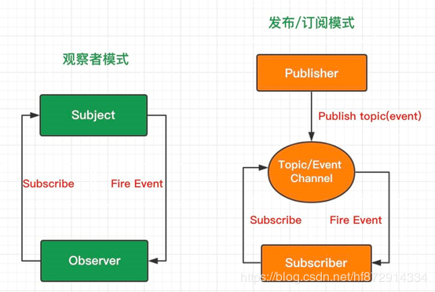

> *定义对象间的一种一对多的依赖关系，当一个对象的状态发生改变时，所有依赖于它的对象都得到通知并被自动更新*

又称发布-订阅者模式,是一种通知机制，让发送通知的一方（被观察方）和接收通知的一方（观察者）能彼此分离，互不影响,解决主体对象与观察者之间功能的耦合,即实现**松耦合(loosely coupled)**

观察者模式属于**行为型设计模式**，行为模式**关注的是对象之间的通讯**，观察者模式就是观察者和被观察者之间的通讯。

其实24种基本的设计模式中并没有发布订阅模式，上面也说了，他只是观察者模式的一个别称。

但是经过时间的沉淀，似乎他已经强大了起来，已经独立于观察者模式，成为另外一种不同的设计模式。

在现在的发布订阅模式中，称为发布者的消息发送者不会将消息直接发送给订阅者，这意味着发布者和订阅者不知道彼此的存在。在发布者和订阅者之间存在第三个组件，称为**消息代理或调度中心或中间件**，它维持着发布者和订阅者之间的联系，过滤所有发布者传入的消息并相应地分发它们给订阅者。

举一个例子，你在微博上关注了A，同时其他很多人也关注了A，那么当A发布动态的时候，微博就会为你们推送这条动态。A就是发布者，你是订阅者，微博就是调度中心，你和A是没有直接的消息往来的，全是通过微博来协调的（你的关注，A的发布动态）。



观察者模式中的订阅者是双向的,即可以是消息的发布者,也可以是消息的订阅者.

## 发布-订阅模式 (Pub-Sub Pattern)

在发布者和订阅者之间存在第三个组件，称为消息代理或调度中心或中间件，它维持着发布者和订阅者之间的联系，过滤所有发布者传入的消息，并相应的分发给它们的订阅者。

举例:

Vue中的EventBus的实现

```javascript
export default class EventBus {
    constructor(){
        this.subs={}
    }
//订阅,需要传递一个回调函数  
$on(eventType,callback){
    if(this.subs[evenType]){
        this.sub[evenType].push(callback)
    }else{
        this.subs[evenType]=[callback]
    }
}
 // 发布者，通过调用传递过来的回调函数的同时并传递数据
$emit(evenType,...arg){
 // 一旦执行了 $emit 方法，肯定要调用 #1 和 #2 方法，所以我要想办法把 $on 传递过来的 callback 收集起来
    this.subs[evenType].forEach((callback)=>callback(...args))
	}
}
```

------

参考:

[发布-订阅模式和观察者模式真的不一样？](https://segmentfault.com/a/1190000020211587)

JavaScript设计模式