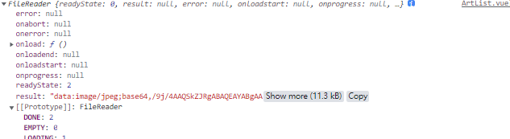
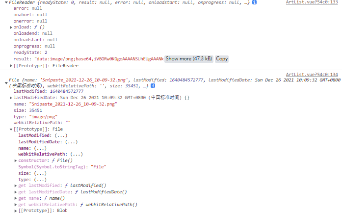

> URL.createObjectURL() 静态方法会创建一个 [`DOMString`](https://developer.mozilla.org/zh-CN/docs/Web/API/DOMString)，其中包含一个表示参数中给出的对象的URL。这个 URL 的生命周期和创建它的窗口中的 [`document`](https://developer.mozilla.org/zh-CN/docs/Web/API/Document) 绑定。这个新的URL 对象表示指定的 [`File`](https://developer.mozilla.org/zh-CN/docs/Web/API/File) 对象或 [`Blob`](https://developer.mozilla.org/zh-CN/docs/Web/API/Blob) 对象。

[使用对象URL显示图片](https://developer.mozilla.org/zh-CN/docs/Web/API/File/Using_files_from_web_applications#example.3a_using_object_urls_to_display_images).(以上MDN解释).简单的说:当传递 URL.createObjectURL 方法一个对象返回值是:一个  DOMString，包含一个对象 URL，可用于引用指定源对象的内容。

同时我们配合 $refs 操纵 DOM 给他设置 src 传递 这个url.

方法一:*URL.createObjectURL()*

下面这个demo,通过点击btn 触发 input 的文件上传属性

```html

<el-form-item label="文章封面" prop="cover_img">
            
            <input
            @change="ChoiceCover"
            accept="image/*" //设置接收的文件类型
            type="file"      //设置input 类型
            style="display:none" //设置默认隐藏
            ref="imgReFile">
            <el-button @click="$refs.imgReFile.click()" type="primary">
              选择封面
            </el-button>
        </el-form-item>
```

```js
ChoiceCover (e) {
      const files = e.target.files
      if (files.length === 0) {
        this.artListForm.cover_img = '' //无文件则置空,传递默认 src 图片(el-form :model="artListForm" artListForm是element ui 中v-bind绑定的给el-form表单的变量)
        this.$refs.imgRef.setAttribute('src', defaultImg)
      } else {									
        this.artListForm.cover_img = files[0]   //否则传入这个文件对象给cover_img
        const url = URL.createObjectURL(files[0])
        this.$refs.imgRef.setAttribute('src', url)
      }
    }
```

<hr>方法二:
FileReader()的方法,new一个实例对象

> FileReader 对象允许Web应用程序异步读取存储在用户计算机上的文件（或原始数据缓冲区）的内容，使用 ***File 或 Blob 对象***指定要读取的文件或数据。
>
> 其中File对象可以是来自用户在一个<input>元素上选择文件后返回的FileList对象,也可以来自拖放操作生成的 DataTransfer对象,还可以是来自在一个HTMLCanvasElement上执行mozGetAsFile()方法后返回结果。
>
> 重要提示： FileReader仅用于以安全的方式从用户（远程）系统读取文件内容 它不能用于从文件系统中按路径名简单地读取文件。 要在JavaScript中按路径名读取文件，应使用标准Ajax解决方案进行服务器端文件读取，如果读取跨域，则使用CORS权限。<p align="right">MDN</p>

通过控制台我们来查看这个实例对象有那些属性:如下图



然后上代码

```html
 <el-form-item>
            
            
            <input
            ref="imgFiles"
            @change="choiceCover"
            style="display:none"
            type="file">
         <el-button @click="$refs.imgFiles.click()" type="primary" size="small" class="btn-pub">发表文章</el-button>
        </el-form-item>
```

给两张图设置if-else判断语句,当用户上传图片就渲染base64,否则显示默认图片

```js
 choiceCover (e) {
      const file = e.target.files[0]
      const reader = new FileReader()
      console.log(reader)
     console.log(file)
      reader.readAsDataURL(file)
      reader.onload = () => {   //监听onload事件
        if (reader.readyState === 2) {
          console.log(reader.result)  //这么我们可以看到result上有我们需要的base64字符串
          this.cover_img = reader.result  //将base64 传递给 :src
        }
      }
    }
```

