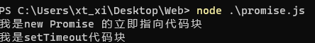

Promise就是一个对象,用于传递异步操作的消息.

Promise 是一个对象，也是一个构造函数

<hr>

特点:

- Promise 实例有三种状态操作 Pending、Resolved(Fulfilled),Rejected
- 一旦改变,就不会再变,状态的改变只有可能是从 Pending 变为 Resolved 和从 Pending 变为 Rejected 能将异步操作以同步流程表达出来,避免出现callback hell
- 让回调函数变成了规范的链式写法，程序流程可以看得很清楚

缺点:

- 无法取消Promise,一旦新建就会立即执行的同步任务.
- 如果不设置callback,内部throw err
- 处于Pending状态时候,无法得知目前进展到那个阶段

示例1:

```js
setTimeout(() => {
    console.log("我是setTimeout代码块");
})
const p1 = new Promise((resolve, reject) => {
    console.log("我是new Promise 的立即指向代码块");
})

```



示例2:

```js
setTimeout(() => {
    console.log("我是setTimeout代码块");
})
const p1 = new Promise((resolve, reject) => {
    console.log("我是new Promise 的立即指向代码块");
    setTimeout(() => {
        console.log('异步指向任务完成!获得了一些结果')
        resolve("成功了!");
    },1000)
})
p1.then((res) => {
     console.log(res);
     }
)
```


<hr>

# Promise.prototype.then()

Promise 实例具有 then 方法,即 then 方法是定义在原型对象 Promise.prototype 上的.

作用是为 Promise 实例添加状态改变时的回调函数

then 方法可以接受两个回调函数作为参数,第二个参数就是可以选的.

then方法返回的是一个新的Promise实例(不是原来的那个Promise).因此可以采用链式写法,即then方法后面调用另一个then方法.采用链式的then,可以指定一组按照次序调用的回调函数,后面的回调函数,需等待该Promise对象状态的改变,才会被调用


# **Promise.prototype.cath()**

一般来说,不要在then定义Reject状态的回调函数,即then的第二个参数,总是使用catch方法

Promise.prototype.cath方法是.then(null,rejection)的别名

当异步操作throw err时,状态会变成Rejected的,就会调用catch方法处理错误

Promise对象的错误具有"冒泡"性质,错误会被一直向后传递,直到下一个catch捕获,被捕获后不会传递到外层,不会有任何反应

<hr>
JavaScript 是单线程语言,而现代游览器是支持多线程的,单线程从字面上就知道,他是容易导致进程阻塞的.

我们知道栈Stack,是一种后进先出(LIFO)的线性结构,是一个特殊的线性表.

队列Queue,是一种先进先去的线性结构(FIFO),是一个特殊的线性表.

Event LOOP 事件循环:

> 在计算机科学中，事件循环是一种编程构造或设计模式，用于在程序中等待和分发事件或消息。事件循环的工作原理是向某个内部或外部的“事件提供程序”发出请求(通常在事件到达之前阻止请求)，然后调用相关的事件处理程序(“分派事件”)。事件循环有时也称为消息调度程序、消息循环、消息泵或运行循环

<p align="right">
    --wikipedia
</p>

JS采用事件循环[Event LOOP](https://en.jinzhao.wiki/wiki/Event_loop)的机制执行JS.
在了解此之前你所需的前置知识点:计算机系统

**进程**:是操纵系统对一个正常运行的程序的一种抽象.一个系统上可以同时运行多个进程

**并发运行**:一个进程的指令和另一个进程的指令是交错执行的,通过处理器在进程简切换,操纵系统这种交错执行的机制称为上下文切换.进程间的转换是由操纵系统的内核(kernel)管理,内核是系统管理全部进程所用代码和数据结构的集合

**上下文**:操纵系统保持跟踪进程运行所需的所有状态信息,这种状态,就是上下文,包括许多信息.比如PC和寄存器文件的当前值,以及贮存的内容.

**线程**:一个进程实际上可以由多个称为显参的执行单元组成.每个线程都运行在进程的上下文中,并共享同样的全局代码和全局数据.一般来说多线程比多进程更容易共享数据,因为线程一般比进程高效


<p align="center">深入理解计算机系统
</p>


- 语言的发展过程中,在ES6标准写进了Promise.

  JS有两种

  #### 执行模式:

  - 同步模式
  - 异步模式

  #### 异步任务:

  - 宏任务
  - 微任务

  ##### 宏任务:

  是由宿主(浏览器、Node发起的),

  宏任务为多线程异步逻辑，

  #### [微任务（Microtasks）](https://developer.mozilla.org/zh-CN/docs/Web/API/HTML_DOM_API/Microtask_guide#%E5%BE%AE%E4%BB%BB%E5%8A%A1%EF%BC%88microtasks%EF%BC%89)

  微任务是由JS自身发起的;

  通常是由 promise 创建的,只有当 Javascript 调用栈为空，而控制权尚未返还给被 [user agent](https://developer.mozilla.org/zh-CN/docs/Glossary/User_agent) 用来驱动脚本执行环境的事件循环之前，该微任务才会被执行。

  起初微任务和任务之间的差异看起来不大。它们很相似；都由位于某个队列的 JavaScript 代码组成并在合适的时候运行。但是，只有在迭代开始时队列中存在的任务才会被事件循环一个接一个地运行，这和处理微任务队列是殊为不同的。

  有两点关键的区别。

  首先，每当一个任务存在，事件循环都会检查该任务是否正把控制权交给其他 JavaScript 代码。如若不然，事件循环就会运行微任务队列中的所有微任务。接下来微任务循环会在事件循环的每次迭代中被处理多次，包括处理完事件和其他回调之后。

  其次，如果一个微任务通过调用  [`queueMicrotask()`](https://developer.mozilla.org/zh-CN/docs/Web/API/queueMicrotask), 向队列中加入了更多的微任务，则那些新加入的微任务 *会早于下一个任务运行* 。这是因为事件循环会持续调用微任务直至队列中没有留存的，即使是在有更多微任务持续被加入的情况下。

  **注意：** 因为微任务自身可以入列更多的微任务，且事件循环会持续处理微任务直至队列为空，那么就存在一种使得事件循环无尽处理微任务的真实风险。如何处理递归增加微任务是要谨慎而行的。

  #### **创建方式:**

  #### **Macrotask**宏任务:

  - setTimeout
  - setInterval
  - MessageChannel
  - IO
  - UI交互事件
  - setlmmediate(Node环境)
  - script(整体代码块)
  - postMessage

  #### **Microtask**微任务:

  - Promise.[ then/catch/finally ]
  - process.nextTick（Node环境）
  - MutationOberver（浏览器环境）
  - Object.observe
  - queueMicrotask
  - requestAnimationFrame(有争议)

### [总结](https://zh.javascript.info/event-loop#zong-jie)

更详细的事件循环算法（尽管与 [规范](https://html.spec.whatwg.org/multipage/webappapis.html#event-loop-processing-model) 相比仍然是简化过的）：

1. 从 **宏任务** 队列（例如 “script”）中出队（dequeue）并执行最早的任务。

2. 执行所有 

   微任务

   - 当微任务队列非空时：
     - 出队（dequeue）并执行最早的微任务。

3. 如果有变更，则将变更渲染出来。

4. 如果宏任务队列为空，则休眠直到出现宏任务。

5. 转到步骤 1。

安排（schedule）一个新的 **宏任务**：

- 使用零延迟的 `setTimeout(f)`。

它可被用于将繁重的计算任务拆分成多个部分，以使浏览器能够对用户事件作出反应，并在任务的各部分之间显示任务进度。

此外，也被用于在事件处理程序中，将一个行为（action）安排（schedule）在事件被完全处理（冒泡完成）后。

安排一个新的 **微任务**：

- 使用 `queueMicrotask(f)`。
- promise 处理程序也会通过微任务队列。

在微任务之间没有 UI 或网络事件的处理：它们一个立即接一个地执行。

所以，我们可以使用 `queueMicrotask` 来在保持环境状态一致的情况下，异步地执行一个函数。

<div align="center">
<svg xmlns="http://www.w3.org/2000/svg" xmlns:xlink="http://www.w3.org/1999/xlink" version="1.1" width="978px" viewBox="-0.5 -0.5 978 771" content="&lt;mxfile&gt;&lt;diagram id=&quot;kd00niN6A60JnVUqGfcJ&quot; name=&quot;第 1 页&quot;&gt;&lt;mxGraphModel dx=&quot;1147&quot; dy=&quot;804&quot; grid=&quot;1&quot; gridSize=&quot;10&quot; guides=&quot;1&quot; tooltips=&quot;1&quot; connect=&quot;1&quot; arrows=&quot;1&quot; fold=&quot;1&quot; page=&quot;1&quot; pageScale=&quot;1&quot; pageWidth=&quot;3300&quot; pageHeight=&quot;4681&quot; math=&quot;0&quot; shadow=&quot;0&quot;&gt;&lt;root&gt;&lt;mxCell id=&quot;0&quot;/&gt;&lt;mxCell id=&quot;1&quot; parent=&quot;0&quot;/&gt;&lt;mxCell id=&quot;4&quot; style=&quot;edgeStyle=none;html=1;exitX=1;exitY=0.5;exitDx=0;exitDy=0;&quot; parent=&quot;1&quot; edge=&quot;1&quot;&gt;&lt;mxGeometry relative=&quot;1&quot; as=&quot;geometry&quot;&gt;&lt;mxPoint x=&quot;690&quot; y=&quot;170&quot; as=&quot;targetPoint&quot;/&gt;&lt;Array as=&quot;points&quot;&gt;&lt;mxPoint x=&quot;510&quot; y=&quot;140&quot;/&gt;&lt;mxPoint x=&quot;550&quot; y=&quot;140&quot;/&gt;&lt;mxPoint x=&quot;590&quot; y=&quot;140&quot;/&gt;&lt;mxPoint x=&quot;690&quot; y=&quot;140&quot;/&gt;&lt;/Array&gt;&lt;mxPoint x=&quot;431&quot; y=&quot;140&quot; as=&quot;sourcePoint&quot;/&gt;&lt;/mxGeometry&gt;&lt;/mxCell&gt;&lt;mxCell id=&quot;10&quot; value=&quot;同步任务执行&quot; style=&quot;rounded=0;whiteSpace=wrap;html=1;&quot; parent=&quot;1&quot; vertex=&quot;1&quot;&gt;&lt;mxGeometry x=&quot;300&quot; y=&quot;300&quot; width=&quot;119&quot; height=&quot;50&quot; as=&quot;geometry&quot;/&gt;&lt;/mxCell&gt;&lt;mxCell id=&quot;13&quot; value=&quot;&quot; style=&quot;endArrow=classic;html=1;exitX=0.5;exitY=1;exitDx=0;exitDy=0;entryX=0.5;entryY=0;entryDx=0;entryDy=0;&quot; parent=&quot;1&quot; edge=&quot;1&quot;&gt;&lt;mxGeometry width=&quot;50&quot; height=&quot;50&quot; relative=&quot;1&quot; as=&quot;geometry&quot;&gt;&lt;mxPoint x=&quot;359&quot; y=&quot;50&quot; as=&quot;sourcePoint&quot;/&gt;&lt;mxPoint x=&quot;359&quot; y=&quot;110&quot; as=&quot;targetPoint&quot;/&gt;&lt;/mxGeometry&gt;&lt;/mxCell&gt;&lt;mxCell id=&quot;88&quot; value=&quot;&amp;lt;span style=&amp;quot;font-family: helvetica; font-size: 12px; font-style: normal; font-weight: 400; letter-spacing: normal; text-indent: 0px; text-transform: none; word-spacing: 0px; display: inline; float: none;&amp;quot;&amp;gt;主线程执行栈&amp;lt;/span&amp;gt;&amp;lt;br style=&amp;quot;font-family: helvetica; font-size: 12px; font-style: normal; font-weight: 400; letter-spacing: normal; text-indent: 0px; text-transform: none; word-spacing: 0px;&amp;quot;&amp;gt;&amp;lt;span style=&amp;quot;font-family: helvetica; font-size: 12px; font-style: normal; font-weight: 400; letter-spacing: normal; text-indent: 0px; text-transform: none; word-spacing: 0px; display: inline; float: none;&amp;quot;&amp;gt;LIFO&amp;lt;/span&amp;gt;&quot; style=&quot;text;whiteSpace=wrap;html=1;align=center;fontColor=#00ec66;&quot; parent=&quot;1&quot; vertex=&quot;1&quot;&gt;&lt;mxGeometry x=&quot;270&quot; y=&quot;200&quot; width=&quot;100&quot; height=&quot;40&quot; as=&quot;geometry&quot;/&gt;&lt;/mxCell&gt;&lt;mxCell id=&quot;91&quot; value=&quot;&amp;lt;span style=&amp;quot;font-family: helvetica; font-size: 12px; font-style: normal; font-weight: 400; letter-spacing: normal; text-indent: 0px; text-transform: none; word-spacing: 0px; display: inline; float: none;&amp;quot;&amp;gt;&amp;lt;font color=&amp;quot;#00ec66&amp;quot;&amp;gt;TaskQueue &amp;lt;br&amp;gt;FIFO&amp;lt;/font&amp;gt;&amp;lt;/span&amp;gt;&quot; style=&quot;text;whiteSpace=wrap;html=1;align=center;labelBorderColor=none;&quot; parent=&quot;1&quot; vertex=&quot;1&quot;&gt;&lt;mxGeometry x=&quot;540&quot; y=&quot;100&quot; width=&quot;120&quot; height=&quot;30&quot; as=&quot;geometry&quot;/&gt;&lt;/mxCell&gt;&lt;mxCell id=&quot;101&quot; style=&quot;edgeStyle=none;html=1;&quot; parent=&quot;1&quot; edge=&quot;1&quot;&gt;&lt;mxGeometry relative=&quot;1&quot; as=&quot;geometry&quot;&gt;&lt;mxPoint x=&quot;810&quot; y=&quot;437&quot; as=&quot;targetPoint&quot;/&gt;&lt;Array as=&quot;points&quot;&gt;&lt;mxPoint x=&quot;810&quot; y=&quot;330&quot;/&gt;&lt;/Array&gt;&lt;mxPoint x=&quot;810&quot; y=&quot;200&quot; as=&quot;sourcePoint&quot;/&gt;&lt;/mxGeometry&gt;&lt;/mxCell&gt;&lt;mxCell id=&quot;94&quot; value=&quot;判断Queue中的Event type&quot; style=&quot;rhombus;whiteSpace=wrap;html=1;&quot; parent=&quot;1&quot; vertex=&quot;1&quot;&gt;&lt;mxGeometry x=&quot;590&quot; y=&quot;170&quot; width=&quot;200&quot; height=&quot;60&quot; as=&quot;geometry&quot;/&gt;&lt;/mxCell&gt;&lt;mxCell id=&quot;96&quot; value=&quot;&amp;lt;span&amp;gt;JS引擎解析JS任务类型&amp;lt;/span&amp;gt;&quot; style=&quot;rhombus;whiteSpace=wrap;html=1;&quot; parent=&quot;1&quot; vertex=&quot;1&quot;&gt;&lt;mxGeometry x=&quot;259&quot; y=&quot;110&quot; width=&quot;200&quot; height=&quot;60&quot; as=&quot;geometry&quot;/&gt;&lt;/mxCell&gt;&lt;mxCell id=&quot;97&quot; value=&quot;&quot; style=&quot;endArrow=classic;html=1;&quot; parent=&quot;1&quot; edge=&quot;1&quot;&gt;&lt;mxGeometry width=&quot;50&quot; height=&quot;50&quot; relative=&quot;1&quot; as=&quot;geometry&quot;&gt;&lt;mxPoint x=&quot;560&quot; y=&quot;200&quot; as=&quot;sourcePoint&quot;/&gt;&lt;mxPoint x=&quot;559.5&quot; y=&quot;445&quot; as=&quot;targetPoint&quot;/&gt;&lt;/mxGeometry&gt;&lt;/mxCell&gt;&lt;mxCell id=&quot;98&quot; value=&quot;MicroTask&quot; style=&quot;rounded=0;whiteSpace=wrap;html=1;&quot; parent=&quot;1&quot; vertex=&quot;1&quot;&gt;&lt;mxGeometry x=&quot;500&quot; y=&quot;440&quot; width=&quot;120&quot; height=&quot;40&quot; as=&quot;geometry&quot;/&gt;&lt;/mxCell&gt;&lt;mxCell id=&quot;99&quot; value=&quot;MacroTask&quot; style=&quot;rounded=0;whiteSpace=wrap;html=1;&quot; parent=&quot;1&quot; vertex=&quot;1&quot;&gt;&lt;mxGeometry x=&quot;740&quot; y=&quot;440&quot; width=&quot;120&quot; height=&quot;40&quot; as=&quot;geometry&quot;/&gt;&lt;/mxCell&gt;&lt;mxCell id=&quot;108&quot; value=&quot;&quot; style=&quot;endArrow=classic;html=1;exitX=0.5;exitY=1;exitDx=0;exitDy=0;entryX=0.5;entryY=0;entryDx=0;entryDy=0;&quot; parent=&quot;1&quot; source=&quot;96&quot; target=&quot;10&quot; edge=&quot;1&quot;&gt;&lt;mxGeometry width=&quot;50&quot; height=&quot;50&quot; relative=&quot;1&quot; as=&quot;geometry&quot;&gt;&lt;mxPoint x=&quot;380&quot; y=&quot;230&quot; as=&quot;sourcePoint&quot;/&gt;&lt;mxPoint x=&quot;390&quot; y=&quot;280&quot; as=&quot;targetPoint&quot;/&gt;&lt;/mxGeometry&gt;&lt;/mxCell&gt;&lt;mxCell id=&quot;110&quot; value=&quot;&quot; style=&quot;endArrow=classic;html=1;exitX=0.5;exitY=1;exitDx=0;exitDy=0;entryX=0.5;entryY=0;entryDx=0;entryDy=0;&quot; parent=&quot;1&quot; source=&quot;10&quot; target=&quot;111&quot; edge=&quot;1&quot;&gt;&lt;mxGeometry width=&quot;50&quot; height=&quot;50&quot; relative=&quot;1&quot; as=&quot;geometry&quot;&gt;&lt;mxPoint x=&quot;334&quot; y=&quot;410&quot; as=&quot;sourcePoint&quot;/&gt;&lt;mxPoint x=&quot;360&quot; y=&quot;430&quot; as=&quot;targetPoint&quot;/&gt;&lt;/mxGeometry&gt;&lt;/mxCell&gt;&lt;mxCell id=&quot;158&quot; style=&quot;edgeStyle=none;html=1;fontColor=#00ec66;entryX=0;entryY=0.5;entryDx=0;entryDy=0;&quot; edge=&quot;1&quot; parent=&quot;1&quot; source=&quot;111&quot; target=&quot;10&quot;&gt;&lt;mxGeometry relative=&quot;1&quot; as=&quot;geometry&quot;&gt;&lt;mxPoint x=&quot;200&quot; y=&quot;320&quot; as=&quot;targetPoint&quot;/&gt;&lt;Array as=&quot;points&quot;&gt;&lt;mxPoint x=&quot;220&quot; y=&quot;460&quot;/&gt;&lt;mxPoint x=&quot;220&quot; y=&quot;325&quot;/&gt;&lt;/Array&gt;&lt;/mxGeometry&gt;&lt;/mxCell&gt;&lt;mxCell id=&quot;111&quot; value=&quot;执行栈空?&quot; style=&quot;rhombus;whiteSpace=wrap;html=1;&quot; parent=&quot;1&quot; vertex=&quot;1&quot;&gt;&lt;mxGeometry x=&quot;259.5&quot; y=&quot;430&quot; width=&quot;200&quot; height=&quot;60&quot; as=&quot;geometry&quot;/&gt;&lt;/mxCell&gt;&lt;mxCell id=&quot;114&quot; value=&quot;结束&quot; style=&quot;rounded=1;whiteSpace=wrap;html=1;&quot; parent=&quot;1&quot; vertex=&quot;1&quot;&gt;&lt;mxGeometry x=&quot;299.5&quot; y=&quot;690&quot; width=&quot;120&quot; height=&quot;50&quot; as=&quot;geometry&quot;/&gt;&lt;/mxCell&gt;&lt;mxCell id=&quot;115&quot; value=&quot;JS任务开始&quot; style=&quot;rounded=1;whiteSpace=wrap;html=1;&quot; parent=&quot;1&quot; vertex=&quot;1&quot;&gt;&lt;mxGeometry x=&quot;299&quot; width=&quot;120&quot; height=&quot;50&quot; as=&quot;geometry&quot;/&gt;&lt;/mxCell&gt;&lt;mxCell id=&quot;120&quot; style=&quot;edgeStyle=none;html=1;exitX=0;exitY=0.5;exitDx=0;exitDy=0;&quot; parent=&quot;1&quot; source=&quot;155&quot; edge=&quot;1&quot;&gt;&lt;mxGeometry relative=&quot;1&quot; as=&quot;geometry&quot;&gt;&lt;mxPoint x=&quot;420&quot; y=&quot;610&quot; as=&quot;targetPoint&quot;/&gt;&lt;mxPoint x=&quot;520&quot; y=&quot;600&quot; as=&quot;sourcePoint&quot;/&gt;&lt;Array as=&quot;points&quot;&gt;&lt;mxPoint x=&quot;460&quot; y=&quot;610&quot;/&gt;&lt;mxPoint x=&quot;420&quot; y=&quot;610&quot;/&gt;&lt;/Array&gt;&lt;/mxGeometry&gt;&lt;/mxCell&gt;&lt;mxCell id=&quot;131&quot; value=&quot;&amp;lt;ul&amp;gt;&amp;lt;li&amp;gt;&amp;lt;b&amp;gt;&amp;lt;font face=&amp;quot;monaco&amp;quot; data-font-src=&amp;quot;https://www.cssfontstack.com/monaco#&amp;quot;&amp;gt;setTimeout&amp;lt;/font&amp;gt;&amp;lt;/b&amp;gt;&amp;lt;/li&amp;gt;&amp;lt;li&amp;gt;&amp;lt;b&amp;gt;&amp;lt;font face=&amp;quot;monaco&amp;quot; data-font-src=&amp;quot;https://www.cssfontstack.com/monaco#&amp;quot;&amp;gt;setInterval&amp;lt;/font&amp;gt;&amp;lt;/b&amp;gt;&amp;lt;/li&amp;gt;&amp;lt;li&amp;gt;&amp;lt;b&amp;gt;&amp;lt;font face=&amp;quot;monaco&amp;quot; data-font-src=&amp;quot;https://www.cssfontstack.com/monaco#&amp;quot;&amp;gt;MessageChanel&amp;lt;/font&amp;gt;&amp;lt;/b&amp;gt;&amp;lt;/li&amp;gt;&amp;lt;li&amp;gt;&amp;lt;b&amp;gt;&amp;lt;font face=&amp;quot;monaco&amp;quot; data-font-src=&amp;quot;https://www.cssfontstack.com/monaco#&amp;quot;&amp;gt;IO事件队列&amp;lt;/font&amp;gt;&amp;lt;/b&amp;gt;&amp;lt;/li&amp;gt;&amp;lt;li&amp;gt;&amp;lt;b&amp;gt;&amp;lt;font face=&amp;quot;monaco&amp;quot; data-font-src=&amp;quot;https://www.cssfontstack.com/monaco#&amp;quot;&amp;gt;setImmediate(Node环境)&amp;lt;/font&amp;gt;&amp;lt;/b&amp;gt;&amp;lt;/li&amp;gt;&amp;lt;li&amp;gt;&amp;lt;b&amp;gt;&amp;lt;font face=&amp;quot;monaco&amp;quot; data-font-src=&amp;quot;https://www.cssfontstack.com/monaco#&amp;quot;&amp;gt;Script(优先执行此宏任务,存在异步代码才执行微任务&amp;lt;/font&amp;gt;&amp;lt;/b&amp;gt;&amp;lt;/li&amp;gt;&amp;lt;/ul&amp;gt;&quot; style=&quot;text;html=1;whiteSpace=wrap;verticalAlign=middle;overflow=hidden;fontColor=#00ec66;&quot; parent=&quot;1&quot; vertex=&quot;1&quot;&gt;&lt;mxGeometry x=&quot;910&quot; y=&quot;370&quot; width=&quot;280&quot; height=&quot;170&quot; as=&quot;geometry&quot;/&gt;&lt;/mxCell&gt;&lt;mxCell id=&quot;137&quot; value=&quot;&amp;lt;font style=&amp;quot;font-size: 18px&amp;quot;&amp;gt;MacroTask&amp;lt;/font&amp;gt;&quot; style=&quot;text;strokeColor=none;fillColor=none;html=1;fontSize=24;fontStyle=1;verticalAlign=middle;align=center;fontColor=#00EC66;&quot; parent=&quot;1&quot; vertex=&quot;1&quot;&gt;&lt;mxGeometry x=&quot;950&quot; y=&quot;350&quot; width=&quot;100&quot; height=&quot;40&quot; as=&quot;geometry&quot;/&gt;&lt;/mxCell&gt;&lt;mxCell id=&quot;138&quot; value=&quot;&amp;lt;font style=&amp;quot;font-size: 18px&amp;quot;&amp;gt;MicroTask&amp;lt;/font&amp;gt;&quot; style=&quot;text;strokeColor=none;fillColor=none;html=1;fontSize=24;fontStyle=1;verticalAlign=middle;align=center;fontColor=#00EC66;&quot; parent=&quot;1&quot; vertex=&quot;1&quot;&gt;&lt;mxGeometry x=&quot;820&quot; y=&quot;590&quot; width=&quot;100&quot; height=&quot;40&quot; as=&quot;geometry&quot;/&gt;&lt;/mxCell&gt;&lt;mxCell id=&quot;140&quot; value=&quot;&amp;lt;font color=&amp;quot;#ffffff&amp;quot;&amp;gt;异步任务执行&amp;lt;/font&amp;gt;&quot; style=&quot;rounded=0;whiteSpace=wrap;html=1;color:#000000&quot; parent=&quot;1&quot; vertex=&quot;1&quot;&gt;&lt;mxGeometry x=&quot;299&quot; y=&quot;590&quot; width=&quot;120&quot; height=&quot;40&quot; as=&quot;geometry&quot;/&gt;&lt;/mxCell&gt;&lt;mxCell id=&quot;144&quot; value=&quot;&quot; style=&quot;endArrow=classic;html=1;fontColor=#00EC66;exitX=0.5;exitY=1;exitDx=0;exitDy=0;entryX=0.5;entryY=0;entryDx=0;entryDy=0;&quot; parent=&quot;1&quot; source=&quot;111&quot; target=&quot;140&quot; edge=&quot;1&quot;&gt;&lt;mxGeometry width=&quot;50&quot; height=&quot;50&quot; relative=&quot;1&quot; as=&quot;geometry&quot;&gt;&lt;mxPoint x=&quot;450&quot; y=&quot;590&quot; as=&quot;sourcePoint&quot;/&gt;&lt;mxPoint x=&quot;359&quot; y=&quot;580&quot; as=&quot;targetPoint&quot;/&gt;&lt;/mxGeometry&gt;&lt;/mxCell&gt;&lt;mxCell id=&quot;149&quot; value=&quot;&amp;lt;ul&amp;gt;&amp;lt;li class=&amp;quot;code-line&amp;quot; style=&amp;quot;position: relative&amp;quot;&amp;gt;&amp;lt;b&amp;gt;&amp;lt;font face=&amp;quot;monaco&amp;quot; data-font-src=&amp;quot;https://www.cssfontstack.com/monaco#&amp;quot;&amp;gt;Promise.[ then/catch/finally ]&amp;lt;/font&amp;gt;&amp;lt;/b&amp;gt;&amp;lt;/li&amp;gt;&amp;lt;li class=&amp;quot;code-line&amp;quot; style=&amp;quot;position: relative&amp;quot;&amp;gt;&amp;lt;b&amp;gt;&amp;lt;font face=&amp;quot;monaco&amp;quot; data-font-src=&amp;quot;https://www.cssfontstack.com/monaco#&amp;quot;&amp;gt;Process.nextTick(Node环境)&amp;lt;/font&amp;gt;&amp;lt;/b&amp;gt;&amp;lt;/li&amp;gt;&amp;lt;li class=&amp;quot;code-line&amp;quot; style=&amp;quot;position: relative&amp;quot;&amp;gt;&amp;lt;b&amp;gt;&amp;lt;font face=&amp;quot;monaco&amp;quot; data-font-src=&amp;quot;https://www.cssfontstack.com/monaco#&amp;quot;&amp;gt;MutationObserve(浏览器环境)&amp;lt;/font&amp;gt;&amp;lt;/b&amp;gt;&amp;lt;/li&amp;gt;&amp;lt;li class=&amp;quot;code-line&amp;quot; style=&amp;quot;position: relative&amp;quot;&amp;gt;&amp;lt;b&amp;gt;&amp;lt;font face=&amp;quot;monaco&amp;quot; data-font-src=&amp;quot;https://www.cssfontstack.com/monaco#&amp;quot;&amp;gt;Object.observe&amp;lt;/font&amp;gt;&amp;lt;/b&amp;gt;&amp;lt;/li&amp;gt;&amp;lt;li class=&amp;quot;code-line&amp;quot; style=&amp;quot;position: relative&amp;quot;&amp;gt;&amp;lt;b&amp;gt;&amp;lt;font face=&amp;quot;monaco&amp;quot; data-font-src=&amp;quot;https://www.cssfontstack.com/monaco#&amp;quot;&amp;gt;queueMicrotask&amp;lt;/font&amp;gt;&amp;lt;/b&amp;gt;&amp;lt;/li&amp;gt;&amp;lt;li class=&amp;quot;code-line&amp;quot; style=&amp;quot;position: relative&amp;quot;&amp;gt;&amp;lt;b&amp;gt;&amp;lt;font face=&amp;quot;monaco&amp;quot; data-font-src=&amp;quot;https://www.cssfontstack.com/monaco#&amp;quot;&amp;gt;requestAnmationFrame(有争议)&amp;lt;/font&amp;gt;&amp;lt;/b&amp;gt;&amp;lt;/li&amp;gt;&amp;lt;/ul&amp;gt;&quot; style=&quot;text;html=1;whiteSpace=wrap;verticalAlign=middle;overflow=hidden;fontColor=#00ec66;&quot; parent=&quot;1&quot; vertex=&quot;1&quot;&gt;&lt;mxGeometry x=&quot;770&quot; y=&quot;600&quot; width=&quot;320&quot; height=&quot;170&quot; as=&quot;geometry&quot;/&gt;&lt;/mxCell&gt;&lt;mxCell id=&quot;151&quot; value=&quot;&quot; style=&quot;endArrow=classic;html=1;fontColor=#00EC66;entryX=1;entryY=0.5;entryDx=0;entryDy=0;&quot; parent=&quot;1&quot; edge=&quot;1&quot;&gt;&lt;mxGeometry width=&quot;50&quot; height=&quot;50&quot; relative=&quot;1&quot; as=&quot;geometry&quot;&gt;&lt;mxPoint x=&quot;780&quot; y=&quot;610&quot; as=&quot;sourcePoint&quot;/&gt;&lt;mxPoint x=&quot;690&quot; y=&quot;610&quot; as=&quot;targetPoint&quot;/&gt;&lt;/mxGeometry&gt;&lt;/mxCell&gt;&lt;mxCell id=&quot;152&quot; value=&quot;&amp;lt;i&amp;gt;&amp;lt;b&amp;gt;&amp;lt;span style=&amp;quot;font-family: &amp;amp;#34;helvetica&amp;amp;#34; ; font-size: 12px ; letter-spacing: normal ; text-align: center ; text-indent: 0px ; text-transform: none ; word-spacing: 0px ; display: inline ; float: none&amp;quot;&amp;gt;Pending|&amp;lt;/span&amp;gt;&amp;lt;font face=&amp;quot;monospace, monospace&amp;quot; style=&amp;quot;font-size: 12px ; letter-spacing: normal ; text-align: center ; text-indent: 0px ; text-transform: none ; word-spacing: 0px&amp;quot;&amp;gt;Resolve&amp;lt;/font&amp;gt;&amp;lt;/b&amp;gt;&amp;lt;/i&amp;gt;&quot; style=&quot;text;whiteSpace=wrap;html=1;fontColor=#00EC66;&quot; parent=&quot;1&quot; vertex=&quot;1&quot;&gt;&lt;mxGeometry x=&quot;440&quot; y=&quot;320&quot; width=&quot;120&quot; height=&quot;30&quot; as=&quot;geometry&quot;/&gt;&lt;/mxCell&gt;&lt;mxCell id=&quot;153&quot; value=&quot;&amp;lt;i&amp;gt;&amp;lt;b&amp;gt;&amp;lt;span style=&amp;quot;font-family: &amp;amp;#34;helvetica&amp;amp;#34; ; font-size: 12px ; letter-spacing: normal ; text-align: center ; text-indent: 0px ; text-transform: none ; word-spacing: 0px ; display: inline ; float: none&amp;quot;&amp;gt;Pending|&amp;lt;/span&amp;gt;&amp;lt;font face=&amp;quot;monospace, monospace&amp;quot; style=&amp;quot;font-size: 12px ; letter-spacing: normal ; text-align: center ; text-indent: 0px ; text-transform: none ; word-spacing: 0px&amp;quot;&amp;gt;Resolve&amp;lt;/font&amp;gt;&amp;lt;/b&amp;gt;&amp;lt;/i&amp;gt;&quot; style=&quot;text;whiteSpace=wrap;html=1;fontColor=#00EC66;&quot; parent=&quot;1&quot; vertex=&quot;1&quot;&gt;&lt;mxGeometry x=&quot;820&quot; y=&quot;320&quot; width=&quot;120&quot; height=&quot;30&quot; as=&quot;geometry&quot;/&gt;&lt;/mxCell&gt;&lt;mxCell id=&quot;159&quot; style=&quot;edgeStyle=none;html=1;fontColor=#00ec66;&quot; edge=&quot;1&quot; parent=&quot;1&quot; source=&quot;155&quot;&gt;&lt;mxGeometry relative=&quot;1&quot; as=&quot;geometry&quot;&gt;&lt;mxPoint x=&quot;680&quot; y=&quot;620&quot; as=&quot;targetPoint&quot;/&gt;&lt;/mxGeometry&gt;&lt;/mxCell&gt;&lt;mxCell id=&quot;155&quot; value=&quot;&amp;lt;span style=&amp;quot;font-family: &amp;amp;#34;helvetica&amp;amp;#34;&amp;quot;&amp;gt;满足条件优先执宏任务&amp;lt;/span&amp;gt;&quot; style=&quot;rhombus;whiteSpace=wrap;html=1;&quot; parent=&quot;1&quot; vertex=&quot;1&quot;&gt;&lt;mxGeometry x=&quot;600&quot; y=&quot;580&quot; width=&quot;200&quot; height=&quot;60&quot; as=&quot;geometry&quot;/&gt;&lt;/mxCell&gt;&lt;mxCell id=&quot;157&quot; value=&quot;&quot; style=&quot;endArrow=classic;html=1;fontColor=#00EC66;exitX=0.5;exitY=1;exitDx=0;exitDy=0;entryX=0.5;entryY=0;entryDx=0;entryDy=0;&quot; parent=&quot;1&quot; source=&quot;140&quot; target=&quot;114&quot; edge=&quot;1&quot;&gt;&lt;mxGeometry width=&quot;50&quot; height=&quot;50&quot; relative=&quot;1&quot; as=&quot;geometry&quot;&gt;&lt;mxPoint x=&quot;380&quot; y=&quot;670&quot; as=&quot;sourcePoint&quot;/&gt;&lt;mxPoint x=&quot;420&quot; y=&quot;670&quot; as=&quot;targetPoint&quot;/&gt;&lt;/mxGeometry&gt;&lt;/mxCell&gt;&lt;mxCell id=&quot;162&quot; value=&quot;&quot; style=&quot;endArrow=none;html=1;fontColor=#00ec66;entryX=0.5;entryY=1;entryDx=0;entryDy=0;&quot; edge=&quot;1&quot; parent=&quot;1&quot; target=&quot;98&quot;&gt;&lt;mxGeometry width=&quot;50&quot; height=&quot;50&quot; relative=&quot;1&quot; as=&quot;geometry&quot;&gt;&lt;mxPoint x=&quot;590&quot; y=&quot;520&quot; as=&quot;sourcePoint&quot;/&gt;&lt;mxPoint x=&quot;610&quot; y=&quot;490&quot; as=&quot;targetPoint&quot;/&gt;&lt;Array as=&quot;points&quot;&gt;&lt;mxPoint x=&quot;560&quot; y=&quot;520&quot;/&gt;&lt;/Array&gt;&lt;/mxGeometry&gt;&lt;/mxCell&gt;&lt;mxCell id=&quot;164&quot; value=&quot;&quot; style=&quot;endArrow=none;html=1;fontColor=#00ec66;entryX=0.609;entryY=1.008;entryDx=0;entryDy=0;entryPerimeter=0;&quot; edge=&quot;1&quot; parent=&quot;1&quot; target=&quot;99&quot;&gt;&lt;mxGeometry width=&quot;50&quot; height=&quot;50&quot; relative=&quot;1&quot; as=&quot;geometry&quot;&gt;&lt;mxPoint x=&quot;590&quot; y=&quot;520&quot; as=&quot;sourcePoint&quot;/&gt;&lt;mxPoint x=&quot;800&quot; y=&quot;520&quot; as=&quot;targetPoint&quot;/&gt;&lt;Array as=&quot;points&quot;&gt;&lt;mxPoint x=&quot;700&quot; y=&quot;520&quot;/&gt;&lt;mxPoint x=&quot;813&quot; y=&quot;520&quot;/&gt;&lt;/Array&gt;&lt;/mxGeometry&gt;&lt;/mxCell&gt;&lt;mxCell id=&quot;168&quot; value=&quot;&quot; style=&quot;endArrow=classic;html=1;fontColor=#00ec66;entryX=0.5;entryY=0;entryDx=0;entryDy=0;&quot; edge=&quot;1&quot; parent=&quot;1&quot; target=&quot;155&quot;&gt;&lt;mxGeometry width=&quot;50&quot; height=&quot;50&quot; relative=&quot;1&quot; as=&quot;geometry&quot;&gt;&lt;mxPoint x=&quot;700&quot; y=&quot;520&quot; as=&quot;sourcePoint&quot;/&gt;&lt;mxPoint x=&quot;700&quot; y=&quot;570&quot; as=&quot;targetPoint&quot;/&gt;&lt;/mxGeometry&gt;&lt;/mxCell&gt;&lt;mxCell id=&quot;169&quot; value=&quot;&quot; style=&quot;endArrow=none;html=1;fontColor=#00ec66;&quot; edge=&quot;1&quot; parent=&quot;1&quot;&gt;&lt;mxGeometry width=&quot;50&quot; height=&quot;50&quot; relative=&quot;1&quot; as=&quot;geometry&quot;&gt;&lt;mxPoint x=&quot;560&quot; y=&quot;199.82999999999998&quot; as=&quot;sourcePoint&quot;/&gt;&lt;mxPoint x=&quot;590&quot; y=&quot;199.82999999999998&quot; as=&quot;targetPoint&quot;/&gt;&lt;/mxGeometry&gt;&lt;/mxCell&gt;&lt;mxCell id=&quot;170&quot; value=&quot;&quot; style=&quot;endArrow=none;html=1;fontColor=#00ec66;&quot; edge=&quot;1&quot; parent=&quot;1&quot;&gt;&lt;mxGeometry width=&quot;50&quot; height=&quot;50&quot; relative=&quot;1&quot; as=&quot;geometry&quot;&gt;&lt;mxPoint x=&quot;790&quot; y=&quot;199.82999999999998&quot; as=&quot;sourcePoint&quot;/&gt;&lt;mxPoint x=&quot;810&quot; y=&quot;200&quot; as=&quot;targetPoint&quot;/&gt;&lt;/mxGeometry&gt;&lt;/mxCell&gt;&lt;/root&gt;&lt;/mxGraphModel&gt;&lt;/diagram&gt;&lt;/mxfile&gt;" onclick="(function(svg){var src=window.event.target||window.event.srcElement;while (src!=null&amp;&amp;src.nodeName.toLowerCase()!='a'){src=src.parentNode;}if(src==null){if(svg.wnd!=null&amp;&amp;!svg.wnd.closed){svg.wnd.focus();}else{var r=function(evt){if(evt.data=='ready'&amp;&amp;evt.source==svg.wnd){svg.wnd.postMessage(decodeURIComponent(svg.getAttribute('content')),'*');window.removeEventListener('message',r);}};window.addEventListener('message',r);svg.wnd=window.open('https://viewer.diagrams.net/?client=1&amp;page=0&amp;edit=_blank');}}})(this);" style="cursor:pointer;max-width:100%;max-height:771px;"><defs><style type="text/css">@font-face {
font-family: "monaco";
src: url("https://www.cssfontstack.com/monaco#");
}
</style></defs><g><path d="M 218 140 L 287 140 Q 297 140 307 140 L 327 140 Q 337 140 347 140 L 367 140 Q 377 140 387 140 L 467 140 Q 477 140 477 150 L 477 163.63" fill="none" stroke="#000000" stroke-miterlimit="10" pointer-events="stroke"/><path d="M 477 168.88 L 473.5 161.88 L 477 163.63 L 480.5 161.88 Z" fill="#000000" stroke="#000000" stroke-miterlimit="10" pointer-events="all"/><rect x="87" y="300" width="119" height="50" fill="#ffffff" stroke="#000000" pointer-events="all"/><g transform="translate(-0.5 -0.5)"><switch><foreignObject style="overflow: visible; text-align: left;" pointer-events="none" width="100%" height="100%" requiredFeatures="http://www.w3.org/TR/SVG11/feature#Extensibility"><div xmlns="http://www.w3.org/1999/xhtml" style="display: flex; align-items: unsafe center; justify-content: unsafe center; width: 117px; height: 1px; padding-top: 325px; margin-left: 88px;"><div style="box-sizing: border-box; font-size: 0; text-align: center; "><div style="display: inline-block; font-size: 12px; font-family: Helvetica; color: #000000; line-height: 1.2; pointer-events: all; white-space: normal; word-wrap: normal; ">同步任务执行</div></div></div></foreignObject><text x="147" y="329" fill="#000000" font-family="Helvetica" font-size="12px" text-anchor="middle">同步任务执行</text></switch></g><path d="M 146 50 L 146 103.63" fill="none" stroke="#000000" stroke-miterlimit="10" pointer-events="stroke"/><path d="M 146 108.88 L 142.5 101.88 L 146 103.63 L 149.5 101.88 Z" fill="#000000" stroke="#000000" stroke-miterlimit="10" pointer-events="all"/><rect x="57" y="200" width="100" height="40" fill="none" stroke="none" pointer-events="all"/><g transform="translate(-0.5 -0.5)"><switch><foreignObject style="overflow: visible; text-align: left;" pointer-events="none" width="100%" height="100%" requiredFeatures="http://www.w3.org/TR/SVG11/feature#Extensibility"><div xmlns="http://www.w3.org/1999/xhtml" style="display: flex; align-items: unsafe flex-start; justify-content: unsafe center; width: 98px; height: 1px; padding-top: 207px; margin-left: 58px;"><div style="box-sizing: border-box; font-size: 0; text-align: center; "><div style="display: inline-block; font-size: 12px; font-family: Helvetica; color: #00ec66; line-height: 1.2; pointer-events: all; white-space: normal; word-wrap: normal; "><span style="font-family: &quot;helvetica&quot; ; font-size: 12px ; font-style: normal ; font-weight: 400 ; letter-spacing: normal ; text-indent: 0px ; text-transform: none ; word-spacing: 0px ; display: inline ; float: none">主线程执行栈</span><br style="font-family: &quot;helvetica&quot; ; font-size: 12px ; font-style: normal ; font-weight: 400 ; letter-spacing: normal ; text-indent: 0px ; text-transform: none ; word-spacing: 0px" /><span style="font-family: &quot;helvetica&quot; ; font-size: 12px ; font-style: normal ; font-weight: 400 ; letter-spacing: normal ; text-indent: 0px ; text-transform: none ; word-spacing: 0px ; display: inline ; float: none">LIFO</span></div></div></div></foreignObject><text x="107" y="219" fill="#00ec66" font-family="Helvetica" font-size="12px" text-anchor="middle">主线程执行栈
LIFO</text></switch></g><rect x="327" y="100" width="120" height="30" fill="none" stroke="none" pointer-events="all"/><g transform="translate(-0.5 -0.5)"><switch><foreignObject style="overflow: visible; text-align: left;" pointer-events="none" width="100%" height="100%" requiredFeatures="http://www.w3.org/TR/SVG11/feature#Extensibility"><div xmlns="http://www.w3.org/1999/xhtml" style="display: flex; align-items: unsafe flex-start; justify-content: unsafe center; width: 118px; height: 1px; padding-top: 107px; margin-left: 328px;"><div style="box-sizing: border-box; font-size: 0; text-align: center; "><div style="display: inline-block; font-size: 12px; font-family: Helvetica; color: #000000; line-height: 1.2; pointer-events: all; white-space: normal; word-wrap: normal; "><span style="font-family: &quot;helvetica&quot; ; font-size: 12px ; font-style: normal ; font-weight: 400 ; letter-spacing: normal ; text-indent: 0px ; text-transform: none ; word-spacing: 0px ; display: inline ; float: none"><font color="#00ec66">TaskQueue <br />FIFO</font></span></div></div></div></foreignObject><text x="387" y="119" fill="#000000" font-family="Helvetica" font-size="12px" text-anchor="middle">TaskQueue...</text></switch></g><path d="M 597 200 L 597 320 Q 597 330 597 340 L 597 430.63" fill="none" stroke="#000000" stroke-miterlimit="10" pointer-events="stroke"/><path d="M 597 435.88 L 593.5 428.88 L 597 430.63 L 600.5 428.88 Z" fill="#000000" stroke="#000000" stroke-miterlimit="10" pointer-events="all"/><path d="M 477 170 L 577 200 L 477 230 L 377 200 Z" fill="#ffffff" stroke="#000000" stroke-miterlimit="10" pointer-events="all"/><g transform="translate(-0.5 -0.5)"><switch><foreignObject style="overflow: visible; text-align: left;" pointer-events="none" width="100%" height="100%" requiredFeatures="http://www.w3.org/TR/SVG11/feature#Extensibility"><div xmlns="http://www.w3.org/1999/xhtml" style="display: flex; align-items: unsafe center; justify-content: unsafe center; width: 198px; height: 1px; padding-top: 200px; margin-left: 378px;"><div style="box-sizing: border-box; font-size: 0; text-align: center; "><div style="display: inline-block; font-size: 12px; font-family: Helvetica; color: #000000; line-height: 1.2; pointer-events: all; white-space: normal; word-wrap: normal; ">判断Queue中的Event type</div></div></div></foreignObject><text x="477" y="204" fill="#000000" font-family="Helvetica" font-size="12px" text-anchor="middle">判断Queue中的Event type</text></switch></g><path d="M 146 110 L 246 140 L 146 170 L 46 140 Z" fill="#ffffff" stroke="#000000" stroke-miterlimit="10" pointer-events="all"/><g transform="translate(-0.5 -0.5)"><switch><foreignObject style="overflow: visible; text-align: left;" pointer-events="none" width="100%" height="100%" requiredFeatures="http://www.w3.org/TR/SVG11/feature#Extensibility"><div xmlns="http://www.w3.org/1999/xhtml" style="display: flex; align-items: unsafe center; justify-content: unsafe center; width: 198px; height: 1px; padding-top: 140px; margin-left: 47px;"><div style="box-sizing: border-box; font-size: 0; text-align: center; "><div style="display: inline-block; font-size: 12px; font-family: Helvetica; color: #000000; line-height: 1.2; pointer-events: all; white-space: normal; word-wrap: normal; "><span>JS引擎解析JS任务类型</span></div></div></div></foreignObject><text x="146" y="144" fill="#000000" font-family="Helvetica" font-size="12px" text-anchor="middle">JS引擎解析JS任务类型</text></switch></g><path d="M 347 200 L 346.51 438.63" fill="none" stroke="#000000" stroke-miterlimit="10" pointer-events="stroke"/><path d="M 346.5 443.88 L 343.02 436.87 L 346.51 438.63 L 350.02 436.89 Z" fill="#000000" stroke="#000000" stroke-miterlimit="10" pointer-events="all"/><rect x="287" y="440" width="120" height="40" fill="#ffffff" stroke="#000000" pointer-events="all"/><g transform="translate(-0.5 -0.5)"><switch><foreignObject style="overflow: visible; text-align: left;" pointer-events="none" width="100%" height="100%" requiredFeatures="http://www.w3.org/TR/SVG11/feature#Extensibility"><div xmlns="http://www.w3.org/1999/xhtml" style="display: flex; align-items: unsafe center; justify-content: unsafe center; width: 118px; height: 1px; padding-top: 460px; margin-left: 288px;"><div style="box-sizing: border-box; font-size: 0; text-align: center; "><div style="display: inline-block; font-size: 12px; font-family: Helvetica; color: #000000; line-height: 1.2; pointer-events: all; white-space: normal; word-wrap: normal; ">MicroTask</div></div></div></foreignObject><text x="347" y="464" fill="#000000" font-family="Helvetica" font-size="12px" text-anchor="middle">MicroTask</text></switch></g><rect x="527" y="440" width="120" height="40" fill="#ffffff" stroke="#000000" pointer-events="all"/><g transform="translate(-0.5 -0.5)"><switch><foreignObject style="overflow: visible; text-align: left;" pointer-events="none" width="100%" height="100%" requiredFeatures="http://www.w3.org/TR/SVG11/feature#Extensibility"><div xmlns="http://www.w3.org/1999/xhtml" style="display: flex; align-items: unsafe center; justify-content: unsafe center; width: 118px; height: 1px; padding-top: 460px; margin-left: 528px;"><div style="box-sizing: border-box; font-size: 0; text-align: center; "><div style="display: inline-block; font-size: 12px; font-family: Helvetica; color: #000000; line-height: 1.2; pointer-events: all; white-space: normal; word-wrap: normal; ">MacroTask</div></div></div></foreignObject><text x="587" y="464" fill="#000000" font-family="Helvetica" font-size="12px" text-anchor="middle">MacroTask</text></switch></g><path d="M 146 170 L 146.48 293.63" fill="none" stroke="#000000" stroke-miterlimit="10" pointer-events="stroke"/><path d="M 146.5 298.88 L 142.97 291.9 L 146.48 293.63 L 149.97 291.87 Z" fill="#000000" stroke="#000000" stroke-miterlimit="10" pointer-events="all"/><path d="M 146.5 350 L 146.5 423.63" fill="none" stroke="#000000" stroke-miterlimit="10" pointer-events="stroke"/><path d="M 146.5 428.88 L 143 421.88 L 146.5 423.63 L 150 421.88 Z" fill="#000000" stroke="#000000" stroke-miterlimit="10" pointer-events="all"/><path d="M 46.5 460 L 17 460 Q 7 460 7 450 L 7 335 Q 7 325 17 325 L 80.63 325" fill="none" stroke="#000000" stroke-miterlimit="10" pointer-events="stroke"/><path d="M 85.88 325 L 78.88 328.5 L 80.63 325 L 78.88 321.5 Z" fill="#000000" stroke="#000000" stroke-miterlimit="10" pointer-events="all"/><path d="M 146.5 430 L 246.5 460 L 146.5 490 L 46.5 460 Z" fill="#ffffff" stroke="#000000" stroke-miterlimit="10" pointer-events="all"/><g transform="translate(-0.5 -0.5)"><switch><foreignObject style="overflow: visible; text-align: left;" pointer-events="none" width="100%" height="100%" requiredFeatures="http://www.w3.org/TR/SVG11/feature#Extensibility"><div xmlns="http://www.w3.org/1999/xhtml" style="display: flex; align-items: unsafe center; justify-content: unsafe center; width: 198px; height: 1px; padding-top: 460px; margin-left: 48px;"><div style="box-sizing: border-box; font-size: 0; text-align: center; "><div style="display: inline-block; font-size: 12px; font-family: Helvetica; color: #000000; line-height: 1.2; pointer-events: all; white-space: normal; word-wrap: normal; ">执行栈空?</div></div></div></foreignObject><text x="147" y="464" fill="#000000" font-family="Helvetica" font-size="12px" text-anchor="middle">执行栈空?</text></switch></g><rect x="86.5" y="690" width="120" height="50" rx="7.5" ry="7.5" fill="#ffffff" stroke="#000000" pointer-events="all"/><g transform="translate(-0.5 -0.5)"><switch><foreignObject style="overflow: visible; text-align: left;" pointer-events="none" width="100%" height="100%" requiredFeatures="http://www.w3.org/TR/SVG11/feature#Extensibility"><div xmlns="http://www.w3.org/1999/xhtml" style="display: flex; align-items: unsafe center; justify-content: unsafe center; width: 118px; height: 1px; padding-top: 715px; margin-left: 88px;"><div style="box-sizing: border-box; font-size: 0; text-align: center; "><div style="display: inline-block; font-size: 12px; font-family: Helvetica; color: #000000; line-height: 1.2; pointer-events: all; white-space: normal; word-wrap: normal; ">结束</div></div></div></foreignObject><text x="147" y="719" fill="#000000" font-family="Helvetica" font-size="12px" text-anchor="middle">结束</text></switch></g><rect x="86" y="0" width="120" height="50" rx="7.5" ry="7.5" fill="#ffffff" stroke="#000000" pointer-events="all"/><g transform="translate(-0.5 -0.5)"><switch><foreignObject style="overflow: visible; text-align: left;" pointer-events="none" width="100%" height="100%" requiredFeatures="http://www.w3.org/TR/SVG11/feature#Extensibility"><div xmlns="http://www.w3.org/1999/xhtml" style="display: flex; align-items: unsafe center; justify-content: unsafe center; width: 118px; height: 1px; padding-top: 25px; margin-left: 87px;"><div style="box-sizing: border-box; font-size: 0; text-align: center; "><div style="display: inline-block; font-size: 12px; font-family: Helvetica; color: #000000; line-height: 1.2; pointer-events: all; white-space: normal; word-wrap: normal; ">JS任务开始</div></div></div></foreignObject><text x="146" y="29" fill="#000000" font-family="Helvetica" font-size="12px" text-anchor="middle">JS任务开始</text></switch></g><path d="M 387 610 L 257 610 Q 247 610 237 610 L 213.37 610" fill="none" stroke="#000000" stroke-miterlimit="10" pointer-events="stroke"/><path d="M 208.12 610 L 215.12 606.5 L 213.37 610 L 215.12 613.5 Z" fill="#000000" stroke="#000000" stroke-miterlimit="10" pointer-events="all"/><rect x="697" y="370" width="280" height="170" fill="none" stroke="none" pointer-events="all"/><g transform="translate(-0.5 -0.5)"><switch><foreignObject style="overflow: visible; text-align: left;" pointer-events="none" width="100%" height="100%" requiredFeatures="http://www.w3.org/TR/SVG11/feature#Extensibility"><div xmlns="http://www.w3.org/1999/xhtml" style="display: flex; align-items: unsafe center; justify-content: unsafe flex-start; width: 278px; height: 1px; padding-top: 455px; margin-left: 699px;"><div style="box-sizing: border-box; font-size: 0; text-align: left; max-height: 166px; overflow: hidden; "><div style="display: inline-block; font-size: 12px; font-family: Helvetica; color: #00ec66; line-height: 1.2; pointer-events: all; white-space: normal; word-wrap: normal; "><ul><li><b><font face="monaco" data-font-src="https://www.cssfontstack.com/monaco#">setTimeout</font></b></li><li><b><font face="monaco" data-font-src="https://www.cssfontstack.com/monaco#">setInterval</font></b></li><li><b><font face="monaco" data-font-src="https://www.cssfontstack.com/monaco#">MessageChanel</font></b></li><li><b><font face="monaco" data-font-src="https://www.cssfontstack.com/monaco#">IO事件队列</font></b></li><li><b><font face="monaco" data-font-src="https://www.cssfontstack.com/monaco#">setImmediate(Node环境)</font></b></li><li><b><font face="monaco" data-font-src="https://www.cssfontstack.com/monaco#">Script(优先执行此宏任务,存在异步代码才执行微任务</font></b></li></ul></div></div></div></foreignObject><text x="699" y="459" fill="#00ec66" font-family="Helvetica" font-size="12px">setTimeoutsetIntervalMessageChanelIO事件队列setImmedia...</text></switch></g><rect x="737" y="350" width="100" height="40" fill="none" stroke="none" pointer-events="all"/><g transform="translate(-0.5 -0.5)"><switch><foreignObject style="overflow: visible; text-align: left;" pointer-events="none" width="100%" height="100%" requiredFeatures="http://www.w3.org/TR/SVG11/feature#Extensibility"><div xmlns="http://www.w3.org/1999/xhtml" style="display: flex; align-items: unsafe center; justify-content: unsafe center; width: 1px; height: 1px; padding-top: 370px; margin-left: 787px;"><div style="box-sizing: border-box; font-size: 0; text-align: center; "><div style="display: inline-block; font-size: 24px; font-family: Helvetica; color: #00EC66; line-height: 1.2; pointer-events: all; font-weight: bold; white-space: nowrap; "><font style="font-size: 18px">MacroTask</font></div></div></div></foreignObject><text x="787" y="377" fill="#00EC66" font-family="Helvetica" font-size="24px" text-anchor="middle" font-weight="bold">MacroTask</text></switch></g><rect x="607" y="590" width="100" height="40" fill="none" stroke="none" pointer-events="all"/><g transform="translate(-0.5 -0.5)"><switch><foreignObject style="overflow: visible; text-align: left;" pointer-events="none" width="100%" height="100%" requiredFeatures="http://www.w3.org/TR/SVG11/feature#Extensibility"><div xmlns="http://www.w3.org/1999/xhtml" style="display: flex; align-items: unsafe center; justify-content: unsafe center; width: 1px; height: 1px; padding-top: 610px; margin-left: 657px;"><div style="box-sizing: border-box; font-size: 0; text-align: center; "><div style="display: inline-block; font-size: 24px; font-family: Helvetica; color: #00EC66; line-height: 1.2; pointer-events: all; font-weight: bold; white-space: nowrap; "><font style="font-size: 18px">MicroTask</font></div></div></div></foreignObject><text x="657" y="617" fill="#00EC66" font-family="Helvetica" font-size="24px" text-anchor="middle" font-weight="bold">MicroTask</text></switch></g><rect x="86" y="590" width="120" height="40" fill="#ffffff" stroke="#000000" pointer-events="all"/><g transform="translate(-0.5 -0.5)"><switch><foreignObject style="overflow: visible; text-align: left;" pointer-events="none" width="100%" height="100%" requiredFeatures="http://www.w3.org/TR/SVG11/feature#Extensibility"><div xmlns="http://www.w3.org/1999/xhtml" style="display: flex; align-items: unsafe center; justify-content: unsafe center; width: 118px; height: 1px; padding-top: 610px; margin-left: 87px;"><div style="box-sizing: border-box; font-size: 0; text-align: center; "><div style="display: inline-block; font-size: 12px; font-family: Helvetica; color: #000000; line-height: 1.2; pointer-events: all; white-space: normal; word-wrap: normal; "><font color="#000000">异步任务执行</font></div></div></div></foreignObject><text x="146" y="614" fill="#000000" font-family="Helvetica" font-size="12px" text-anchor="middle">异步任务执行</text></switch></g><path d="M 146.5 490 L 146.03 583.63" fill="none" stroke="#000000" stroke-miterlimit="10" pointer-events="stroke"/><path d="M 146.01 588.88 L 142.54 581.86 L 146.03 583.63 L 149.54 581.9 Z" fill="#000000" stroke="#000000" stroke-miterlimit="10" pointer-events="all"/><rect x="557" y="600" width="320" height="170" fill="none" stroke="none" pointer-events="all"/><g transform="translate(-0.5 -0.5)"><switch><foreignObject style="overflow: visible; text-align: left;" pointer-events="none" width="100%" height="100%" requiredFeatures="http://www.w3.org/TR/SVG11/feature#Extensibility"><div xmlns="http://www.w3.org/1999/xhtml" style="display: flex; align-items: unsafe center; justify-content: unsafe flex-start; width: 318px; height: 1px; padding-top: 685px; margin-left: 559px;"><div style="box-sizing: border-box; font-size: 0; text-align: left; max-height: 166px; overflow: hidden; "><div style="display: inline-block; font-size: 12px; font-family: Helvetica; color: #00ec66; line-height: 1.2; pointer-events: all; white-space: normal; word-wrap: normal; "><ul><li class="code-line" style="position: relative"><b><font face="monaco" data-font-src="https://www.cssfontstack.com/monaco#">Promise.[ then/catch/finally ]</font></b></li><li class="code-line" style="position: relative"><b><font face="monaco" data-font-src="https://www.cssfontstack.com/monaco#">Process.nextTick(Node环境)</font></b></li><li class="code-line" style="position: relative"><b><font face="monaco" data-font-src="https://www.cssfontstack.com/monaco#">MutationObserve(浏览器环境)</font></b></li><li class="code-line" style="position: relative"><b><font face="monaco" data-font-src="https://www.cssfontstack.com/monaco#">Object.observe</font></b></li><li class="code-line" style="position: relative"><b><font face="monaco" data-font-src="https://www.cssfontstack.com/monaco#">queueMicrotask</font></b></li><li class="code-line" style="position: relative"><b><font face="monaco" data-font-src="https://www.cssfontstack.com/monaco#">requestAnmationFrame(有争议)</font></b></li></ul></div></div></div></foreignObject><text x="559" y="689" fill="#00ec66" font-family="Helvetica" font-size="12px">Promise.[ then/catch/finally ]Process.nextTick(Node环境)M...</text></switch></g><path d="M 567 610 L 483.37 610" fill="none" stroke="#000000" stroke-miterlimit="10" pointer-events="stroke"/><path d="M 478.12 610 L 485.12 606.5 L 483.37 610 L 485.12 613.5 Z" fill="#000000" stroke="#000000" stroke-miterlimit="10" pointer-events="all"/><rect x="227" y="320" width="120" height="30" fill="none" stroke="none" pointer-events="all"/><g transform="translate(-0.5 -0.5)"><switch><foreignObject style="overflow: visible; text-align: left;" pointer-events="none" width="100%" height="100%" requiredFeatures="http://www.w3.org/TR/SVG11/feature#Extensibility"><div xmlns="http://www.w3.org/1999/xhtml" style="display: flex; align-items: unsafe flex-start; justify-content: unsafe flex-start; width: 118px; height: 1px; padding-top: 327px; margin-left: 229px;"><div style="box-sizing: border-box; font-size: 0; text-align: left; "><div style="display: inline-block; font-size: 12px; font-family: Helvetica; color: #00EC66; line-height: 1.2; pointer-events: all; white-space: normal; word-wrap: normal; "><i><b><span style="font-family: &quot;helvetica&quot; ; font-size: 12px ; letter-spacing: normal ; text-align: center ; text-indent: 0px ; text-transform: none ; word-spacing: 0px ; display: inline ; float: none">Pending|</span><font face="monospace, monospace" style="font-size: 12px ; letter-spacing: normal ; text-align: center ; text-indent: 0px ; text-transform: none ; word-spacing: 0px">Resolve</font></b></i></div></div></div></foreignObject><text x="229" y="339" fill="#00EC66" font-family="Helvetica" font-size="12px">Pending|Resolve</text></switch></g><rect x="607" y="320" width="120" height="30" fill="none" stroke="none" pointer-events="all"/><g transform="translate(-0.5 -0.5)"><switch><foreignObject style="overflow: visible; text-align: left;" pointer-events="none" width="100%" height="100%" requiredFeatures="http://www.w3.org/TR/SVG11/feature#Extensibility"><div xmlns="http://www.w3.org/1999/xhtml" style="display: flex; align-items: unsafe flex-start; justify-content: unsafe flex-start; width: 118px; height: 1px; padding-top: 327px; margin-left: 609px;"><div style="box-sizing: border-box; font-size: 0; text-align: left; "><div style="display: inline-block; font-size: 12px; font-family: Helvetica; color: #00EC66; line-height: 1.2; pointer-events: all; white-space: normal; word-wrap: normal; "><i><b><span style="font-family: &quot;helvetica&quot; ; font-size: 12px ; letter-spacing: normal ; text-align: center ; text-indent: 0px ; text-transform: none ; word-spacing: 0px ; display: inline ; float: none">Pending|</span><font face="monospace, monospace" style="font-size: 12px ; letter-spacing: normal ; text-align: center ; text-indent: 0px ; text-transform: none ; word-spacing: 0px">Resolve</font></b></i></div></div></div></foreignObject><text x="609" y="339" fill="#00EC66" font-family="Helvetica" font-size="12px">Pending|Resolve</text></switch></g><path d="M 487 610 L 472.7 617.15" fill="none" stroke="#000000" stroke-miterlimit="10" pointer-events="stroke"/><path d="M 468 619.5 L 472.7 613.24 L 472.7 617.15 L 475.83 619.5 Z" fill="#000000" stroke="#000000" stroke-miterlimit="10" pointer-events="all"/><path d="M 487 580 L 587 610 L 487 640 L 387 610 Z" fill="#ffffff" stroke="#000000" stroke-miterlimit="10" pointer-events="all"/><g transform="translate(-0.5 -0.5)"><switch><foreignObject style="overflow: visible; text-align: left;" pointer-events="none" width="100%" height="100%" requiredFeatures="http://www.w3.org/TR/SVG11/feature#Extensibility"><div xmlns="http://www.w3.org/1999/xhtml" style="display: flex; align-items: unsafe center; justify-content: unsafe center; width: 198px; height: 1px; padding-top: 610px; margin-left: 388px;"><div style="box-sizing: border-box; font-size: 0; text-align: center; "><div style="display: inline-block; font-size: 12px; font-family: Helvetica; color: #000000; line-height: 1.2; pointer-events: all; white-space: normal; word-wrap: normal; "><span style="font-family: &quot;helvetica&quot;">满足条件优先执宏任务</span></div></div></div></foreignObject><text x="487" y="614" fill="#000000" font-family="Helvetica" font-size="12px" text-anchor="middle">满足条件优先执宏任务</text></switch></g><path d="M 146 630 L 146.45 683.63" fill="none" stroke="#000000" stroke-miterlimit="10" pointer-events="stroke"/><path d="M 146.49 688.88 L 142.93 681.91 L 146.45 683.63 L 149.93 681.85 Z" fill="#000000" stroke="#000000" stroke-miterlimit="10" pointer-events="all"/><path d="M 377 520 L 357 520 Q 347 520 347 510 L 347 480" fill="none" stroke="#000000" stroke-miterlimit="10" pointer-events="stroke"/><path d="M 377 520 L 477 520 Q 487 520 497 520 L 590 520 Q 600 520 600.02 510 L 600.08 480.32" fill="none" stroke="#000000" stroke-miterlimit="10" pointer-events="stroke"/><path d="M 487 520 L 487 573.63" fill="none" stroke="#000000" stroke-miterlimit="10" pointer-events="stroke"/><path d="M 487 578.88 L 483.5 571.88 L 487 573.63 L 490.5 571.88 Z" fill="#000000" stroke="#000000" stroke-miterlimit="10" pointer-events="all"/><path d="M 347 199.83 L 377 199.83" fill="none" stroke="#000000" stroke-miterlimit="10" pointer-events="stroke"/><path d="M 577 199.83 L 597 200" fill="none" stroke="#000000" stroke-miterlimit="10" pointer-events="stroke"/></g><switch><g requiredFeatures="http://www.w3.org/TR/SVG11/feature#Extensibility"/><a transform="translate(0,-5)" xlink:href="https://www.diagrams.net/doc/faq/svg-export-text-problems" target="_blank"><text text-anchor="middle" font-size="10px" x="50%" y="100%">Viewer does not support full SVG 1.1</text></a></switch></svg>
</div>
<hr>

#### 参考:

ES6标准入门

深入计算机系统

[事件循环:微任务和宏任务](https://zh.javascript.info/event-loop#zong-jie)

[MDN-在 JavaScript 中通过 queueMicrotask() 使用微任务](https://developer.mozilla.org/zh-CN/docs/Web/API/HTML_DOM_API/Microtask_guide)

